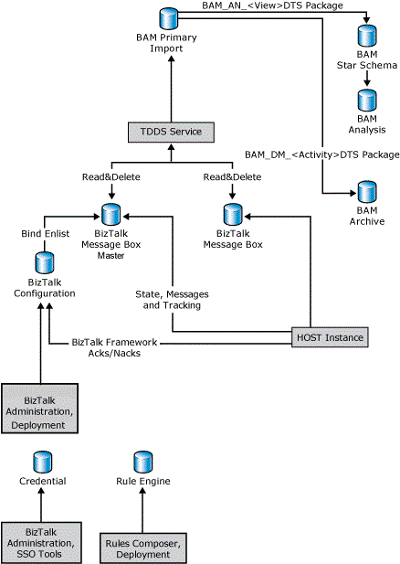

# Database Structure and Jobs
This topic discusses the database structure and database jobs for [!INCLUDE[btsBizTalkServerNoVersion](../includes/btsbiztalkservernoversion-md.md)].  
  
## Database Write Diagram  
 The following figure shows the processes and entities that write to the BizTalk Server databases.  
  
   
  
        Database write diagram showing the processes and entities that write to the BizTalk Server databases  
  
## BizTalk Server Database Jobs  
 [!INCLUDE[btsBizTalkServerNoVersion](../includes/btsbiztalkservernoversion-md.md)] includes the following SQL Server Agent jobs to assist you in managing the BizTalk Server databases:  
  
> [!NOTE]
>  The names of the jobs change depending on the database names given during configuration. If you have deployed multiple MessageBox databases in your environment, there will be several jobs for each MessageBox.  
  
> [!WARNING]
>  In the BizTalk Management (BizTalkMgmtDb) database, there's a stored procedure named **adm_CleanupMgmtDB**. **DO NOT RUN THIS STORED PROCEDURE!** If you do run this stored procedure, all the entries in the database will be deleted.  
  
|Job|Description|  
|---------|-----------------|  
|Backup BizTalk Server (BizTalkMgmtDb)|This job performs full database and log backups of the BizTalk Server databases. For more information about configuring and running this job, see [Backing Up and Restoring BizTalk Server Databases](../core/backing-up-and-restoring-biztalk-server-databases.md).|  
|CleanupBTFExpiredEntriesJob_BizTalkMgmtDb|This job cleans up expired BizTalk Framework (BTF) entries in the BizTalk Management (BizTalkMgmtDb) database.|  
|DTA Purge and Archive (BizTalkDTADb)|This job automatically archives data in the BizTalk Tracking (BizTalkDTADb) database and purges obsolete data. For more information about configuring and running this job, see [Archiving and Purging the BizTalk Tracking Database](../core/archiving-and-purging-the-biztalk-tracking-database.md).|  
|MessageBox_DeadProcesses_Cleanup_BizTalkMsgBoxDb|This job detects when a BizTalk Server host instance (NT service) has stopped and releases all work that was being done by that host instance so that it can be worked on by another host instance.|  
|MessageBox_Message_Cleanup_BizTalkMsgBoxDb|This job removes all messages that are no longer being referenced by any subscribers in the BizTalk MessageBox (BizTalkMsgBoxDb) database tables. **Caution:**  This is an unscheduled job which is started by the MessageBox_Message_ManageRefCountLog_BizTalkMsgBoxDb job. Do not manually start this job.|  
|MessageBox_Message_ManageRefCountLog_BizTalkMsgBoxDb|This job manages the reference count logs for messages and determines when a message is no longer referenced by any subscriber. **Note:**  Even thought this SQL Server Agent job is scheduled to run once per minute, the stored procedure that is called by this job contains logic to ensure that the stored procedure runs continually. This is by design behavior and should not be modified.|  
|MessageBox_Parts_Cleanup_BizTalkMsgBoxDb|This job removes all message parts that are no longer being referenced by any messages in the BizTalk MessageBox (BizTalkMsgBoxDb) database tables. All messages are made up of one or more message parts, which contain the actual message data.|  
|MessageBox_UpdateStats_BizTalkMsgBoxDb|This job manually updates the statistics for the BizTalk MessageBox (BizTalkMsgBoxDb) database.|  
|Monitor BizTalk Server|This job scans the BizTalkMgmtDb, BizTalkMsgBoxDb and BizTalkDTADb database for any known issues, including orphaned instances.|  
|Operations_OperateOnInstances_OnMaster_BizTalkMsgBoxDb|This job is needed for multiple MessageBox deployments. It asynchronously performs operational actions such as bulk terminate on the master MessageBox after those changes have been applied to the subordinate MessageBox.|  
|PurgeSubscriptionsJob_BizTalkMsgBoxDb|This job purges unused subscription predicates from the BizTalk Server MessageBox (BizTalkMsgBoxDb) database.|  
|Rules_Database_Cleanup_BizTalkRuleEngineDb|This job automatically purges old audit data from the Rule Engine (BizTalkRuleEngineDb) database every 90 days. This job also purges old history data (deploy/undeploy notifications) from the Rule Engine (BizTalkRuleEngineDb) database every 3 days.|  
  
## See Also  
 [The Messaging Engine](../core/the-messaging-engine.md)