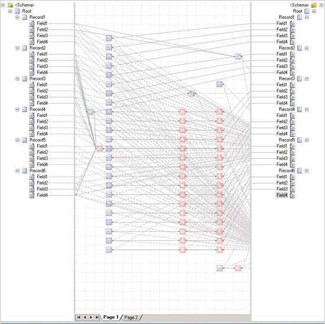
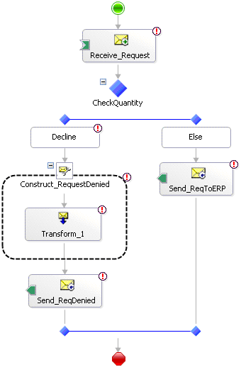

# Defining Business Processes
The exchange of messages between different systems is a necessary part of solving the problems that [!INCLUDE[btsBizTalkServerNoVersion](../includes/btsbiztalkservernoversion-md.md)] addresses. The real goal, however, is to define and execute business processes based on the applications. The [!INCLUDE[btsBizTalkServerNoVersion](../includes/btsbiztalkservernoversion-md.md)] engine uses orchestrations to define the logic of these business processes. To create and evaluate groups of business rules, it uses the Business Rule Engine. This section describes both orchestrations and the Business Rule Engine.  
  
## Using Orchestrations  
 The logic of an automated business process can be implemented directly in a language such as Microsoft Visual Basic or Microsoft Visual C#. Yet creating, maintaining, and managing complex business processes in conventional programming languages can be challenging. Unlike its predecessors, [!INCLUDE[btsBizTalkServerNoVersion](../includes/btsbiztalkservernoversion-md.md)] takes a different approach. It enables business managers or developers to define a business process graphically. Doing this can be faster than building the process directly in a programming language, and it also makes the process easier to understand, explain, and change. Business processes built in this fashion can also be monitored more easily, a fact that is exploited by the Business Activity Monitoring (BAM) technology.  
  
 For a developer, creating an orchestration relies on three primary tools: the BizTalk Editor for creating XML schemas, the BizTalk Mapper for defining translations between those schemas, and the Orchestration Designer for specifying the logic of business processes. All of these tools are hosted inside [!INCLUDE[btsVStudioNoVersion](../includes/btsvstudionoversion-md.md)], providing a consistent environment for developers. This section describes what each of these tools does and how they work together.  
  
### Creating Schemas: The BizTalk Editor  
 Orchestrations work with XML documents, each of which conforms to some XML schema. The BizTalk Editor enables developers to define these schemas, which essentially define the structure and types of a document’s information, using the XML Schema Definition language (XSD).  
  
 Creating raw XSD schemas without some tool support is not simple. To make this necessary step more approachable, the BizTalk Editor enables users—probably developers—to build a schema by defining its elements in a graphical hierarchy. Existing schemas can also be imported from either files or accessible Web services. However they’re acquired, schemas are used as the basis for BizTalk maps.  
  
### Mapping Between Schemas: The BizTalk Mapper  
 An orchestration implementing a business process typically receives some documents and sends others. Often, part of the information in the received documents is transferred to the sent documents, perhaps transformed in some way. For example, an order fulfillment process might receive an order for some number of items, then send back a message indicating that the order was declined for some reason. Information from the order, such as a request identifier and the quantity ordered, might be copied from fields in the received order message into fields in the rejection message. The BizTalk Mapper can be used to define a transformation, called a map, from one document to the other.  
  
   
  
 As the figure above shows, each map is expressed as a graphical correlation between two XML schemas that defines a relationship between elements in those schemas. The World Wide Web Consortium (W3C) has defined the Extensible Stylesheet Language Transformation (XSLT) as a standard way to express these kinds of transformations between XML schemas, and so maps in [!INCLUDE[btsBizTalkServerNoVersion](../includes/btsbiztalkservernoversion-md.md)] are implemented as XSLT transformations.  
  
 The transformation defined in a map can be simple, such as copying values unchanged from one document to another. Direct data copies like this are expressed using a link, which is shown in the BizTalk Mapper as a line connecting the appropriate elements in the source schema with their counterparts in the destination schema. More complex transformations are also possible using functoids. A functoid is a chunk of executable code that can define arbitrarily complex mappings between XML schemas, and as shown above, the BizTalk Mapper represents it as a box on the line connecting the elements being transformed. Because some of those transformations are fairly common, [!INCLUDE[btsBizTalkServerNoVersion](../includes/btsbiztalkservernoversion-md.md)] includes a number of built-in functoids. These built-in functoids are grouped into categories, which include the following:  
  
- Mathematical functoids that perform operations such as adding, multiplying, and dividing the values of fields in the source document and storing the result in a field in the target document.  
  
- Conversion functoids that convert a numeric value to its ASCII equivalent and vice-versa.  
  
- Logical functoids that can be used to determine whether an element or attribute should be created in the target document based on a logical comparison between specified values in the source document. Those values can be compared for equality, greater than/less than, and in other ways.  
  
- Cumulative functoids that compute averages, sums, or other values from various fields in the source document, then store the result in a single field in the target document.  
  
- Database functoids that can access information stored in a database.  
  
  It is also possible to create custom functoids directly in XSLT or using .NET-enabled languages like Visual C# and Visual Basic. Functoids can also be combined in sequences, cascading the output of one into the input of another.  
  
  It is essential that you have a way to define a document’s XML schema, as well as a mechanism for mapping information across documents with different schemas. The BizTalk Editor and BizTalk Mapper address these two problems. Yet defining schemas and maps is only part of the process. You must also specify the business logic that will use the schemas and invoke the maps.  
  
### Defining Business Logic: The Orchestration Designer  
 A business process is a set of actions that together meet some useful business need. With [!INCLUDE[btsBizTalkServerNoVersion](../includes/btsbiztalkservernoversion-md.md)], a developer can use the Orchestration Designer to define these actions graphically. Instead of expressing the steps in some programming language, a developer can create an orchestration by connecting together a series of shapes in a logical way. The shapes available in the Orchestration Designer include:  
  
- The Receive shape, which allows the orchestration to receive messages. A Receive shape can have a filter that defines the types of messages that will be received, and it can also be configured to start a new instance of an orchestration when a new message arrives.  
  
- The Send shape, which allows the orchestration to send messages.  
  
- The Port shape, which defines how messages are transmitted. Each instance of a Port shape is connected to either a Send or Receive shape. Each port also has a type, which defines things such as the kinds of messages the port can receive; a direction, such as send or receive; and a binding, which determines how a message is sent or received by, for example, specifying a particular URL and other information.  
  
- The Decide shape, which represents an if-then-else statement that allows an orchestration to perform different tasks based on Boolean conditions. An Expression Editor, part of the Orchestration Designer, can be used to specify this conditional statement.  
  
- The Loop shape, which controls the repeated performing of an action while some condition is true.  
  
- The Construct Message shape, which allows building a message.  
  
- The Transform shape, which allows the transfer of information from one document to another, and transforming it by invoking maps defined with the BizTalk Mapper.  
  
- The Parallel Actions shape, which allows a developer to specify that multiple operations should be performed in parallel rather than in sequence. The shape that follows this one is not executed until all of the parallel actions have completed.  
  
- The Scope shape, which allows the grouping of operations into transactions and defining exception handlers for error handling. Both traditional atomic transactions and long-running transactions are supported. Unlike atomic transactions, long-running transactions rely on compensating logic rather than rollback to handle unexpected events.  
  
- The Message Assignment shape, which allows assigning values to orchestration variables. These variables can be used to store state information used by the orchestration, such as a message being created or a character string.  
  
  The figure below shows an orchestration created in the Orchestration Designer using a few of these shapes. In this simple example, a message is received, a decision is made based on the content of that message, and one of two paths is executed as a result of that decision. Orchestrations that solve real problems can be significantly more complex than this; to make these more complex diagrams easier to work with, the Orchestration Designer includes the ability to zoom in and out. Developers can view only those parts of an orchestration that they are currently interested in.  
  
    
  
  After a developer has defined an orchestration, the group of shapes and relations between them is converted into the Microsoft Intermediate Language (MSIL) used by the .NET Framework’s Common Language Runtime (CLR). Ultimately, the group of shapes defined by a BizTalk Server developer becomes just a standard .NET-enabled assembly. You can also add explicit code to an orchestration when necessary by calling a COM or .NET object from inside a shape.  
  
### The Role of Web Services  
 Web services allow applications to exchange XML documents using SOAP, and have had a significant impact on integration platforms. To access an external Web service, an orchestration’s creator can use the Add Web Reference option in [!INCLUDE[btsVStudioNoVersion](../includes/btsvstudionoversion-md.md)] along with the Web Services adapter to directly invoke operations. Similarly, [!INCLUDE[btsBizTalkServerNoVersion](../includes/btsbiztalkservernoversion-md.md)] provides a Web Services Publishing wizard that can generate an ASP.NET Web service project exposing one or more of an orchestration’s operations as SOAP-callable Web services. These two options allow developers to both access existing Web services from within a business process and expose an orchestration’s functionality as a Web service to other business processes.  
  
- The rise of Web services also has an impact on how business processes are defined. For example, think about the case where two organizations interact using Web services. To interoperate effectively, it might be necessary for each party to the interaction to know something about the business process the other is using. If both organizations use [!INCLUDE[btsBizTalkServerNoVersion](../includes/btsbiztalkservernoversion-md.md)], this isn’t a big problem; tools such as the Trading Partner Management technology can be used to distribute this knowledge. But what if they use different products? For cases like this, it is useful to have a way to describe aspects of business processes in a non-vendor specific way.  
  
  To allow this, Microsoft, IBM, and others have created the Business Process Execution Language (BPEL). A business process defined using the Orchestration Designer can be exported to BPEL, and [!INCLUDE[btsBizTalkServerNoVersion](../includes/btsbiztalkservernoversion-md.md)] can also import processes defined in BPEL. While the language is useful for describing and sharing externally visible parts of a business process, BPEL is focused more on solving this problem than on cross-platform execution of complete business processes. It’s also important to understand that BPEL is built entirely on Web services, while [!INCLUDE[btsBizTalkServerNoVersion](../includes/btsbiztalkservernoversion-md.md)] and other products that support this language provide more. For example, [!INCLUDE[btsBizTalkServerNoVersion](../includes/btsbiztalkservernoversion-md.md)] supports mapping between different XML schemas, calling methods in local objects, and other features that aren’t available in BPEL. For these and other reasons, BPEL isn’t a complete language for defining business processes. And given that BPEL is still in the process of being standardized by the Organization for the Advancement of Structured Information Standards (OASIS), it’s hard to view it today as a fully mature technology.  
  
- Orchestrations are the fundamental mechanism for creating business processes in BizTalk Server. Some aspects of an orchestration tend to change more often than others, however. In particular, the decisions embedded in a business process—the business rules—are commonly its most volatile aspect. A manager’s spending limit was $100,000 last week, but her promotion bumps this up to $500,000, or a slow-paying customer’s maximum allowed order decreases from 100 units to only 10. You can specify and update these rules using the  Business Rule Engine.  
  
## Using the Business Rule Engine  
 The Orchestration Designer, together with the BizTalk Editor and the BizTalk Mapper, provide an effective way to define a business process and the rules it uses. It can be useful, however, to have an easier way to define and change business rules. To allow this, BizTalk Server provides the Business Rule Engine (BRE). Developers will most often use the BRE, but more business-oriented users can create and modify sets of business rules using a tool called the Business Rule Composer.  
  
 One situation in which the BRE is useful is when a complex set of business rules must be evaluated. Deciding whether to grant a loan, for example, might entail working through a large set of rules based on the customer’s credit history, income, and other factors. Similarly, determining whether to sell life insurance to an applicant depends on a number of things, including the applicant’s age, gender, and health. Expressing all of these rules as conditional statements using, say, an orchestration’s Decide shape might be possible, but would be fairly complex to implement. For rule-intensive processes like these, the BRE can make a developer’s life simpler.  
  
 Using the BRE, developers can quickly and easily change rules as needed. To see why, think about what’s required to change a business rule that’s implemented within an orchestration. A developer must first open the orchestration in [!INCLUDE[btsVStudioNoVersion](../includes/btsvstudionoversion-md.md)], modify the appropriate shapes (and perhaps the .NET or COM objects they invoke), and then build and deploy the modified assembly. Doing this also requires stopping and restarting the BizTalk application that includes this orchestration. If instead this business rule is implemented using the BRE, it can be modified without recompiling or restarting anything. All that’s needed is to use the Business Rule Composer to change the desired rule, then redeploy the new set of rules. The change takes effect immediately. And while orchestrations are typically created and maintained by developers, business rules are readable enough that in some cases they can be modified by business analysts without the need to involve more technical people.  
  
 The creator of a set of business rules typically begins by using the Business Rule Composer to define a vocabulary for use in specifying those rules. Each term in the vocabulary provides a user-friendly name for some information. For example, a vocabulary might define terms such as Number Shipped or Maximum Quantity of Items or Approval Limit. Each of these terms can be set to a constant or be mapped to a particular element or attribute in some XML schema (and thus in an incoming message) or to the result of a SQL query against some database or even to a value in a .NET object.  
  
 After a vocabulary has been defined, the Business Rule Composer can be used to create business policies that use this vocabulary. Each policy can contain one or more business rules. A rule uses the terms defined in some vocabulary together with logical operators such as Greater Than, Less Than, Is Equal To, and others to define how a business process operates. A business rule can define how values contained in a received XML document should affect the values created in an XML document that’s sent, or how those received values should affect what value is written in a database, or other things.  
  
 To execute a business policy, an orchestration uses a CallRules shape. This shape creates an instance of the BRE, specifies which policy to execute, then passes in the information this policy needs, such as a received XML document. The BRE can also be invoked programmatically using a .NET-based object model, which allows it to be called from applications that don’t use [!INCLUDE[btsBizTalkServerNoVersion](../includes/btsbiztalkservernoversion-md.md)]. This means that Windows Forms applications, software exposing Web services, and anything else built on the .NET Framework can potentially use the BRE whenever it helps solve the problem at hand.  
  
 Both vocabularies and business rules can be much more complicated—and much more powerful—than the simple examples described here. But the core idea of defining a vocabulary, then defining sets of rules that use that vocabulary is the heart of the Business Rule Engine.  
  
## See Also  
 [The BizTalk Server Messaging Engine](../core/the-biztalk-server-messaging-engine.md)