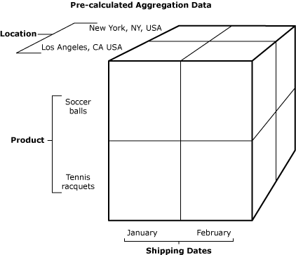

# Defining Dimensions
Microsoft Excel defines dimensions as categories used to organize data in a table into levels that will be used for analysis. For example, a location data dimension might contain levels such as city, state/province, and country/region. When creating BAM Views in the BAM View wizard, you can add one or more of the following dimension types:  
  
- [Progress Dimension](../core/progress-dimension.md)  
  
- [Data Dimension](../core/data-dimension.md)  
  
- [Time Dimension](../core/time-dimension.md)  
  
- [Numeric Range Dimension](../core/numeric-range-dimension.md)  
  
    
  Pre-calculated Aggregation Data  
  
  You add new dimensions in the BAM View wizard. Before you can add dimensions, you need to use the wizard to create business activity views. For more information about using the wizard, see [Define Business Activities and Views in Excel](../core/defining-business-activities-and-views-in-excel.md).  
  
### To add new dimensions  
  
1.  In the BAM View wizard, click **Next** until you see the **New BAM View: Aggregation Dimensions and Measures** page. Click **New Dimensions**.  
  
2.  Type a name for the dimension.  
  
3.  From the drop-down list, select a dimension type.  
  
4.  Based on the dimension type you selected, fill in the appropriate data, and then click **OK**.  
  
## See Also  
 [Progress Dimension](../core/progress-dimension.md)