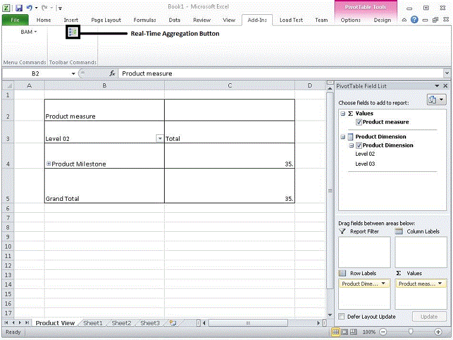

# Defining Real-Time Aggregations
In some cases, specific slices of the multi-dimensional aggregations are so time- sensitive that you want them to be available in real time. For example, your business is selling perishable products and you want the aggregation of product quantity in different stages of delivery to be available in real time. At the same time, you want other aggregations such as the age of your typical customers, but only at the end of the month for business intelligence analysis.  
  
-   Using the **PivotTable** toolbar, mark the selected PivotTable as a real-time aggregation (RTA), if applicable. The type of data contained in the PivotTable should determine whether it needs to be viewed in real time. For example, a report that tracks hourly Web orders might need to viewed in real time, whereas a report that tracks daily sales totals would not be viewed in real time.  
  
       
RTA button  
  
> [!IMPORTANT]
>  Do not define multiple RTAs that use the same BAM activity. If you do so, the RTA data will be incorrect when you archive the BAM data.  
  
 For more information about Pivot tables, see Excel online help. After you create your Pivot table, you can view your live BAM data.  
  
## See Also  
 [Viewing Live BAM Data](../core/viewing-live-bam-data.md)   
 [Progress Dimension](../core/progress-dimension.md)   
 [Data Dimension](../core/data-dimension.md)   
 [Time Dimension](../core/time-dimension.md)   
 [Numeric Range Dimension](../core/numeric-range-dimension.md)   
 [Defining Dimensions](../core/defining-dimensions.md)
