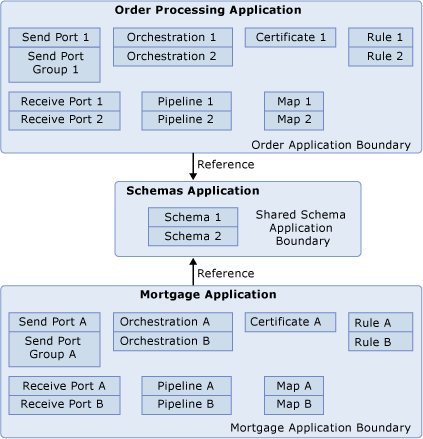
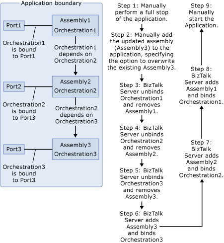
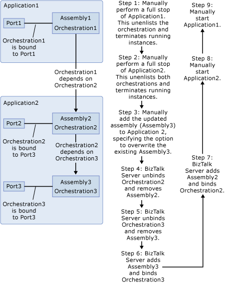

# Dependencies and Application Deployment
This topic describes how dependencies between artifacts in two or more BizTalk applications affect application deployment and maintenance.  
  
 When one artifact needs to use another artifact in order to function properly, it is said to be *dependent* on another artifact. An example of such a dependency is when an orchestration needs to use a specific schema for message resolution or a specific pipeline in order to transmit messages correctly. In both of these scenarios, the orchestration is dependent on another artifact.  
  
 Before you can update an artifact in an application, you must first undeploy it, along with any artifacts that depend on it. When artifacts that have dependencies exist in the same application, BizTalk Server automatically handles the undeployment and redeployment tasks for the updated and dependent artifacts. When artifacts that have dependencies exist in different applications, however, this is not the case. You must take manual steps to undeploy the artifacts that have the dependencies before you can update an artifact on which they depend. Afterwards, you must manually redeploy the dependent artifacts.  
  
 To avoid the need to take these manual steps when you want to update an artifact on which other artifacts depend, you can attempt to keep all artifacts with dependencies together in the same application. This is not always possible, however. As described in [Artifacts That Must Be Unique in an Application or Group](../core/artifacts-that-must-be-unique-in-an-application-or-group.md), most types of artifacts must be unique in a BizTalk group. You cannot have the same artifact in two different applications in the same group, even if both applications contain artifacts that depend on the same artifact.  
  
 When this happens, you can add the needed artifact to one application and then add a reference to that application from any other applications containing artifacts that depend on it. When you add a reference to an application, artifacts in the application can use any artifacts in the application that it references. For instructions on adding a reference, see [How to Add a Reference to Another Application](../core/how-to-add-a-reference-to-another-application.md).  
  
 The following diagram depicts two applications that each depend on artifacts in a third application. The Order Processing application uses Schema1, which is contained in the Schemas application, so the Order Processing application contains a reference to the Schemas application. The Mortgage application uses Schema2, which is also contained in the Schemas application, and likewise the former application contains a reference to the latter.  
  
   
  
 Adding a reference from one application to another creates a dependency between the two applications that affects how you deploy and manage both applications. Because of the various effects of application dependencies described later in this topic, we recommend that you follow the best practices for adding artifacts to application, as described in [Best Practices for Deploying a BizTalk Application](../core/best-practices-for-deploying-a-biztalk-application.md).  
  
 The following diagram illustrates the steps involved in updating an assembly when there is a chain of dependency, and all assemblies that depend on the assembly being updated exist in the same application.  
  
   
  
 The following diagram illustrates the steps involved in updating an assembly when there is a chain of dependencies on the assembly being updated, and one of the dependent assemblies exists in a different application.  
  
   
  
> [!NOTE]
>  The reason to perform a full stop before updating an assembly is that doing this automatically unenlists the orchestration, and stops and terminates all messages. If you need to continue processing messages, you can deploy a different version of the same assembly and thereby avoid the need to stop and terminate messages. For more information, see [Updating BizTalk Applications](../core/updating-biztalk-applications.md).  
  
 The following effects may result from dependencies between applications:  
  
-   **Stopping an artifact.** If you stop an artifact in one application (which may result from stopping the entire application) that another application depends on, the dependent application will not function correctly. For more information about stopping an application, see [How to Start and Stop a BizTalk Application](../core/how-to-start-and-stop-a-biztalk-application.md).  
  
-   **Removing or changing the state of an artifact.** When you add a reference from one application to another and make any changes to the state of an artifact on which another application depends or remove the artifact, the application that has the dependency will not function correctly. For more information about changing the state of an artifact, see the section on the appropriate artifact in [Managing Artifacts](../core/managing-artifacts.md).  
  
-   **Importing applications that have dependencies.** If you want to import an application into a different BizTalk group and run it in that group, you must also import any artifacts on which this application depends. You can do this by first importing the other application or by adding the needed artifact to the application that requires it. For more information about importing applications, see [How to Import a BizTalk Application](../core/how-to-import-a-biztalk-application.md).  
  
    > [!NOTE]
    >  BizTalk Server verifies the identity of an application by matching the application names in the source and the destination BizTalk group. It does not verify that the artifacts on which your application has dependencies are included in it. When you import an application that has dependencies and the application to which it refers, we recommend that you verify that the referenced application contains the required artifact or artifacts.  
  
-   **Importing applications that have references.** If an application you are importing depends on an artifact in another application, you need to add a reference to this application. The Import Wizard provides this option. If you are using the ImportApp command of BTSTask, however, you must add the reference to the application after import, as described in [How to Add a Reference to Another Application](../core/how-to-add-a-reference-to-another-application.md). While BizTalk Server verifies that the referenced application exists, we recommend that you take the additional step of verifying that the referenced application contains the required artifact.  
  
-   **Installing applications that have dependencies.** When you install an application, you must also install any applications on which it depends. When you install an application that has a dependency on an artifact, such as a BizTalk assembly, which is contained in another application, you must first install the application that contains the artifact. For example, if you want to install Application A, and it depends on an assembly in Application B, you must install Application B first. Then you can install Application A. For more information about installing applications, see [How to Install a BizTalk Application](../core/how-to-install-a-biztalk-application.md).  
  
-   **Moving an artifact.** When you move an artifact to a new application, any other artifacts on which it has dependencies are also moved unless the new application has a reference to the application(s) containing the artifacts on which the moved artifact depends. Also, any artifacts that have dependencies on the moved artifact also will be moved unless the application(s) containing them have a reference to the new application. When moving an artifact, you will be shown the list of other artifacts that will also be moved. For instructions on moving an artifact, see [How to Move an Artifact to a Different Application](../core/how-to-move-an-artifact-to-a-different-application.md).  
  
-   **Updating an artifact when an artifact in another application depends on it.** When you update an artifact in an application that has a dependency on an artifact in the same application, BizTalk Server automatically takes care of undeploying and redeploying the dependent artifact. If you want to update an artifact in one application, and an artifact in another application has a dependency on it, however, you must undeploy and redeploy the dependent artifact manually as follows:  
  
    1.  Stop, unenlist, and unbind the dependent artifact.  
  
    2.  Update the artifact on which it depends.  
  
    3.  Bind, enlist, and start the dependent artifact.  
  
## See Also  
 [Understanding BizTalk Application Deployment and Management](../core/understanding-biztalk-application-deployment-and-management.md)