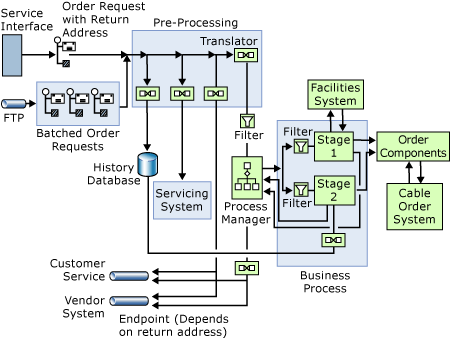

# Designing with Patterns: the Business Process Management Solution
The business process management solution shows one way to construct a process manager in a BizTalk application. The solution uses a component to select and control the sequence of stages in order processing. The solution takes an order—which may be for new service, a change, or cancellation of service—logs it, and acknowledges the order before passing it on for processing. The processing consists of one or more stages that handle the order. Finally, the solution returns a final response to the original order request.  
  
 A well-designed process management solution enables you to add or subtract stages from the process without having to reconstruct the rest of the application. The approach taken in this solution allows for exactly that. The order process is broken into discrete, independent stages. All stages read from the same port and use a filter to determine which messages are theirs to process. This is explained further in the following section, "Patterns."  
  
 This solution also accepts input through a Web service, although you can also use a non-service interface with this solution through an FTP connection. This facility simulates how the application might be used in a batch system.  
  
## Patterns  
 The following diagram shows a simplified version of the patterns in the business process management solution as described in the preceding section.  
  
   
  
 The solution consists of the following parts: the service interface, the FTP channel, various translators, the process manager, and the two processing stages. The four translators in the preprocessing section create an acknowledgement message that goes back to the service interface, generate an entry in a history or tracking database, and make an entry in the service system. The fourth translator creates the message needed by the process manager. The process manager in turn controls the processing stages.  
  
 In many process manager implementations, the manager tracks the processing state. This implementation, as the diagram shows, modifies this. In this solution, the process manager sets a flag in the message to indicate the processing stage that should next handle the message. Each stage then uses a filter to determine whether it should handle a particular message.  
  
 Using this approach, the process manager does not have to maintain any routing information. All messages between the manager and the various stages use the same ports. To add a stage, you only have to add a component that sends and receives on the proper ports and filters for the correct stage number. You don't need to change anything in the process manager itself.  
  
 Note that a lot is left out of the diagram. The processing stages may—and, in fact, do—communicate with backend processes. The solution could also collect historical information at more than one point in the process. Perhaps, most significantly, the logic of the process manager isn't specified. In addition, the use of synchronous or asynchronous connections is not specified. These will be considered in following sections.  
  
## See Also  
 [Patterns in the Business Process Management Solution](../core/patterns-in-the-business-process-management-solution.md)   
 [Translating the Patterns of the Business Process Management Solution](../core/translating-the-patterns-of-the-business-process-management-solution.md)