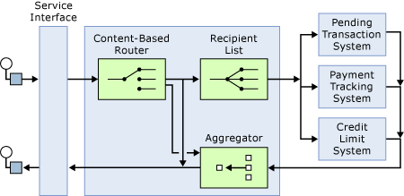

# Designing with Patterns: the Service Oriented Solution
The service-oriented solution shows how to expose a BizTalk application as a service for use by other applications. Presenting an application as a service enables other applications to easily consume the information and use it in the services that they provide. For more information about service interfaces see "Service Interface" at [http://go.microsoft.com/fwlink/?LinkId=46185](http://go.microsoft.com/fwlink/?LinkId=46185). For more information about service-oriented integration see "Service-Oriented Integration" at [http://go.microsoft.com/fwlink/?LinkId=46186](http://go.microsoft.com/fwlink/?LinkId=46186).  
  
 The solution is a credit information application that provides the information as a Web service response, after aggregating relevant information from three other applications. The application consolidates the results and returns a single message containing the summarized credit information. The three back-end systems are as follows:  
  
- **SAP Enterprise System.** The SAP back end provides the customer's overall credit limit. The solution communicates with this backend system using the SAP adapter in [!INCLUDE[adapterpacknoversion](../includes/adapterpacknoversion-md.md)].  
  
- **Pending Transactions System.** The Pending Transactions system reports the total amount of transactions outstanding against the account. The solution uses Microsoft Host Integration Server (HIS) to communicate with the mainframe from Windows Server. It also uses the Transaction Integrator technology of HIS. These enable the system to interact with the mainframe as a Web service. The BizTalk orchestration consumes this Web service.  
  
- **Payment Tracking System.** The Payment Tracking system reports the last payment the individual made. This system uses MQSeries.  
  
  As you may recall from the overview of the solution, you can also use a non-Web service interface through MQSeries queues. (For more information about the general structure of the application, see [Understanding the Service Oriented Solution](../core/understanding-the-service-oriented-solution.md)). Although Web services are the most common way to construct service oriented architectures, not all applications can use them. With BizTalk Server solutions you can provide, along with Web services, alternate ways for legacy applications to use the service.  
  
  The MQSeries access simulates how a legacy interactive voice response system might use the solution. The MQSeries access, along with the Web service access, shows how a single solution can be used by both legacy applications and new applications.  
  
## Patterns Used in the Service Oriented Solution  
 The following diagram shows a simplified version of the patterns in the service-oriented solution.  
  
   
  
 The solution consists of four main parts, each of which represents a pattern: the service interface, a content-based router, a recipient list, and an aggregator. The service interface represents the interface mechanism that makes it possible to connect to the solution. The content-based router checks the validity of the message and sends an error message if it is invalid. The recipient list sends the message to the three back-end applications. As the back-end applications respond, the aggregator combines the responses into a single response message. The response message goes back to the requester through the service interface.  
  
 Note that a lot is left unspecified in the diagram:  
  
-   The diagram omits message translators, which are required by the solution in order to communicate with the external systems.  
  
-   The diagram doesn't specify how to communicate with the back-end processes.  
  
-   The diagram also does not specify the nature of the service interface.  
  
-   Nor does the diagram indicate whether or not to use synchronous or asynchronous communication.  
  
## See Also  
 [Developing a Service Oriented Solution](../core/developing-a-service-oriented-solution.md)   
 [Translating the Patterns of the Service Oriented Solution](../core/translating-the-patterns-of-the-service-oriented-solution.md)