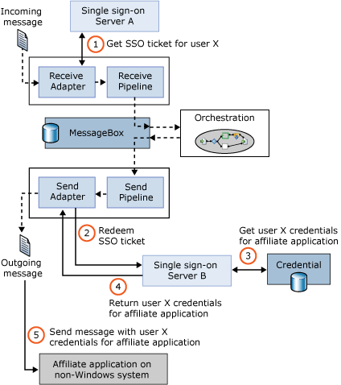

# Enterprise Single Sign-On
A business process that relies on several different applications may have to cross several different security domains. Accessing an application on a Microsoft Windows system may require one set of security credentials, while accessing an application on an IBM mainframe may require different credentials, such as an RACF username and password. Dealing with this profusion of credentials is difficult for users, and it can be even harder for automated processes. To address this problem, [!INCLUDE[btsBizTalkServerNoVersion](../includes/btsbiztalkservernoversion-md.md)] includes Enterprise Single Sign-On.  
  
 Don’t be confused—this isn’t a mechanism that lets people have one login for all applications. Instead, Enterprise Single Sign-On provides a way to map a Windows user ID to non-Windows user credentials. It does not solve all of an organization’s enterprise sign-on problems, but this service can make things simpler for business processes that use applications on diverse systems.  
  
## Creating Affiliate Application for Non-Windows Systems  
 To use Enterprise Single Sign-On, an administrator defines affiliate applications, each of which represents a non-Windows system or application. For example, an affiliate application might be a CICS application running on an IBM mainframe, an SAP ERP system running on Unix, or any other kind of software. Each of these applications has its own mechanism for authentication, and so each requires its own unique credentials.  
  
 Enterprise Single Sign-On stores an encrypted mapping between a user’s Windows user ID and his credentials for one or more affiliate applications in an SSO database. When this user needs to access an affiliate application, the credentials for that application can be looked up in the SSO database by a Single Sign-On (SSO) Server. The diagram below shows how this works.  
  
   
  
 In this example, a message sent by some application to BizTalk Server is processed by an orchestration, then sent to an affiliate application running on an IBM mainframe. The job of Enterprise Single Sign-On is to make sure that the correct credentials (that is., the right username and password) are sent with the message when it is passed to the affiliate application.  
  
## Message Processing With an SSO Ticket  
 As the diagram shows, when a receive adapter gets a message, the adapter can request an SSO ticket from SSO server A (step 1). This encrypted ticket contains the Windows identity of the user that made the request and a timeout period. (Don’t confuse this with a Kerberos ticket—it is not the same thing.) After the ticket is acquired, it is added as a property to the incoming message. The message then takes its normal path through the BizTalk Server engine, which in this example means it is handled by an orchestration. When this orchestration generates an outgoing message, that message also contains the SSO ticket acquired earlier.  
  
 This new message is destined for the application running on an IBM mainframe, and so it must contain the appropriate credentials for this user to access that application. To get these credentials, the send adapter contacts SSO server B (step 2), supplying the message (which contains the SSO ticket) it just received and the name of the affiliate application it is trying to retrieve the credentials for. This operation, called redemption, causes SSO server B to validate the SSO ticket, and then look up this user’s credentials for that application (step 3). SSO Server B returns those credentials to the send adapter (step 4), which uses them to send an appropriately-authenticated message to the affiliate application (step 5).  
  
## Administering SSO  
 Enterprise Single Sign-On also includes administration tools to perform various operations. All operations performed on the SSO database are audited, for example, so tools are provided that allow an administrator to monitor these operations and set various audit levels. Other tools allow an administrator to disable a particular affiliate application, turn on and off an individual mapping for a user, and perform other functions. There’s also a client utility that allows end users to configure their own credentials and mappings. And like other parts of BizTalk Server, Enterprise Single Sign-On exposes its services through a programmable API. The creators of third-party BizTalk Server adapters use this API to access the single sign-on services, and administrators can use it to create scripts for automating common tasks.  
  
 The example described above shows a typical use of Enterprise Single Sign-On, but SSO can be configured in other ways. A smaller BizTalk Server installation may have only a single SSO server, for example, and it’s possible to use Enterprise Single Sign-On independently from the BizTalk Server engine. (The technology also ships with Microsoft Host Integration Server.)  
  
## See Also  
 [The BizTalk Server Messaging Engine](../core/the-biztalk-server-messaging-engine.md)   
 [Implementing Enterprise Single Sign-On](../core/implementing-enterprise-single-sign-on.md)
