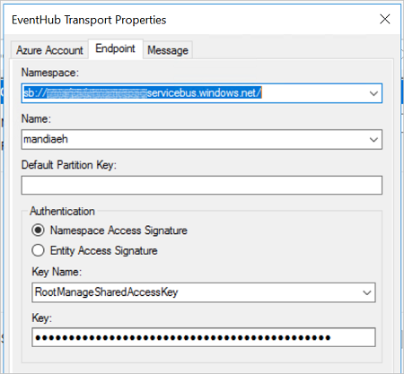
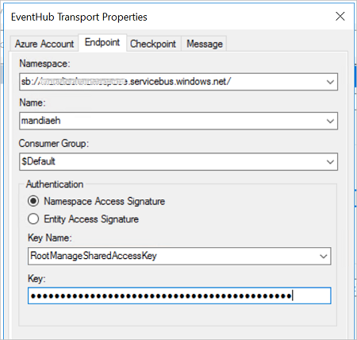
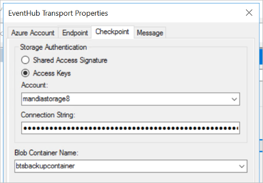

# Event Hub adapter in BizTalk

## Overview
**Starting with [!INCLUDE[bts2016_md](../includes/bts2016-md.md)] Feature Pack 2**, you can send and receive messages between BizTalk Server and Azure Event Hubs. 

Azure Event Hubs is a highly scalable data streaming platform, and can receive and process millions of events per second. [What is Event Hubs?](https://docs.microsoft.com/azure/event-hubs/event-hubs-what-is-event-hubs) provides more details.

## Prerequisites

* Create an [Azure event hubs namespace and event hub](https://docs.microsoft.com/azure/event-hubs/event-hubs-create)
* Create an [Azure blob storage account with a container](https://docs.microsoft.com/azure/storage/common/storage-create-storage-account)
* Install [Feature Pack 2](https://aka.ms/bts2016fp2) on your BizTalk Server

Your event hub is now created, and you have the connection strings you need to send and receive events.

## Send messages to Event Hubs

1.  In the BizTalk Server Administration console, right-click **Send Ports**, select **New**, and select **Static One-way send port**.

    [Create a Send Port](../core/how-to-create-a-send-port2.md) provides some guidance.

2. Enter a **Name**. In **Transport**, set the **Type** to **EventHub**, and select **Configure**. 

3. Configure the **Azure Account** properties: 

    |Use this|To do this|  
    |---|---|  
    | **Sign-in** | Sign into your Azure account |
    | **Subscription** | Select the subscription that has your EventHubs namespace |
    | **Resource Group** | Select your resource group that has your EventHubs namespace |

4. Configure the **Endpoint** properties: 

    |Use this|To do this|  
    |---|---|  
    | **Namespace** | Select your Event Hubs namespace, which is something like sb://*youreventhubnamespace*.servicebus.windows.net/ |
    | **Name** | Select the name of your Event Hub (which was created within your Event Hubs namespace) |
    | **Default Partition Key** | Optional. [Event Hubs programming guide](https://docs.microsoft.com/azure/event-hubs/event-hubs-programming-guide) provides more details on this key. |
    | **Authentication** | **Namespace Access Signature** is the default, and automatically uses the RootManageSharedAccessKey that's created when you create an Event Hubs namespace.<br/><br/>**Entity Access Signature** is the SAS policy you can create at the Event Hub-level (not the Event Hubs namespace-level). <br/><br/>[Event Hubs features overview](https://docs.microsoft.com/azure/event-hubs/event-hubs-features) explains more. |

    When finished, your properties look similar to the following: 

    


5. Optional. Configure the **Message** properties. The **Namespace for User Defined Message Properties** value represents a BizTalk message schema mapped to Event Hubs message properties.

6. Select **Ok** to save your changes. 


### Test your send port

You can use a simple File receive port and location to send messages to your Azure Event Hub. 

1. Create a receive port using the File adapter. Within your receive location,  set the **Receive folder** to **C:\Temp\In\\**, and set the file mask to **\*.xml**.
2. In your Event Hub send port properties, set the **Filters** to `BTS.ReceivePortName == FileReceivePort`.
3. Paste the following into a text editor, and save the file as **EventHubMessage.xml**. This is your sample message. 

    ```xml
    <Data>
      <DataID>DataID_0</DataID>
      <DataDetails>DataDetails_0</DataDetails>
    </Data>
    ```

4. Start the File receive location and the Event Hub send port.
5. Copy **EventHubMessage.xml** sample message into the receive folder (C:\Temp\In\). The send port sends the XML file to the event hub.

## Receive messages from Event Hubs

1. In the BizTalk Server Administration console, right-click **Receive Ports**, select **New**, and select **One-Way receive port**. 

    [Create a receive port](../core/how-to-create-a-receive-port.md) provides some guidance.

2. Enter a name, and select **Receive Locations**. 

3. Select **New**, and **Name** the receive location. In **Transport**, select **EventHub** from the **Type** drop-down list, and then select **Configure**. 

4. Configure the **Azure Account** properties: 

    |Use this|To do this|  
    |---|---|  
    | **Sign-in** | Sign into your Azure account |
    | **Subscription** | Select the subscription that has your EventHubs namespace |
    | **Resource Group** | Select your resource group that has your EventHubs namespace |

4. Configure the **Endpoint** properties: 

    |Use this|To do this|  
    |---|---|  
    | **Namespace** | Select your Event Hubs namespace, which is something like sb://*youreventhubnamespace*.servicebus.windows.net/ |
    | **Name** | Select the name of your Event Hub (which was created within your Event Hubs namespace) |
    | **Consumer Group** | Select the Consumer group within your Event Hub. A default group is created automatically. <br/><br/>[Event Hubs features overview](https://docs.microsoft.com/azure/event-hubs/event-hubs-features) provides more details. |
    | **Authentication** | **Namespace Access Signature** is the default, and automatically uses the RootManageSharedAccessKey that's created when you create an Event Hubs namespace.<br/><br/>**Entity Access Signature** is the SAS policy you can create at the Event Hub-level (not the Event Hubs namespace-level). <br/><br/>[Event Hubs features overview](https://docs.microsoft.com/azure/event-hubs/event-hubs-features) explains more. |

    When finished, your properties look similar to the following: 

    

5. Configure the **Checkpoint** properties. This adapter uses an Azure blob storage account to reliably read events using a checkpoint, and resume from a restart. 

    **Storage Authentication**   
    Select an authentication method. Typically, it's recommended to use a Shared Access Signature. The following links are good resources to help you decide which is right for your scenario:<br/><br/>[About Azure storage accounts](https://docs.microsoft.com/azure/storage/common/storage-create-storage-account)<br/>[Using shared access signatures (SAS)](https://docs.microsoft.com/azure/storage/common/storage-dotnet-shared-access-signature-part-1)

    When finished, your properties look similar to the following: 

    

6. Configure the **Message** properties: 

    |Use this|To do this|  
    |---|---|  
    | **Namespace for User Defined Message Properties** | http://schemas.microsoft.com/BizTalk/EventHubAdapter/EventData/User is the default schema, but you can enter another schema. This value represents a BizTalk message schema mapped to Event Hubs message properties. |
    | **Promote user defined properties** | Optional. You can promote these properties if you prefer. <br/><br/>**NOTE**<br/>The properties that need to be promoted should have a porperty schema deployed *before* receiving events.|

7. Select **Ok** to save your changes. 

### Test your receive settings

You can use a simple File send port to receive messages from your Azure Event Hub. 

1. Create a send port using the File adapter. Within your send port properties, set the **Destination folder** to **C:\Temp\Out\\**, and set the and **File name** to **%MessageID%.xml**.
2. In your File send port properties, set the **Filters** to  `BTS.ReceivePortName == EHReceivePort`.
3. Start the Event Hub receive location and the File send port.
4. Look for messages in the destination folder (c:\temp\out).

## Do more
Event Hubs is considered the "front door" to a lot of other Azure services, including Azure Data Lake, HD Insight, and more. It's designed to process a lot of messages, and process them fast. Read more about Event Hubs, and its features: 

[Event Hubs features overview](https://docs.microsoft.com/azure/event-hubs/event-hubs-features)  
[What is Event Hubs?](https://docs.microsoft.com/azure/event-hubs/event-hubs-what-is-event-hubs)