# Execute a PeopleSoft Enterprise Sample Get
The PeopleSoft system is accessible from a [!INCLUDE[btsBizTalkServerNoVersion](../includes/btsbiztalkservernoversion-md.md)] system by using the PeopleSoft adapter. This adapter is included with [!INCLUDE[btsBizTalkServerNoVersion](../includes/btsbiztalkservernoversion-md.md)].
  
 This is the second part of the PeopleSoft lab work. In the first part (Lab 1), you manually accessed and modified data on the PeopleSoft system without the assistance of [!INCLUDE[btsBizTalkServerNoVersion](../includes/btsbiztalkservernoversion-md.md)] or other Microsoft technologies. In this part (Lab 2), you will create a BizTalk orchestration as part of a [!INCLUDE[btsVStudioNoVersion](../includes/btsvstudionoversion-md.md)] BizTalk project. You will configure ports on this orchestration to use the PeopleSoft adapter to get data from a PeopleSoft system.  
  
## Prerequisites  
  
- Microsoft [!INCLUDE[btsBizTalkServerNoVersion](../includes/btsbiztalkservernoversion-md.md)]
  
- Microsoft BizTalk Adapters for Enterprise Applications  
  
- Microsoft Visual Studio  
  
- Sun Systems Java Development Kit (JDK) version 1.4 or higher  
  
> [!NOTE]
>  See [Install and configure the adapters for enterprise applications](../adapters-and-accelerators/install-configure-biztalk-adapters-enterprise-applications.md) for key configuration information for the JD Edwards, PeopleSoft, and TIBCO adapters.  
  
## Lab 2 - Executing a PeopleSoft Sample Get  
 In this lab, you will execute a **Get** operation against the PeopleSoft system. Specifically you will perform the following tasks:  
  
- Verify the PeopleSoft prerequisites  
  
- Set up a PeopleSoft send port in [!INCLUDE[btsBizTalkServerNoVersion](../includes/btsbiztalkservernoversion-md.md)]  
  
- Create a BizTalk orchestration project  
  
- Build and deploy the project  
  
- Test the application and view the XML output  
  
## Procedures for Lab 2- Executing a PeopleSoft Sample Get  
 Two files are necessary for proper interface access to a PeopleSoft system: PSJOA.JAR and GET_CI_INFO.PC. On the [!INCLUDE[btsBizTalkServerNoVersion](../includes/btsbiztalkservernoversion-md.md)] computer, the PeopleSoft adapter communicates with the PeopleSoft system by using the PeopleSoft Java interface. This interface is supplied by the PSJOA.JAR file. A copy of this file placed onto the [!INCLUDE[btsBizTalkServerNoVersion](../includes/btsbiztalkservernoversion-md.md)] typically comes from the administrator of the PeopleSoft server system that is being accessed. In this lab, a copy of PSJOA.JAR exists in the C:\PSJars\Ver841\ folder on the [!INCLUDE[btsBizTalkServerNoVersion](../includes/btsbiztalkservernoversion-md.md)]. The location of this file is specified in the PeopleSoft adapter configuration properties.  
  
 On the PeopleSoft system itself, a custom component interface (CI) must be installed. This allows the adapter to browse PeopleSoft objects during adapter configuration. The custom component interface is called (from within the Add Generated Items step) to get a list of accessible PeopleSoft objects. These objects determine exposed PeopleSoft functionality available to the client system.  
  
 Specifically the custom component, GET_CI_INFO, must be installed on the PeopleSoft system once during initial setup. This file can be modified to limit what the GET_CI_INFO exposes (by default it exposes all component interfaces within the PeopleSoft system). Its source is found in the GET_CI_INFO.PC text file at the following default location:  
  
 **C:\Program Files\Microsoft BizTalk Adapters for Enterprise Applications\PeopleSoft Enterprise(r)\Config**  
  
 General instructions about installing the GET_CI_INFO component interface into PeopleSoft are provided in [Install and configure the adapters for enterprise applications](../adapters-and-accelerators/install-configure-biztalk-adapters-enterprise-applications.md). These instructions are for an experienced PeopleSoft administrator.  
  
## Step 1: Confirm the PeopleSoft rerequisites  
 Before you start creating a BizTalk project for use with the PeopleSoft adapter, you need to be sure that everything is set up correctly to access PeopleSoft.  
  
1. Confirm that the PSJOA.JAR file exists on the [!INCLUDE[btsBizTalkServerNoVersion](../includes/btsbiztalkservernoversion-md.md)] computer in the C:\psjars\ver841 folder. (This file can exist at a different location on the [!INCLUDE[btsBizTalkServerNoVersion](../includes/btsbiztalkservernoversion-md.md)]. In the configuration given below, it is assumed the file is at this location.)  
  
2. Confirm that the get_ci_info.pc file exists in the C:\Program Files\Microsoft BizTalk Adapters for Enterprise Applications\PeopleSoft Enterprise(r)\Config folder.  
  
3. In the [!INCLUDE[btsBizTalkServerNoVersion](../includes/btsbiztalkservernoversion-md.md)] Administration console, expand **Console Root**, expand [!INCLUDE[btsBizTalkServerNoVersion](../includes/btsbiztalkservernoversion-md.md)] **Administration**, expand **BizTalk Group**, expand **Platform Settings**, and then expand **Adapters**. Ensure that the PeopleSoft adapter is installed and on the list.  
  
    If the PeopleSoft adapter is not installed, install the BizTalk Adapters for Enterprise Applications (see the earlier "Prerequisites" section). After the adapters are installed, right-click **Adapters** and then click **New - Adapter** to install the PeopleSoft adapter. Restart the host instance for this to take effect.  
  
## Step 2: Create a Send Port for PeopleSoft  
 [!INCLUDE[btsBizTalkServerNoVersion](../includes/btsbiztalkservernoversion-md.md)] needs to have a send port to use for communicating with the PeopleSoft system. This send port will eventually be bound to the orchestration's logical ports.  
  
1. In the [!INCLUDE[btsBizTalkServerNoVersion](../includes/btsbiztalkservernoversion-md.md)] Administration console, expand **Console Root**, expand **BizTalk Server Administration**, expand **BizTalk Group**, expand **Applications**, and then expand **BizTalk.EnterpriseApplication.**  
  
2. Right-click **Send Ports**, click **New**, and then select **Static Solicit-Response Send Port**. In the **Send Port Properties** dialog box, enter the following values for the properties:  
  
   1.  **Name:**  `PeopleSoftSamplePort`  
  
   2.  **Type:**  `PeopleSoft`  
  
   3.  **Send handler:**  `BizTalkServerApplication`  
  
   4.  **Send pipeline:**  `XMLTransmit`  
  
   5.  **Receive pipeline:**  `XMLReceive`  
  
3. Click **Configure**, and then enter the following property values:  
  
   1. **Application server path**: **//Servername:9000**  
  
       Servername is your application server. This is the specific server name or IP address and port number for this PeopleSoft system.  
  
   2. **JAVA_HOME**: **C:\J2SDK1.4.2_08**  
  
       This path is specific to the Java SDK installation on the [!INCLUDE[btsBizTalkServerNoVersion](../includes/btsbiztalkservernoversion-md.md)].  
  
   3. **Password**: \<enter your PeopleSoft password\>  
  
   4. **PeopleSoft 8.x JAR files**: **C:\PSJARS\VER841\PSJOA.JAR**  
  
   5. **User name:** \<enter your PeopleSoft UserID\>  
  
      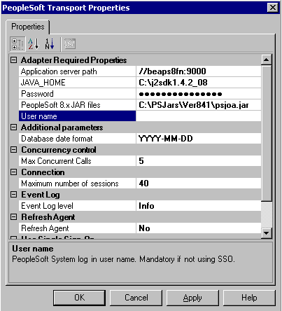  
  
4. Click **OK** twice to close the dialog boxes.  
  
## Step 3: Create a BizTalk Orchestration Project  
 Now you will create a BizTalk project in [!INCLUDE[btsVStudioNoVersion](../includes/btsvstudionoversion-md.md)] and configure an orchestration in the project to handle communication between [!INCLUDE[btsBizTalkServerNoVersion](../includes/btsbiztalkservernoversion-md.md)] and the PeopleSoft system. You will add send and receive ports, build the project, and then deploy the project.  
  
1. Open [!INCLUDE[btsVStudioNoVersion](../includes/btsvstudionoversion-md.md)] and create a new BizTalk project in the C:\LABS folder. On the **File** menu, click **New**. The **New Project** dialog box appears. In the **Templates** section, select **Empty BizTalk Server project.** Enter `PS_Test` as the unique project name, and then click **OK**.  
  
2. In Solution Explorer, right-click the project, click **Add**, and then click **Add Generated Items**. Select **Add Adapter Metadata** in the **Categories** pane, select **Add Adapter Metadata** on the **Templates** side, and then click **Add**.  
  
3. In the Add Adapter Wizard, select the **PeopleSoft Enterprise** adapter, select the **PeopleSoftSamplePort** send port that you created in the preceding procedure, and then click **Next**.  
  
    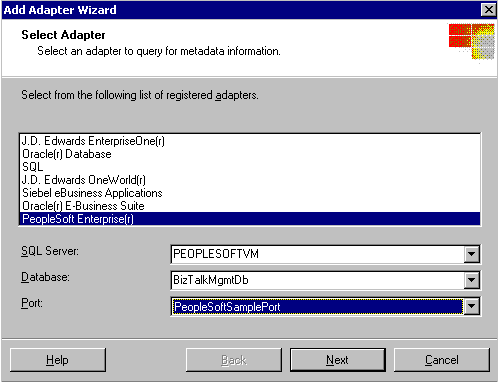  
  
4. On the **Select Services to Import** page, expand **PeopleSoft**, and then expand **CI**.  
  
    The PeopleSoft system is interrogated by the adapter using the Browsing Agent. When you expand **CI**, the BrowsingAgent.exe process starts (you can view it as running in Task Manager) and returns the services shown in the following figure.  
  
    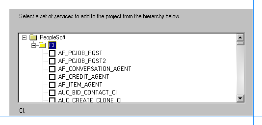  
  
   > [!NOTE]
   >  The PeopleSoft services obtained and displayed from your PeopleSoft system may be slightly different than the services displayed here.  
  
5. Scroll down, select **LOCATION**, and then click **Finish**.  
  
    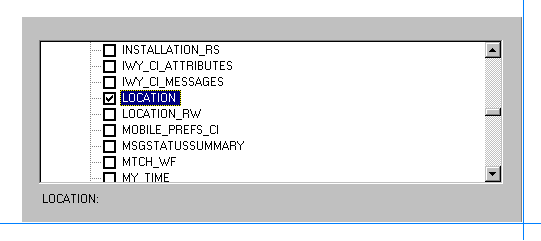  
  
6. In Solution Explorer, there is a new BizTalk orchestration and two new associated schema files. These files are created by the Add Adapter Wizard. Double-click the **BizTalk Orchestration.odx** file to open the orchestration.  
  
    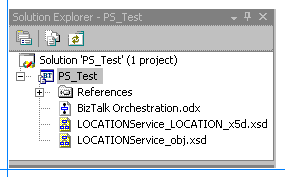  
  
   This orchestration accepts as input an XML file formatted for the PeopleSoft **Get** method and sends the XML file to the PeopleSoft system. The **Get** method retrieves location information from the PeopleSoft system and returns it to the BizTalk orchestration. The orchestration uses ports to facilitate this communication with the adapter and the PeopleSoft system. The ports you will configure here are for receiving and sending XML files. The outgoing XML file tells the PeopleSoft system that this is a **Get** operation. The incoming XML file returns the location information to the orchestration.  
  
   To complete the orchestration, you need to create and configure ports to receive and send the XML files. First, set up a new receive port to accept the initial XML input file that contains the **Get** method to start the orchestration.  
  
#### Configure a receive port  
  
1. Within the BizTalk Orchestration.odx file that you opened in the previous step, right-click the left port surface and then click **New Configured Port**. This starts the Port Configuration Wizard. On the **Welcome to the Port Configuration Wizard** page, click **Next**.  
  
2. On the **Port Properties** page, enter `FileIn` for **Name**, and then click **Next**.  
  
3. In the **Select a Port Type** page, select **Create a new Port Type**, and then enter or select the following property values:  
  
    **Port Type Name**: `FileInPort`  
  
    **Communication Pattern**: **One Way**  
  
    **Access Restrictions**: **Internal - limited to this project**  
  
4. Click **Next** to go to the **Port Binding** page, and then select the following property values:  
  
    **Port direction of communication**: **I'll always be receiving messages on this port**  
  
    **Port binding**: **Specify later**  
  
5. Click **Next**, and then click **Finish**. You will use the File adapter to accept this file as input from disk.  
  
   Next, create a send port to accept the XML file containing the location results from the call to the PeopleSoft **Get** method. The orchestration uses the File adapter to write that XML file to disk through this send port.  
  
#### Configure a send port  
  
1. Within the BizTalk Orchestration.odx file, right-click the left port surface and then click **New Configured Port**. This starts the Port Configuration Wizard. On the **Welcome to the Port Configuration Wizard** page click **Next**.  
  
2. On the **Port Properties** page, enter `FileOut` for **Name**, and then click **Next**.  
  
3. On the **Select a Port Type** page, select **Create a new Port Type**, and then enter or select the following property values:  
  
    **Port Type Name**: `FileOutPort`  
  
    **Communication Pattern**: **One Way**  
  
    **Access Restrictions**: **Internal - limited to this project**  
  
4. Click **Next** to go to the **Port Binding** page, and then select the following property values:  
  
    **Port direction of communication**: **I'll always be sending messages on this port**  
  
    **Port binding**: **Specify later**  
  
5. Click **Next**, and then click **Finish**.  
  
   Finally, create a send/receive port to send the initial XML input file containing the **Get** method to the PeopleSoft system. This port will also receive an XML file containing the location information that results from the **Get** method call on the PeopleSoft system.  
  
#### Configure a send/receive port  
  
1. Within the BizTalk Orchestration.odx file, right-click the right port surface and then click **New Configured Port**. This starts the Port Configuration Wizard. On the **Welcome to the Port Configuration Wizard** page, click **Next**.  
  
2. On the **Port Properties** page, enter `PeopleSoft_Port` for **Name**, and then click **Next**.  
  
3. On the **Select a Port Type** page, select **Use an existing Port Type**. For **Available Port Types**, select **PS_Test.LOCATION**, and then click **Next**.  
  
    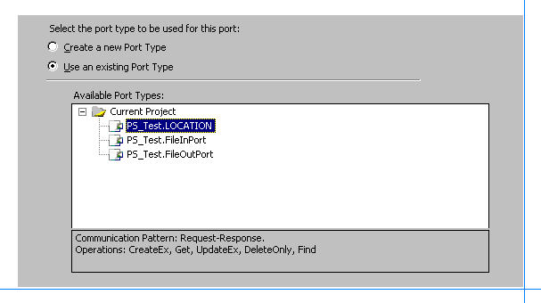  
  
4. Click **Next** to go to the **Port Binding** page, and then select the following property values:  
  
    **Port direction of communication**: **I'll always be sending a request and receiving a response**  
  
    **Port binding**: **Specify later**  
  
5. Click **Next**, and then click **Finish**.  
  
   Displayed on the port surface are the new port and the available methods for the PeopleSoft Location service. Later you will specify the PeopleSoft adapter to send and receive files from the PeopleSoft system.  
  
   Now insert two **Send** shapes and two **Receive** shapes into the orchestration to link to the ports you just created.  
  
#### Add Send and Receive shapes  
  
1. Drag a **Receive** component from the Toolbox and drop it immediately below the start of the orchestration (the green circle). Click the **Receive** shape, and in the Properties window, enter `FromDisk` for the **Name**, and set **Activate** to `true`. Doing so will activate the orchestration when an incoming document is received on this receive port.  
  
2. Drag a **Send** component from the Toolbox and drop it immediately below the **FromDiskReceive** shape. Click the new **Send** shape, and in the Properties window, enter `ToPS` for the **Name**.  
  
3. Drag a **Receive** component from the Toolbox and drop it immediately below the **To_PS**<strong>Send</strong> shape. Click the **Receive** shape, and in the Properties window, enter `FromPS` for the **Name**.  
  
4. Drag a **Send** component from the Toolbox and drop it immediately below the **From_PSReceive** shape. Click the new **Send** shape, and in the Properties window, enter `ToDisk` for the **Name**.  
  
   Before you can connect these shapes to logical ports, you need to define the message types to be processed. The adapter needs both an incoming (**Request** method) message and an outgoing (**Response** method) message. The messages for each of the methods are different.  
  
   In this orchestration, you are only using the **Get-Request** and **Get-Response** messages. If the orchestration were updating the data, say by using the **UpdateEx** method, it would require different Request/Response messages.  
  
#### Define and assign messages to ports  
  
1.  On the left port surface, click **Request** on the **FileIn** port. In the Properties window, expand **Message Type**, expand **Multi-part Message**, and then click **PS_Test.Get**.  
  
2.  On the left port surface, click **Request** on the **FileOut** port. In the Properties window, expand **Message Type**, expand **Multi-part Message**, and then click **PS_Test.GetResponse**.  
  
     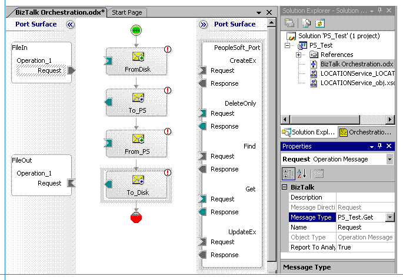  
  
3.  Select the **FileIn** port and drag its outgoing send arrow to the incoming converse receive arrow on the **FromDisk** shape.  
  
4.  Select the **FileOut** port and drag its incoming converse receive arrow to the outgoing send arrow on the **ToDisk** shape.  
  
5.  Rename existing generic message names to more descriptive names to adhere to good application design principles. In Solution Explorer, click the **Orchestration View** tab. Under **Messages**, change the identifier for **Message_1** to **PS_Msg**. Change the identifier for **Message_2** to **PS_Resp**.  
  
     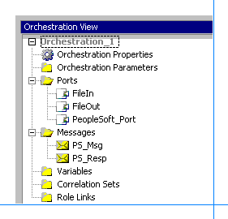  
  
     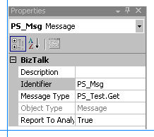  
  
6.  Highlight the **To_PS** send shape and set its **Message** property to **PS_Msg**.  
  
7.  Highlight the **From_PS** receive shape and set its **Message** property to **PS_Resp**.  
  
8.  Connect the **To_PS** send shape to the **Request** portion of the **Get** method on the **PeopleSoft_Port** port.  
  
9. Connect the **From_PS** send shape to the **Response** portion of the **Get** method on the **PeopleSoft_Port** port.  
  
     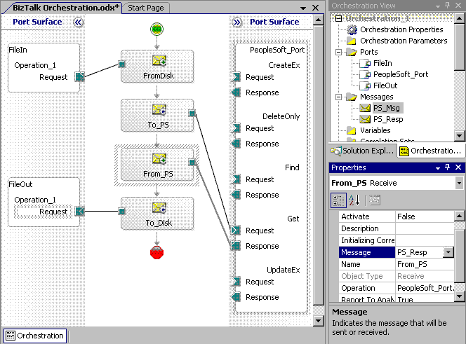  
  
## Step 4: Build and Deploy the Project  
 Now the BizTalk project is complete and you can build and deploy it in [!INCLUDE[btsVStudioNoVersion](../includes/btsvstudionoversion-md.md)].  
  
1.  In Visual Studio, point to **Visual Studio Tools**, and then select Visual Studio Command Prompt**.  
  
2.  To build the project, you need a strong name key file.At the command prompt, enter the following to create a strong name key file:  
  
     **sn -k labs.snk**  
  
3.  In Solution Explorer, right-click the **PS_Test** project and then click **Properties** to launch the Project Designer for the project..  
  
4.  Click the **Signing** tab.  
  
5.  Select **Sign the assembly** option, click drop-down list for the **Choose a strong name key file** option, and then click **Browse**.  
  
6.  Browse to select the key file: **labs.snk**, and then click **Open**.  
  
7.  Click **Deployment** tab in the Project Designer.  
  
8.  Set the **Application Name** to `PS_Test`.  
  
9. In Solution Explorer, right-click the **PS_Test** project, and then click **Build.**  
  
10. After the build completes successfully, right-click the **PS_Test** project, and then click **Deploy**.  
  
## Step 5: Test the Application and Viewing the XML Output  
 Now you will test the application that you have created and deployed. You will create the XML file that starts the orchestration process, and then you will configure folders to receive and send XML files within the application. After you have configured the application, you will run it and view the XML files that the orchestration returns.  
  
#### Generate the XML file for the query  
  
1.  In Solution Explorer, double-click **LOCATIONService_LOCATION_x5d.xsd** to open the file.  
  
2.  Right-click **LOCATIONService_LOCATION_x5d.xsd** and then click **Properties**. For the **Output Instance Filename** enter the following path and file name for the sample XML:  
  
     `C:\LABS\PS_TEST\SAMPLEQUERY.XML`  
  
3.  Click **OK.** In the Properties window, select **\<Schema\>** and set **Root Reference: Get**.  
  
4.  Right-click **LOCATIONService_LOCATION_x5d.xsd** and then click **Generate Instance**. This generates the **SampleQuery.xml** file. This file will be dropped in the receive location as input to the adapter to start the orchestration process.  
  
     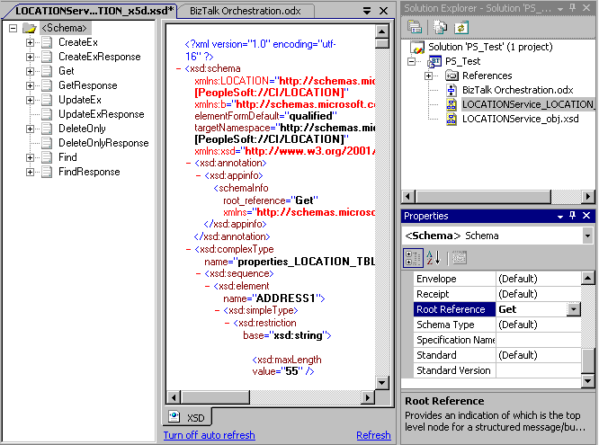  
  
#### Configure and start the BizTalk application  
  
1. Configure folders for receiving the incoming files and sending the outgoing files. Go to **C:\LABS\PS_TEST** and create two new subfolders named `FileIn` and `FileOut`.  
  
2. In the [!INCLUDE[btsBizTalkServerNoVersion](../includes/btsbiztalkservernoversion-md.md)] Administration console, expand **Console Root**, expand **[!INCLUDE[btsBizTalkServerNoVersion](../includes/btsbiztalkservernoversion-md.md)] Administration**, expand **BizTalk Group**, expand **Applications**, right-click **PS_Test** and then click **Configure**.  
  
    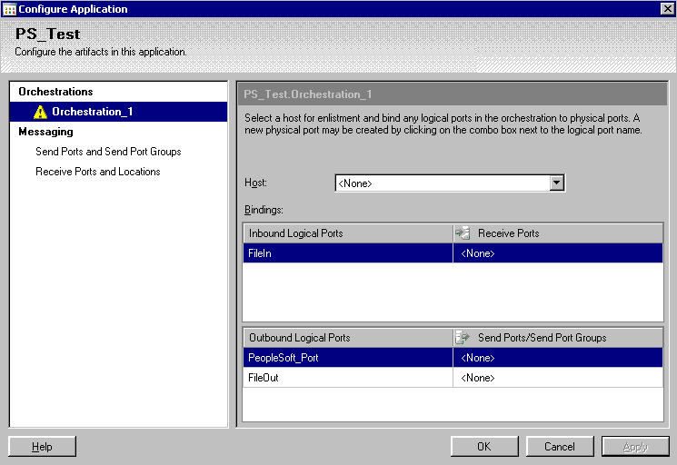  
  
3. Select **Orchestration_1** and click the **Host** drop-down box. Select **BizTalkServerApplication**.  
  
4. Under **Receive Ports**, click **\<None\>**. In the drop-down list, select **New Receive Port**.  
  
5. For **Name**, type `FileInPort`, and then click **OK**. A message box appears stating that you need to designate a receive location. Click **OK**, and then click **New**.  
  
    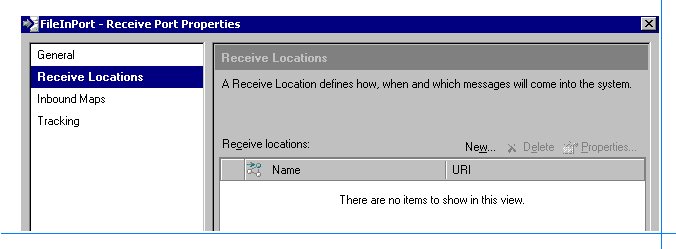  
  
6. Type or select the following values for the properties:  
  
    **Name**: `FileInLoc`  
  
    **Type**: **File**  
  
    **Receive Handler**: **BizTalkServerApplication**  
  
    **Receive Pipeline**: **XMLReceive**  
  
    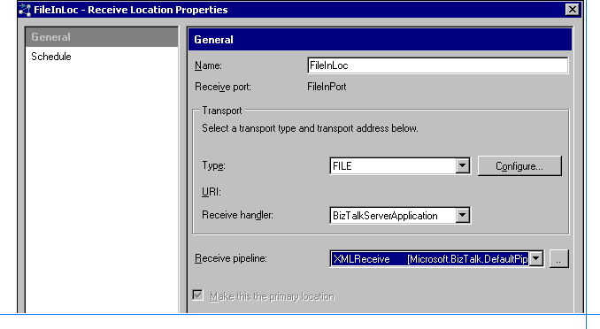  
  
7. Click **Configure** and type `C:\LABS\PS_TEST\FILEIN` for **Receive Folder**, and then click **OK** three times.  
  
    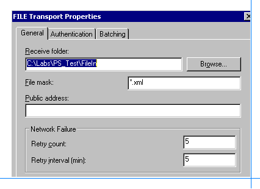  
  
8. Click **\<None\>** for **PeopleSoft_Port** in the drop-down list.  
  
9. Select **New Send Port** and then select or type the following values for the properties.  
  
     **Name**: `PS_Test_Port`  
  
     **Type**: **PeopleSoft**  
  
     **Send Handler**: **BizTalkServerApplication**  
  
     **Pipelines**: **XMLTransmit** and **XMLReceive**  
  
10. Click **Configure**, and then enter the following property values:  
  
    1. **Application server path**: **//Servername:9000**  
  
        Servername is your application server. This is the specific server name or IP address and port number for this PeopleSoft system.  
  
    2. **JAVA_HOME**: **C:\J2SDK1.4.2_08**  
  
        This path is specific to the Java SDK installation on the [!INCLUDE[btsBizTalkServerNoVersion](../includes/btsbiztalkservernoversion-md.md)].  
  
    3. **Password**: \<enter your PeopleSoft password\>  
  
    4. **PeopleSoft 8.x JAR files**: **C:\PSJARS\VER841\PSJOA.JAR**  
  
       **User name:** \<enter your PeopleSoft UserID\>  
  
11. Click **OK** twice to close the dialog boxes.  
  
12. In the Configure Applicationwindow, click **\<None\>** for **FileOut** in the drop-down list.  
  
13. Select **New Send Port** and type or select the following values for the properties:  
  
     **Name**: `FileOutPort`  
  
     **Type**: **File**  
  
     **Send Handler**: **BizTalkServerApplication**  
  
     **Send Pipeline**: **XMLTransmit**  
  
14. Click **Configure** and type`C:\Labs\PS_Test\FileOut` for **Destination Folder.** Keep **%MessageID%.xml** for **File Name** because this results in a unique file for each message.  
  
15. Click **OK** three times to close the dialog boxes.  
  
16. In the [!INCLUDE[btsBizTalkServerNoVersion](../includes/btsbiztalkservernoversion-md.md)] Administration console,right-click the **PS_Test** application and then click **Start**.  
  
       
  
#### Test the orchestration  
  
1.  In the **C:\Labs\PS_Test** directory, change the **Samplequery.xml** file to the following:  
  
    ```  
    <ns0:Get xmlns:ns0="http://schemas.microsoft.com/[PeopleSoft://CI/LOCATION]">  
      <ns0:SETID>SHARE</ns0:SETID>  
      <ns0:LOCATION>AUS01</ns0:LOCATION>  
      <ns0:getHistory>true</ns0:getHistory>  
    </ns0:Get>  
    ```  
  
    > [!NOTE]
    >  The **SHARE** data value will be used on all systems. However the value you will use for **Location** in this XML file must exist on your system. You found this out in Lab 1.  
  
2.  Save the changes and copy the file to the **C:\Labs\PS_Test\FileIn** folder. This is the receive location for FileIn that starts the orchestration process.  
  
3.  In a few seconds, an XML file should appear in the **C:\Labs\PS_Test\FileOut** folder. This should contain the data from the record where the location is AUS01.  
  
     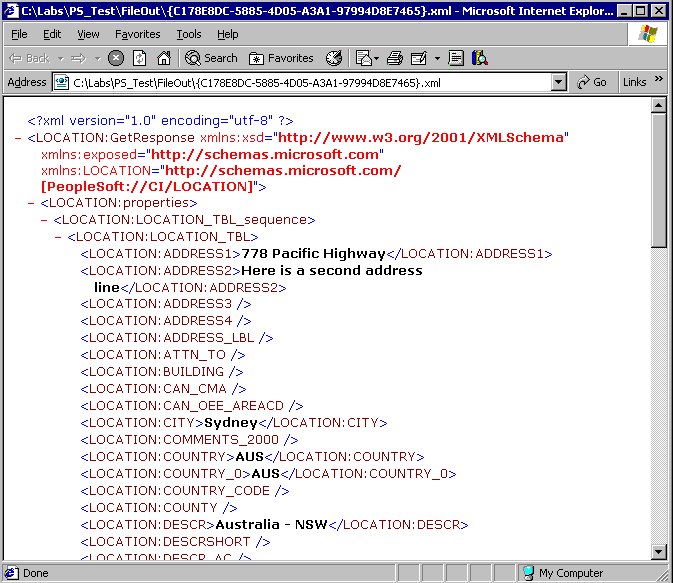  
  
     This returned record data should match what was returned by the query against the PeopleSoft system in PeopleSoft Lab 1. By comparing the values you obtained in Lab 1, specifically the **Address1** and **Address2** lines, to what is shown here in the **\<LOCATION:ADDRESS1\>** and **\<LOCATION:ADDRESS2\>** fields, you can verify that the **Get** method worked properly.  
  
## Summary  
 In this lab, you first verified that the prerequisites were set up correctly to access the PeopleSoft system. Then you used [!INCLUDE[btsVStudioNoVersion](../includes/btsvstudionoversion-md.md)] to create a new BizTalk project containing an orchestration. You configured the BizTalk orchestration to use the PeopleSoft adapter to get data from the PeopleSoft system. To configure the orchestration, you created send, receive, and send/receive ports. You bound these ports to the PeopleSoft adapter, and assigned messages to the appropriate ports.  
  
 After you completed the BizTalk project, you used [!INCLUDE[btsVStudioNoVersion](../includes/btsvstudionoversion-md.md)] to build and deploy it. You then configured your new application and ran it to get data from the PeopleSoft system. To verify that the application worked correctly, you compared its output XML file to the file that you received from the PeopleSoft system in Lab 1.