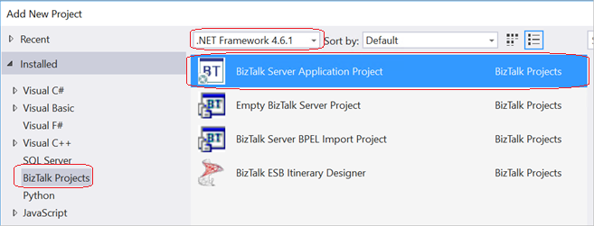
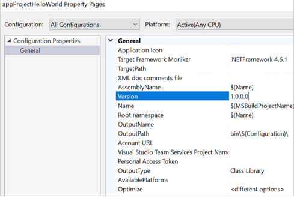
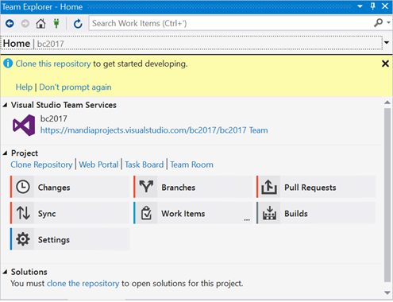

# Step 1: Add the BizTalk Server Application project in Visual Studio

When you build your applications using Visual Studio Team Services, a new BizTalk project file is created – .btaproj. This new project holds all the BizTalk applications that you build and deploy using the VSTS build and release features. 

The BizTalk Application Project includes the `BizTalkServerInventory.json` file. In this file, add your BizTalk assemblies, add the binding files for your BizTalk application, and then set a deployment sequence. 

## Before you begin

* These steps assume you have an existing BizTalk project. If not, you can use the HelloWorld SDK sample (\Program Files (x86)\Microsoft BizTalk Server *yourVersion*\SDK\Samples\Orchestrations\HelloWorld). 
* Have the path to the XML binding file to your BizTalk project ready. 
* Know your VSTS account, your collection, and your team project details.
* Be familiar with git concepts, including cloning and working with repositories. 

## Add the application project

1. On the BizTalk Server, open your solution (ProjectName.sln) in Visual Studio. Do not select Visual Studio Blend.

2. In solution explorer, right-click your project, and select **Build**. Be sure your build succeeds. Right-click your project, and select **Deploy**. Be sure your deploy succeeds.

3. Right-click your solution, select **Add**, and select **Add New Project**.

4. Select the **BizTalk Projects** tab, select **.NET Framework 4.6.1** from the drop-down list, and select **BizTalk Server Application Project**. Enter a name (e.g. appProjectHelloWorld), and select **OK**:  

    

5. In Solution Explorer, right-click your newly-added application project (.btaproj), select **Add**, select **Reference**. Expand the **Projects** tab, and check your BizTalk project (the project you are deploying using VSTS). Select **OK**.  
    Once added, expand **References** under your application project (e.g. appProjectHelloWorld) to see the BizTalk project you just added. 

6. In Solution Explorer, right-click your application project (.btaproj), select **Add**, select **Existing Item**, and **Add** your binding XML file.

7. Open the properties of binding.xml, and set **Copy to Output Directory** to **Copy always**. **Save** your changes:  

    

8. Optional. Right-click your newly-added application project, and select **Properties**. Customize the **Application Name** you want displayed in BizTalk Administration:  

    

## Configure the JSON template

1. In Visual Studio, in your application project (.btaproj), open the `BizTalkServerInventory.json` file. 

2. The template includes the following sections: 

    | | |
    |---|---|
    |BizTalkAssemblies | The assemblies used in your applications |
    |BindingFiles | The binding files you are referencing|
    |DeploymentSequence | The sequence for the elements to be installed|
    
    Sample template: 
    
    

    > [!IMPORTANT]
    > Depending on the complexity of your solution, the elements you want in the build must be referenced in this JSON template file.

3. In `BizTalkAssemblies`, add the assemblies used by your BizTalk project: 

    ```json
    "BizTalkAssemblies": [
        {
            "Name": "AssemblyName",
            "Path": "PathToAssembly
        }
    ]
    ```

4. In `BindingsFiles`, add the binding files for your BizTalk project: 

    ```json
    "BindingsFiles": [
        {
            "Name": "Binding File Name",
            "Path": "PathToBindingFile
        }
    ]
    ```

5. In `DeploymentSequence`, add the application names in the order you want them deployed, and installed on the [!INCLUDE[btsBizTalkServerNoVersion_md](../includes/btsbiztalkservernoversion-md.md)]: 

    ```json
    "DeploymentSequence": [
        "NameOfFirst",
        "NameOfSecond",
        "NameOfThird"
    ]
    ```

6. **Save** your changes. When finished, your .json file looks like the following: 

    ```json
    {
      "$schema": "C:\\Program Files (x86)\\Microsoft BizTalk Server 2016\\Developer Tools\\BizTalkServerAppplicationSchema.json",
      "BizTalkAssemblies": [
        {
          "Name": "HelloWorld",
          "Path": "HelloWorld\\bin\\Release\\HelloWorld.dll"
        }
      ],
      "BindingsFiles": [
        {
          "Name": "HelloWorldBinding",
          "Path": "HelloWorld\\HelloWorldBinding.xml"
        }
      ],
      "DeploymentSequence": [
        "HelloWorld", "HelloWorldBinding"
      ]
    }
    ```

7. **Optional**. Right-click your application project (e.g. appProjectHelloWorld), and select **Properties**. You can set the Debug or Release version to a new value. We don’t in these steps, but be aware you can do this.  

    

8. Right-click your application project (e.g. appProjectHelloWorld), and select **Build**. If it succeeds, a zip file is created in **_yourApplicationProject_\bin\debug** folder:  

    

9. Select your solution, and select the **Team Explorer** tab. Under VSTS, select **Connect**.  

    

10. Select your VSTS account, your collection, and your team project. Select **OK**. If you didn’t create a VSTS account yet, then create one ([Step 2: Create the VSTS token](feature-pack-create-vsts-token.md) provides some guidance). Once it's created, come back to this step, and connect.  

    

11. When you connect, you may get a prompt to clone this repository. Select the **Clone this repository** link.  

    

12. Note the URL and paths, and select **Clone**:  

    

Once completed, the Visual Studio Team Service deployment task honors the required files and the install sequence. 

> [!TIP]
> If you make changes to your project after you clone in git, you can **Stage** your changes, and then **Push**, all within Visual Studio. 

## What you did

In your BizTalk project, you added a BizTalk Application project (.btaproj). This project is used to automate deployments of your BizTalk Server projects using VSTS. After you created the application project, you added a reference to your BizTalk project. Then, you updated a JSON file that tells the automated deployment what DLLs to deploy, which binding file to use, and the order to deploy the applications. 

## Next steps
[Step 2: Create the VSTS token](feature-pack-create-vsts-token.md)  
[Step 3: Create the build and release definitions](feature-pack-add-build-release-definitions.md)  
[Configure environmental tokens and variables](configure-environmental-tokens-and-variables-for-automatic-deployment.md)
