# Step 3: Create the build and release definition

The build and release definitions are Azure DevOps tasks, and should probably be done by a Azure DevOps admin. The build definition builds your project within your git repository, and the release definitions deploys it to your BizTalk Server environment. 

## Before you begin
Complete [Step 2 - Create VSTS token and install agent](feature-pack-create-vsts-token.md).

## Add the Build tasks
1. In your project, select **Pipelines** > **Create Pipeline**:

    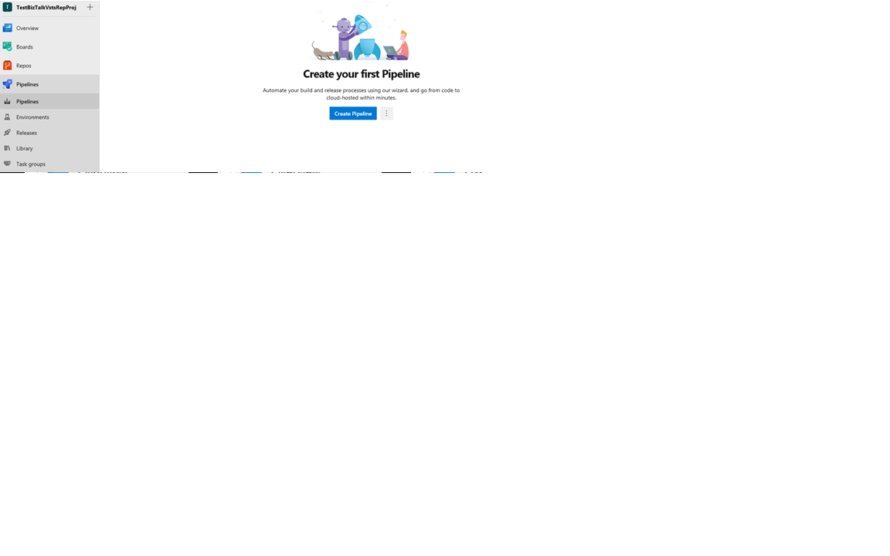

    Use the classic editor to create a pipeline without YAML:

    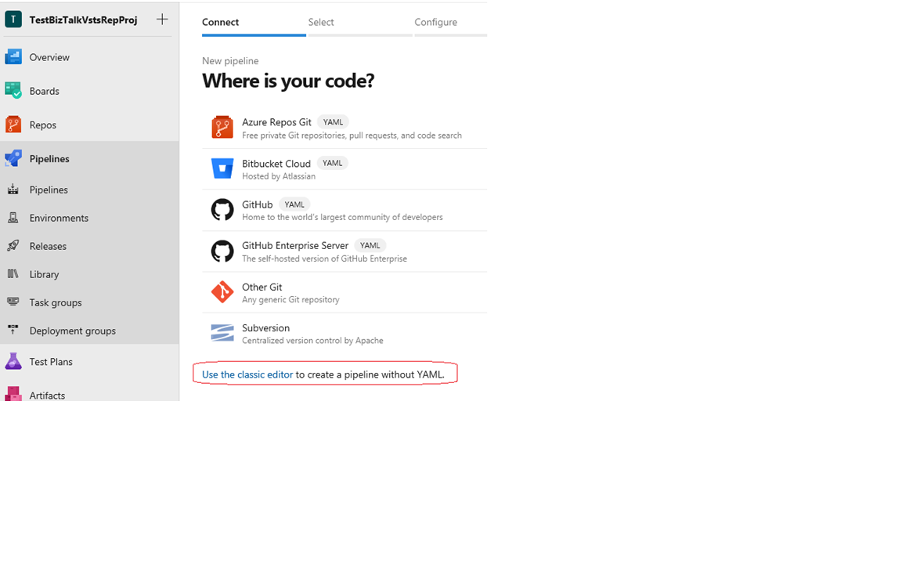

    Select **Azure Repos Git** > **Continue**:

    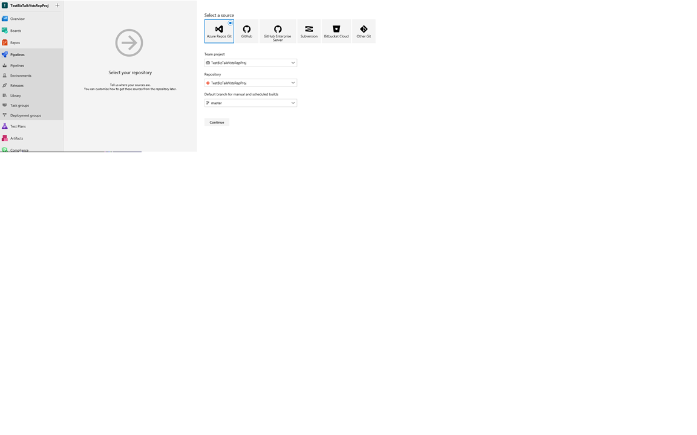

2. Select the **Empty** template > **Apply**:  

    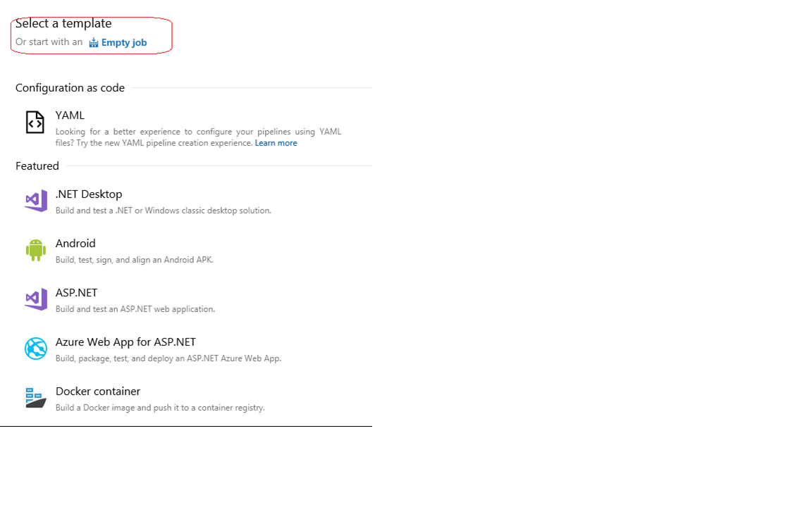
 
3. Set the **Agent Pool** to **Default**: 

    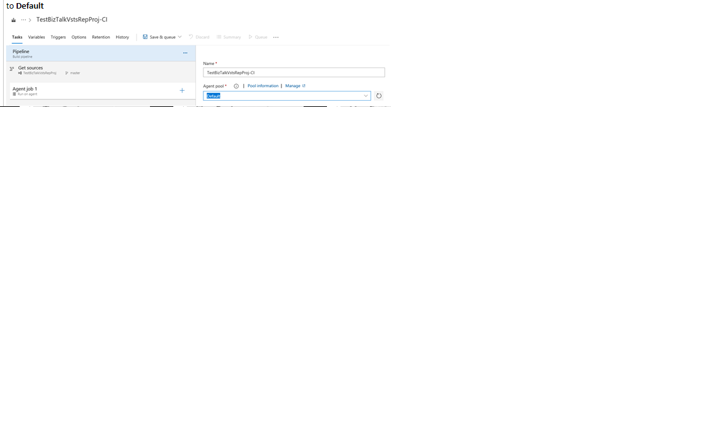

4. In **Phase 1**, add a task, select **Visual Studio Build**, and select **Add**:

    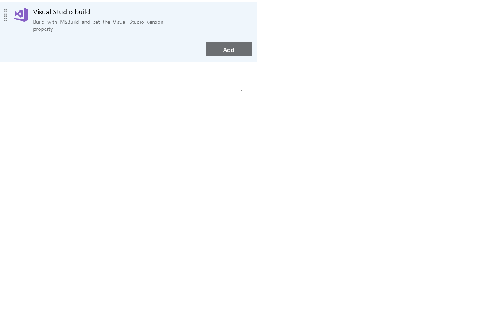

5. Click the Visual Studio Build task you just added, and set the following properties:  

    | Property | Set to |
    | --- | --- | 
    | Display name | *YourProjectName* Build solution **\*.sln | 
    | Visual Studio version | Visual Studio 2015 | 
    | MSBuild Architecture | MSBuild x86 | 

    Your properties look similar to the following:

    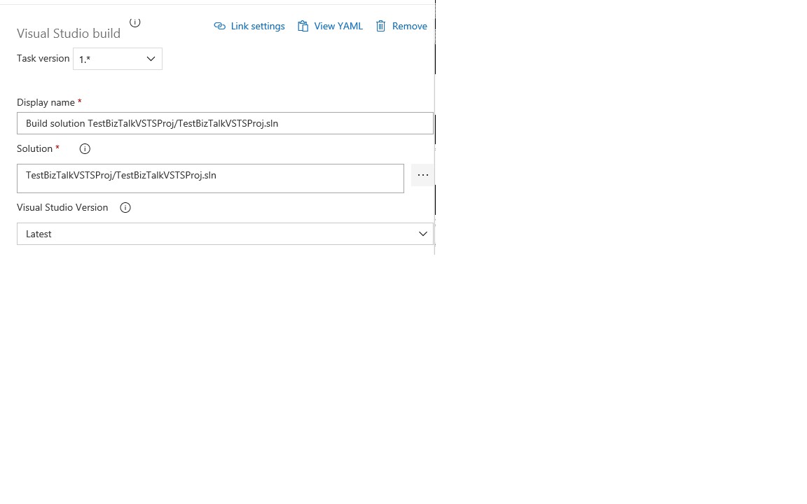

6. In **Phase 1**, add a task, select **Publish Build Artifacts**, and select **Add**: 

    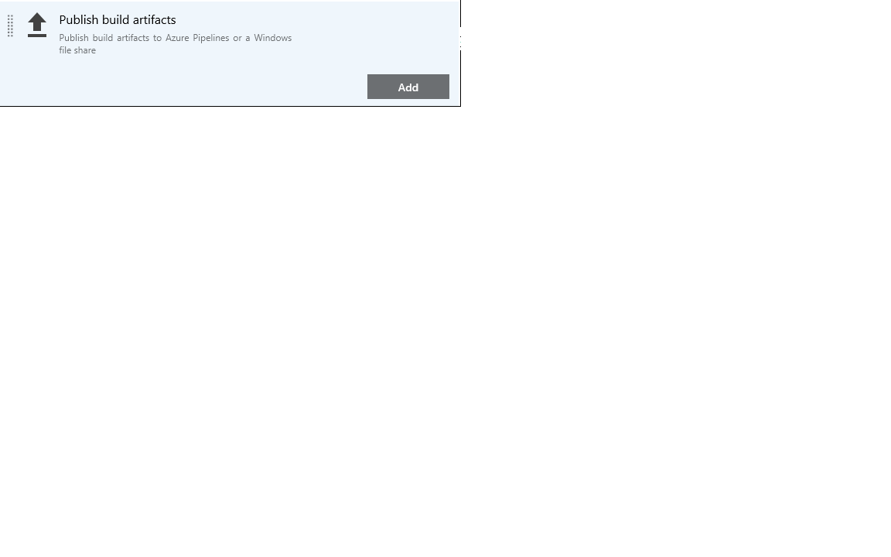

7. Select the **Publish Artifact** task, and enter your preferred **Display name**. For **Path to publish**, select the **...**  button, and choose the application project folder (e.g. appProjectHelloWorld). Select **OK**.

    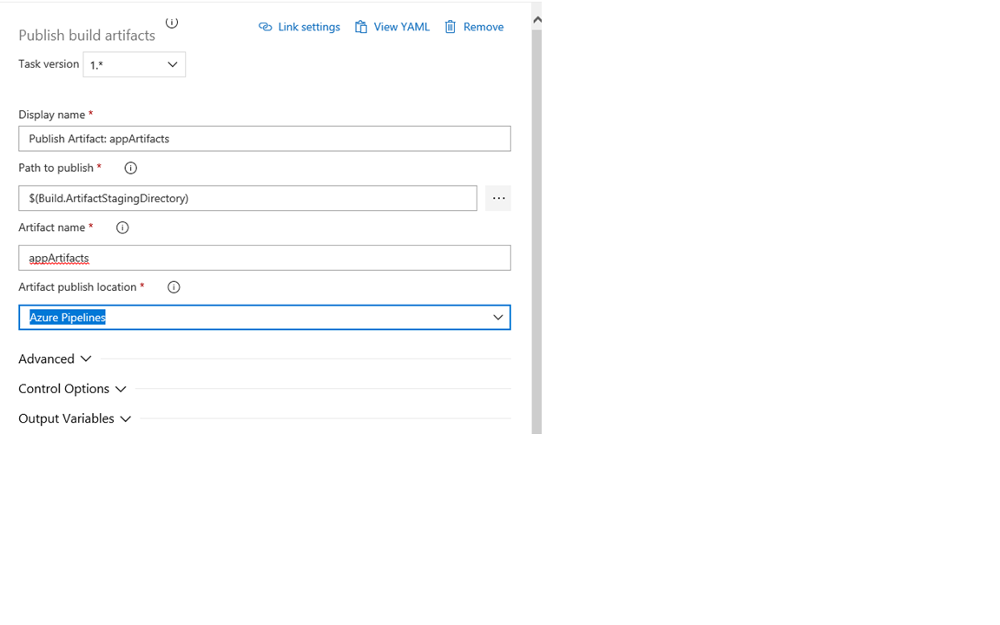

8. The **Artifact Name** can be anything you want. Select **Save**. 

9. Go to **Triggers**, and set the **Trigger status** to **Enabled**:  

    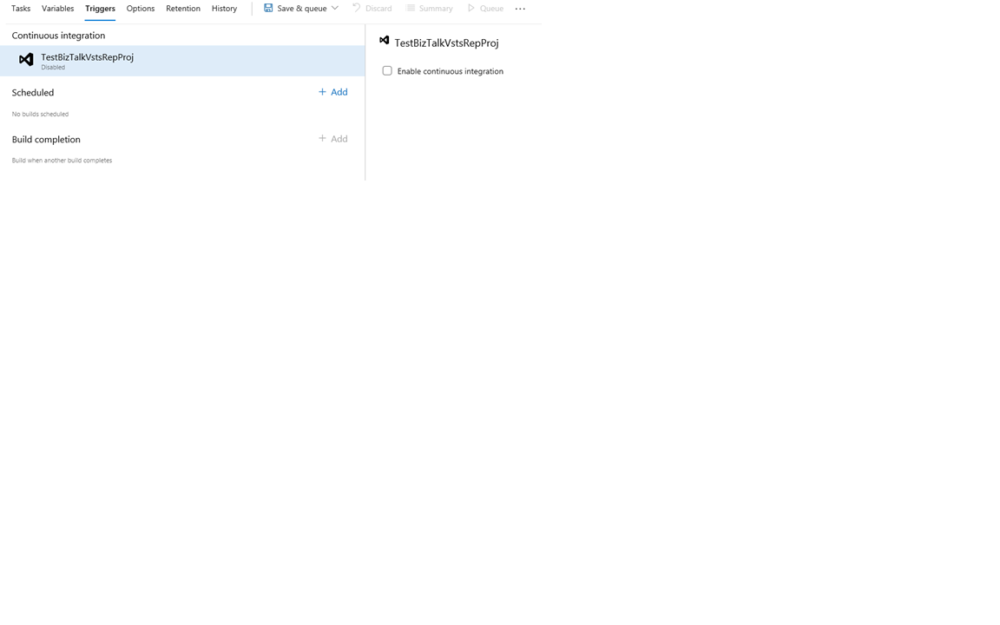

10. **Save & Queue** to test your build definition. When you queue, you are prompted for the agent queue and your branch. Select the **Default** agent queue, and choose your branch. Select **Queue**.  

    

11. A new build is started, and you can select it to check for a success or failure. 

## Add the release tasks

When the build succeeds, the release definition deploys your application to your BizTalk Server. 

1. Select the **Releases** tab > **New pipeline**. 

    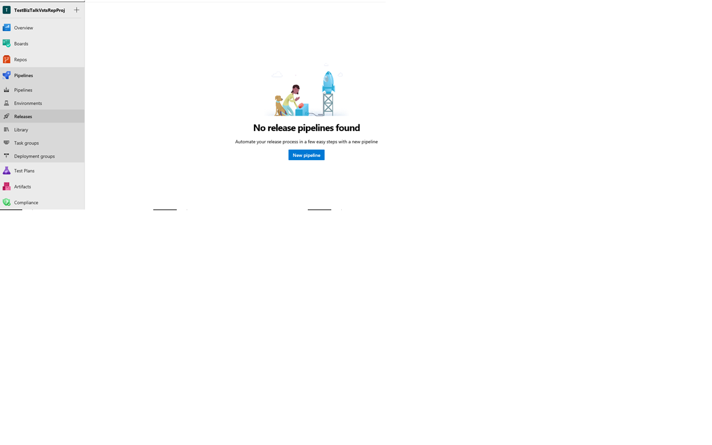

2. Select the **Empty** template > **Apply**:

    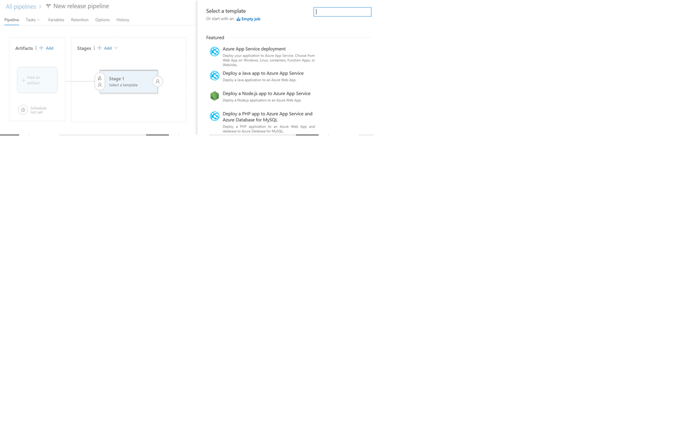

3. Change the **Environment name** to **Dev**, or whatever you want to call it. 

4. Select **Add artifact**, select your project, your build definition, and select **Add**: 

    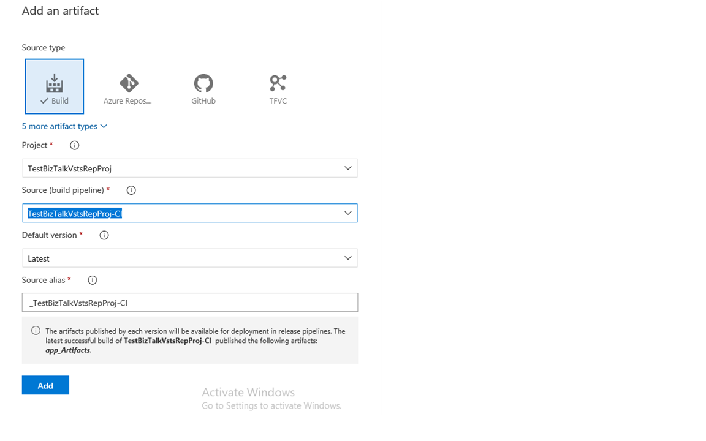

5. Go to the **Tasks** tab, add a new task: 

    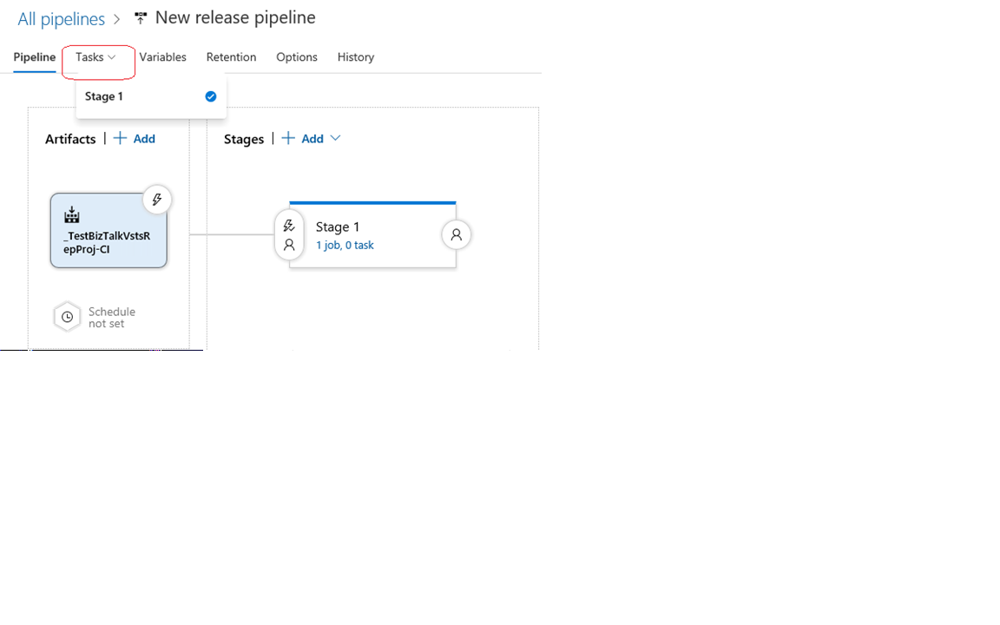

6. From the list, filter the results, select the **BizTalk Server Application Deployment** task > **Add**:  

    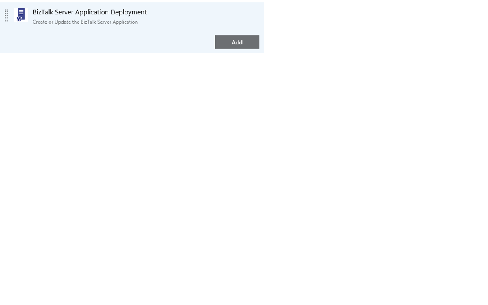

    If **BizTalk Server Application Deployment** isn't listed, then install it at [Deploy BizTalk Application](https://marketplace.visualstudio.com/items?itemName=ms-biztalk.deploy-biztalk-application).

7. Select the **Deploy** task, and enter the values: 

    **Operation Name**: Your options:   
        - **Create new BizTalk Application**: Deploys a new application. If the application already exists, it uninstalls the current applications (full stop), and installs the new application. If continuous integration is enabled, it automatically redeploys the application when it is updated in the repository.   
        - **Update an existing BizTalk Application**: Appends changes, such as schemas, to an already running application. It does not require a full redeploy of the application.  
        - **Install BizTalk Server Application**: [Install the applications](../core/how-to-install-a-biztalk-application.md), and you enter the BizTalk management computer name, and the deployment package path.  

     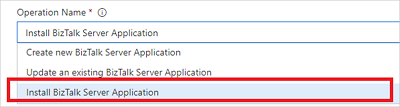

    **Application Name**: The text you enter will be the application name in BizTalk Administration. Do **not** enter BizTalk Application 1.

    **Deployment package**: Select the zip file to your application project, and select **OK**. 

8. Select the **Agent phase** task. Select the **Default** Agent queue. **Save** your changes.

9. Select **Release** > **Create release**:  

    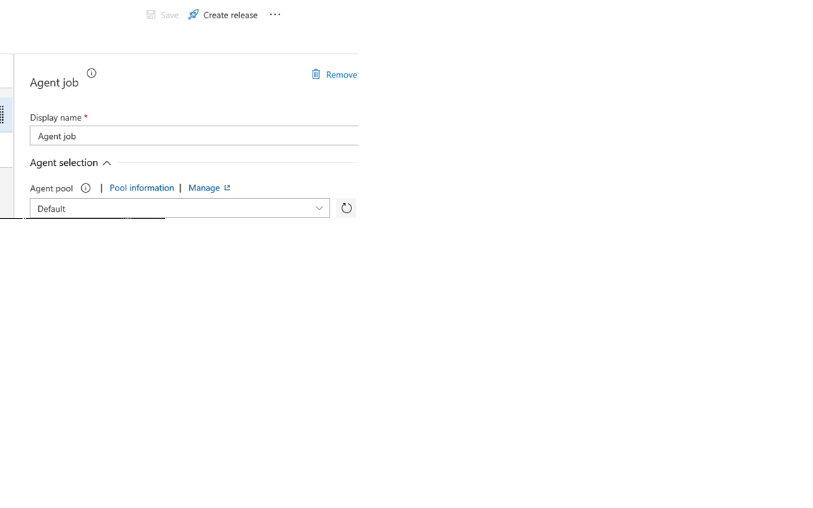

10. Select **Queue**. Check the status by clicking the release link. If it fails, the error displays. If it succeeds, the application is added to the BizTalk Administration console. 

## What you did

In VSTS, you created a build definition that builds your application within Git or Team Foundation Version Control (whatever you chose). When changes are made within the source control, the changes are automatically detected, and you can push them. After the build completes, you created a release definition that deploys the application to BizTalk Server, which you can see in BizTalk Server Administration. 

## Next step
At this step, you're done. If you prefer, you can create environmental tokens within your BizTalk XML binding file, and create variables within VSTS that match the environmental tokens. See [Configure environmental tokens and variables](configure-environmental-tokens-and-variables-for-automatic-deployment.md) for the details. 
