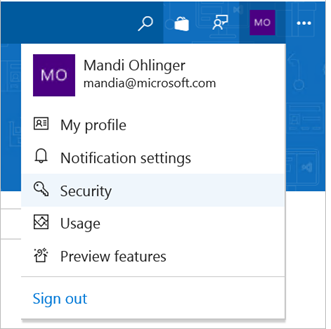
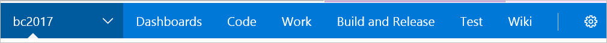
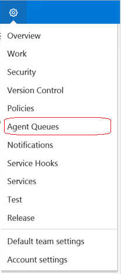
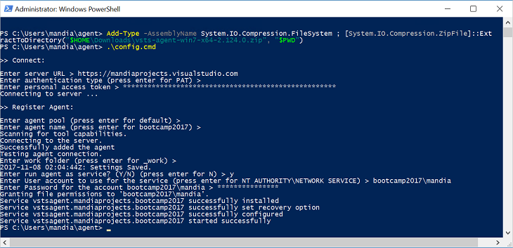

# Step 2: Create the token & install the agent

A personal access token (PAT) is created in Visual Studio Team Services. This token is your password, and is used by the VSTS build agent to authenticate. The token is only displayed when you create it. After that, it isn't displayed anymore. So once you create it, save it to another file in a remember-able location. 

More info on PAT at [Authenticate access with personal access tokens for VSTS and TFS](https://docs.microsoft.com/vsts/accounts/use-personal-access-tokens-to-authenticate). 

After you create the token, you install the build agent, and configure it to use this token. 

## Before you begin
Complete [Step 1 - Add Application project and update json](feature-pack-add-application-project.md).

## Sign into VSTS, and create the token
1. Go to [https://app.vsaex.visualstudio.com/go/profile](https://app.vsaex.visualstudio.com/go/profile), and sign-in with your work or school account. After you sign in, your VSTS account is listed. In the following example, the account is **mandiaprojects.visualstudio.com**.  

    

    If you don’t have an account, select **Create new account**, and enter a name. To manage your code, choose your personal preference between **Git or Team Foundation Version Control**. When finished, your new account is created, and a site similar to *https://YourAccountName.visualstudio.com/MyFirstProject* opens:  

    

2. Open your VSTS account (https://<em>YourAccountName</em>.visualstudio.com). Select your icon in the top right-side corner, and select **Security**: 

    

3. **Personal access tokens** automatically opens. If you have an existing agent, select it, and confirm **Agent Pools (read, manage)** is selected:

    

    > [!IMPORTANT]
    > You must know the access token. If you don’t, and didn’t note it anywhere, it cannot be retrieved. In this situation, create a new agent. 

    If you don’t have an existing agent, select **Add**, enter a description, set the expiration date, and select your account. In **Selected scopes**, select **Agent Pools (read, manage)**: 

    

    Select **Create Token**. **Note the token value; you need in future steps.**

4. Select **Code**, and select **Clone in Visual Studio**:  

      

    

5. Visual Studio opens. Within Visual Studio, open your BizTalk solution. 

## Install the Build Agent

The build agent is installed on the BizTalk development computer. If using deployment groups, the build agent is installed on all the BizTalk servers you want to deploy to. The following steps show you how to install the build agent on a single computer. For details on using deployment groups, see [Deployment groups](https://docs.microsoft.com/vsts/build-release/concepts/definitions/release/deployment-groups/index).

1. Open your VSTS account and project, which is something like *https://YourAccountName.visualstudio.com/MyFirstProject*. Select the settings icon, and select **Agent Queues**:  

    

2. Select the **Default** agent, and select **Download Agent**. Select the **Download** button, and save the file to your **Downloads** folders.

3. The install steps automatically open. Follow those steps for the most up-to-date details. Here is some guidance: 

   1. Open Windows PowerShell as Administrator.

   2. To create the agent, enter: 

       ```powershell
       PS C:\> mkdir agent ; cd agent  

       PS C:\agent> Add-Type -AssemblyName System.IO.Compression.FileSystem ; [System.IO.Compression.ZipFile]::ExtractToDirectory("$HOME\Downloads\vsts-agent-win7-x64-2.124.0.zip", "$PWD")
       ```

       The vsts-agent file version changes. So follow the VSTS install steps for specific details. After you hit enter, it may take a couple of minutes for the prompt to return. 

   3. To configure the agent, enter: 

       ```powershell
       PS C:\agent> .\config.cmd
       ```

   4. Enter the following details:  


      |        Property        |                                                                      Value                                                                       |
      |------------------------|--------------------------------------------------------------------------------------------------------------------------------------------------|
      |       Server URL       |                                                     https://{your-account}.visualstudio.com                                                      |
      |  Authentication Type   |                                                                       PAT                                                                        |
      | Personal access token  |                                                              Paste your VSTS token                                                               |
      |       Agent pool       |                                                              Enter for the default                                                               |
      |       Agent name       |                                                              Enter for the default                                                               |
      |        Replace         |                                                  *Only displays if you have an existing agent*                                                   |
      |      Work folder       |                                                              Enter for the default                                                               |
      | Run agent as a service |                                                                        Y                                                                         |
      |      User account      | This is up to you, but you may run into a permissions issue. <br/><br/>Consider entering your current logged-on account, which is a local Admin. |


   5. When finished, your PowerShell window looks like the following:  

       

4. Open services.msc to see the new service. It should be running:  

    

    If the service fails to start, [remove and re-configure an agent](https://docs.microsoft.com/vsts/build-release/actions/agents/v2-windows) using an account with more privilages.


## What you did

You signed into your VSTS account, and created a security token. This security token is like a password, and gives you access to your VSTS project. It's only displayed once, so be sure you saved it. You also cloned your VSTS project into Visual Studio, and created an agent that runs as a service on your BizTalk development computer. This agent uses the security token. 

## Next steps
[Step 3: Create the build and release definitions](feature-pack-add-build-release-definitions.md)  
[Configure environmental tokens and variables](configure-environmental-tokens-and-variables-for-automatic-deployment.md)