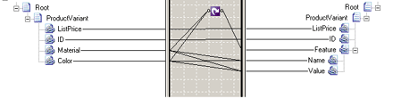

# Flat Schema to Catalog

## Overview
You can use the **Looping** functoid to convert a flat schema to an hierarchical schema by mapping a single record to multiple records. This is a common operation in converting flat schemas to Microsoft Commerce Server catalogs.  
  
 The following code shows a portion of a catalog listing product variants with each variant as its own record.  
  
```  
<ns0:Root xmlns:ns0="http://ValueMappingFlattening.FlatCatalog">  
    <ProductVariant ListPrice="99.99" ID="45-01" Material="Leather" Color="Black" />  
    <ProductVariant ListPrice="69.99" ID="45-02" Material="Vinyl" Color="Brown" />  
</ns0:Root>  
```  
  
 Expanding this portion of the catalog would convert some or all of the **ProductVariant** attributes into records.  
  
```  
<ns0:Root xmlns:ns0="http://ValueMappingFlattening.Catalog">  
    <ProductVariant ListPrice="99.99" ID="45-01">  
        <Feature Name="Material" Value="Leather"/>  
        <Feature Name="Color" Value="Black"/>  
    </ProductVariant>  
    <ProductVariant ListPrice="69.99" ID="45-02">  
        <Feature Name="Material" Value="Vinyl"/>  
        <Feature Name="Color" Value="Brown"/>  
    </ProductVariant>  
</ns0:Root>  
```  
  
 The following figure shows a map that performs this conversion.  
  
   
Looping Functoid, Flat Schema Map  

## Set the schema  
 For this type of map to work correctly, you must do the following:  
  
- For each link connecting to the **Name** field in the destination schema, set the source-schema link properties to copy the name. For more information, see [Configuring Links](../core/configuring-links.md). Also see **Link Properties** [!INCLUDE[ui-guidance-developers-reference](../includes/ui-guidance-developers-reference.md)].
  
- For each link connecting to the **Value** field in the destination schema, set the source-schema link properties to copy the value (the default).  
  
- For the link connecting the **Looping** functoid to the record named **Feature** in the destination schema, set the destination-schema link properties to match links top-down.  
  
  For the inverse of this mapping, converting a catalog schema to a flat schema, see [Value Mapping (Flattening) Functoid](../core/value-mapping-flattening-functoid.md).  
  
## See Also  
 [How to Add Looping Functoids to a Map](../core/how-to-add-looping-functoids-to-a-map.md)   
 [Looping Functoid](../core/looping-functoid.md)   
 [Value Mapping (Flattening) Functoid](../core/value-mapping-flattening-functoid.md)