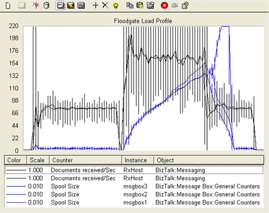

# Floodgate Load Test
The information in this topic refers to the tests explained in [Test Scenarios for Measuring MST of the Engine](../core/test-scenarios-for-measuring-mst-of-the-engine.md).  
  
## What Causes Floodgate Events?  
 There are a number of scenarios where just a few large peaks (also known as **floodgate events**) of messages arrive at the system each day. Between these peaks, the throughput can be very low. Examples of these types of scenarios include:  
  
- Equity trading, for example, at market open and market close  
  
- Banking systems, for example, during end of day transaction reconciliation  
  
  Other types of events can cause backlog behavior similar to floodgate events. For example, if a partner send address goes off line so that messages destined for that address must be re-tried and/or suspended, this can result in backlog building up. When the partner comes back on line, there may be a large number of suspended messages that need to be resumed, resulting in another type of floodgate event. The following test of the system illustrates this behavior.  
  
## Simulating a Floodgate Event  
 For this test, the system was initially driven at around half the maximum sustainable throughput which of course was very stable. Then, to simulate a floodgate event, the load generation tool was configured to send in about 410 msgs/sec for a short period of time (the same as for the overdrive test). The resultant load profile measuring messages received per second and spool depth is displayed below.  
  
 **Load profile of floodgate load test**  
  
   
  
 Note from the graph that the spool tables quickly built up a backlog during the floodgate event. However, because the event was relatively short lived and the subsequent receive rate after the event was below the maximum sustainable rate, the cleanup jobs were able to run and recover from the event without requiring a system receive outage. For this particular test, the MessageBox was housed on SQL Server 2005; the duration of this test from beginning to end was approximately 45 minutes.  
  
 Of course, every system is different, so "your mileage will vary." The best way to verify that you can recover is to test with a representative load before going into production.  
  
## See Also  
 [Test Scenarios for Measuring MST of the Engine](../core/test-scenarios-for-measuring-mst-of-the-engine.md)   
 [Using Settings Dashboard for BizTalk Server Performance Tuning](../core/using-settings-dashboard-for-biztalk-server-performance-tuning.md)   
 [Overdrive Load Test](../core/overdrive-load-test.md)   
 [Sustainable Load Test](../core/sustainable-load-test.md)