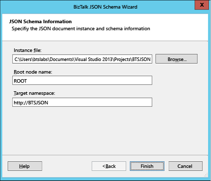

# Generate an XSD schema for JSON message
> [!NOTE]
>  This tutorial applies to BizTalk Server only.  
  
 In this solution, a [!INCLUDE[btsBizTalkServerNoVersion](../includes/btsbiztalkservernoversion-md.md)] application receives a JSON message. Before the application can process the message, it must be converted to an XSD schema. To do so, [!INCLUDE[btsBizTalkServerNoVersion](../includes/btsbiztalkservernoversion-md.md)] provides a JSON Schema Wizard that creates an XSD schema from a JSON message.  
  
1. In Visual Studio, create a new [!INCLUDE[btsBizTalkServerNoVersion](../includes/btsbiztalkservernoversion-md.md)] project.  
  
2. In the Solution Explorer, right-click the project name > **Add** > **New Item** > **JSON Schema Wizard**. Provide a name for the schema (`PO.xsd`), and then click **Add**.  
  
3. In the JSON Schema Wizard, on the welcome page, click **Next**.  
  
4. In the JSON Schema Information page, provide the location of the JSON purchase order file that is sent to the [!INCLUDE[btsBizTalkServerNoVersion](../includes/btsbiztalkservernoversion-md.md)] application. Provide a root node name, a target namespace, and then click **Finish**.  
  
      
  
5. A schema with the specified name is added to the [!INCLUDE[btsBizTalkServerNoVersion](../includes/btsbiztalkservernoversion-md.md)] project. The generated schema file (**PO.xsd**) is also provided with the sample.  
  
## See Also  
 [Processing JSON messages using BizTalk Server](../core/processing-json-messages-using-biztalk-server.md)