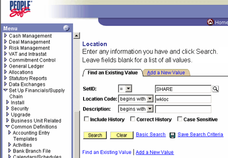
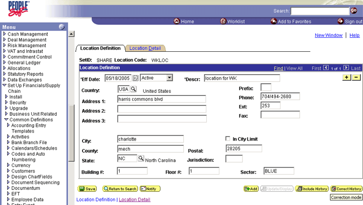
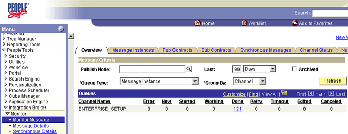
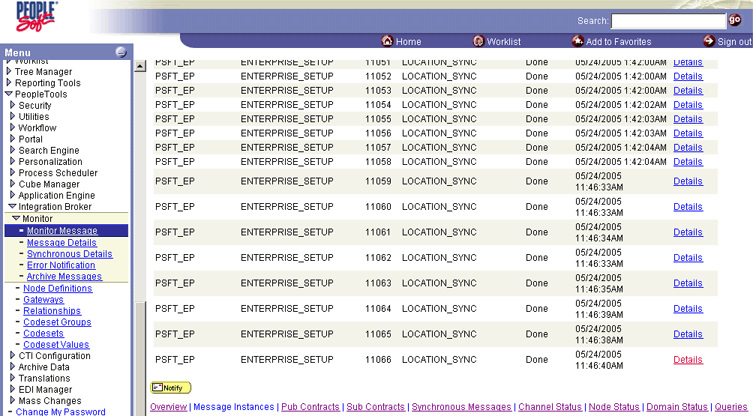
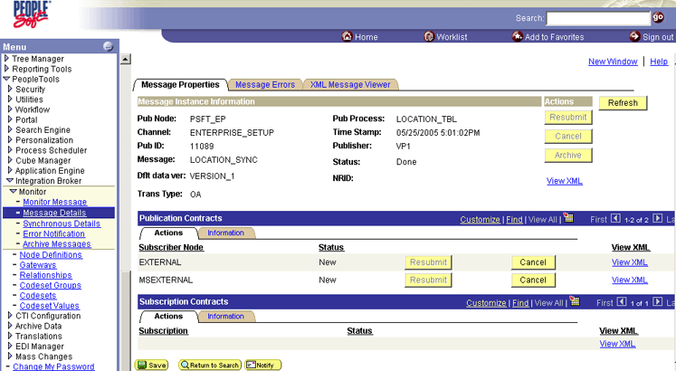
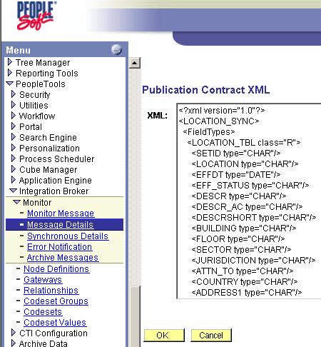

# Generating XML or Schema in PeopleSoft
The following procedure describes how to use PeopleSoft Enterprise to create an XML file and trigger a PeopleSoft event. To do this, you change something in the PeopleSoft environment. The change activates an XML file, which is sent to the file folder that you set in your orchestration to be monitored. Later, in BizTalk Server, you import the XML and generate a schema.  
  
> [!NOTE]
>  When you associate the Location with the MSEXTERNAL node, any change made to Location Value generates an XML document—triggering an event. After enlisting and starting your orchestration, you can navigate through the PeopleSoft screens to the LOCATION screen. If you make a change to Location Value and save your change, a corresponding XML appears in your \out directory.  
  
### To generate XML or Schema in PeopleSoft  
  
1. In the PeopleSoft application, point to **Set up Financials**, point to **Supply Chain**, point to **Common Definitions**, point to **Location**, and then select **Location**.  
  
2. On the **Location** screen, enter the following information:  
  
   - **Set ID:** Enter **SHARE**.  
  
   - **Location Code:** Enter a code that starts with `WKLOC`.  
  
       
  
3. Click **Search**, and then click **Correct History** to put the screen in **Edit** mode.  
  
      
  
4. Make a change to a field on the screen, and then click **Save**.  
  
5. Point to **PeopleTools**, point to **Integration Broker**, point to **Monitor**, and then select **Monitor Message**.  
  
      
  
6. Make sure that **Channel Type** is **Message Instance**, and then click **Refresh**.  
  
7. In the **Done** column, click the number.  
  
8. Scroll to the bottom of the list and click the **Details** link on a **LOCATION_SYNC** message.  
  
      
  
9. Click **View XML** on a **MSEXTERNAL** Node.  
  
       
  
     Copy and paste the contents of the XML into a file that can be accessed by your BizTalk Server project.  
  
       
  
10. Remember the location of the file;  you reference it in BizTalk Server.  
  
## See Also  
 [Appendix B: Using the PeopleSoft Application](../core/appendix-b-using-the-peoplesoft-application.md)