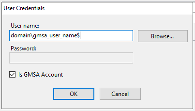
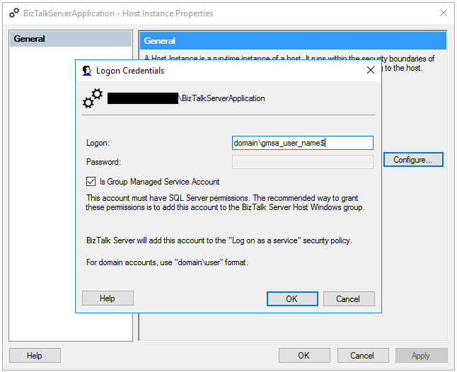

# Using Group Managed Service Account for BizTalk Server Features

BizTalk 2020 Supports Group Managed Service Account. Detailed information about gMSA can be found [here](https://docs.microsoft.com/windows-server/security/group-managed-service-accounts/group-managed-service-accounts-overview) .

With gMSA support users can continue to run BizTalk service without having the need to change passwords.

There are multiple BizTalk Features and following table shows the features where gMSA is supported

| Feature Name | Supported |
| --- | --- | 
| Enterprise SSO | No |
| Group | N/A |
| BizTalk Runtime | Yes |
| Business Rules Engine | Yes |
| BAM Tools | Yes (for Bam Alerts) |
| BAM Portal | Only for Application Pool Account |
| BizTalk EDI/AS2 Runtime | N/A |
| Rest API | Yes |
| BizTalk TMS | Yes |

New installations of BizTalk may be configured with gMSA(where ever supported) by running Microsoft BizTalk Server Configuration. 

> [!NOTE]
> gMSA is not available in basic configuration.

The features where gMSA is supported shows a check box which when checked password gets disabled. The user name should be set to appropriate gMSA account.

Users upgrading to BizTalk 2020, may use the below mentioned ways to configure individual features with gMSA.

## BizTalk Runtime

Users can update logon information using `BizTalk Server Administration Console`

1. Go to Platform Settings > Host Instances  
2. Open the host instance you want to change to gMSA account
3. Click on configure button and configure logon while choosing `"Is Group Managed Service Account"`

## Business Rules Engine, BAM Alerts & BizTalk TMS

Users may update 'Rule Engine Update Service', 'BAMAlerts' and 'BizTalk TMS' services with appropriate logon for group managed service account.
To change logon, please use sc config or Services MMC(Microsoft Management Console).
Detailed information on sc config can be found [here](https://docs.microsoft.com/windows-server/administration/windows-commands/sc-config)

## BAM Portal and Rest API

BAM portal and Rest API create Application Pools in IIS(Internet Information Services Manager)
The Identity of each of these pools can be changed to use gMSA account.
Please refer to IIS documentation for more details on Application Pools

