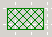

# Grid Preview Dialog Box
Use the **Grid Preview** dialog box as an aid to navigating the displayed map grid page.  
  
|Use this|To do this|  
|--------------|----------------|  
|**Green cross-hatched grid preview scroll tool**   |Drag this rectangle to a new location on the small-scale version of the displayed map grid page shown in this dialog box to make a portion of the displayed map grid page visible in the BizTalk Mapper grid.|  
|**Standard Windows close icon**   |Close the **Grid Preview** dialog box, returning to the indicated view of the current grid page.|