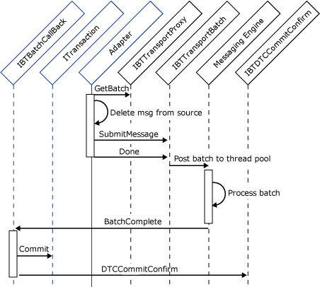
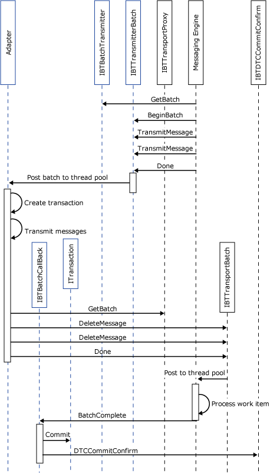

# Handling Transactions
## Transacted Receivers  
 The main difference between transacted receivers and nontransacted receivers is that transacted receivers create and use an explicit MSDTC transaction to ensure atomicity between their data source and the [!INCLUDE[btsBizTalkServerNoVersion](../includes/btsbiztalkservernoversion-md.md)] MessageBox database. In general every other aspect of the adapter is the same.  
  
 It should be noted that a request-response receive adapter only uses a transaction for submitting the original request message to the Messaging Engine. A different transaction is needed for the transmission of the response sent from the Messaging Engine to the adapter. This is because the scope of the first transaction is between the adapter and the MessageBox database. The subsequent request message is not sent to the adapter from the Messaging Engine until the transaction for the original request message commits.  
  
 The following object interaction diagram illustrates the interaction between the adapter and the Messaging Engine during a transactional submission of incoming messages. In this example, the following sequence of interactions takes place:  
  
1. The adapter gets a new batch from the engine.  
  
2. The adapter creates a new MSDTC transaction.  
  
3. The adapter does a destructive read from its data source that has been enlisted in the transaction.  
  
4. The adapter submits the message.  
  
5. The adapter calls **Done** on the batch, passing in its MSDTC transaction and its **BatchComplete** callback pointer. The engine returns an **IBTDTCCommitConfirm** interface.  
  
6. The engine processes the batch, calls the adapter back on its **BatchComplete** implementation, and conveys the status of its message processing to the adapter.  
  
7. If the batch was successful the adapter commits the transaction and calls the **IBTDTCCommitConfirm.DTCCommitConfirm** API with a `true` value signifying commit.  
  
     
  
## Transacted Transmitters  
 Transacted adapters are for the most part very similar to nontransacted adapters. The main difference is that the transacted adapter sends the data in the message to a resource that it has enlisted in an MSDTC transaction.  
  
 **Implementation Tip:** For transacted sends, the adapter should use the same MSDTC transaction for writing the data to the destination and for deleting it through the **IBTTransportBatch.DeleteMessage** method call. Only these two operations need to be transacted. Any other operations, such as **IBTTransportBatch.Resubmit**, **IBTTransportBatch.MoveToNextTransport**, and **IBTTransportBatch.MoveToSuspendQ** do not need to be transacted. This is because the engine implicitly uses a transaction and these types of operations do not need to be atomic with respect to the destination.  
  
 The following object interaction diagram illustrates the interactions between the adapter and the engine. The sequence of events is as follows:  
  
1. The engine gets a new batch from the adapter.  
  
2. The engine adds two messages to the new batch.  
  
3. The engine calls **Done** on the batch, causing the adapter to post the batch to its internal transmit queue that is serviced by its thread pool.  
  
4. The adapter creates a new MSDTC transaction.  
  
5. The adapter transmits the messages enlisting the destination in the MSDTC transaction. For example, this could be writing to a [!INCLUDE[btsSQLServerNoVersion](../includes/btssqlservernoversion-md.md)] database.  
  
6. After transmission, the adapter gets a new batch from the engine.  
  
7. The adapter calls **DeleteMessage** for the messages that it has successfully transmitted.  
  
8. The adapter calls **Done** on the batch passing in its DTC transaction. The engine returns an **IBTDTCCommitConfirm** interface.  
  
9. The engine processes the batch, deleting the messages from the application queue.  
  
10. The engine calls back the adapter's **IBTBatchCallback** interface with information on the success of its deletion operations.  
  
11. If the batch was successful, the adapter commits the transactions.  
  
12. The adapter calls **IBTDTCCommitConfirm.DTCCommitConfirm** to inform the engine that the transaction was successfully committed.  
  
      
  
### Transacted Solicit-Response Adapters  
 Unlike two-way receives, two-way sends may be performed by using the same DTC transaction. Transacted solicit-response adapters should use the same **IBTTransportBatch** for the **SubmitResponseMessage** and **DeleteMessage** operations. This batch should use the same MSDTC transaction that is used to send and receive the solicit-response message pair. This ensures atomicity for the solicit-response message exchange.  
  
## Service Components and BYOT  
 The Messaging Engine APIs require an MSDTC transaction to be supplied. However some .NET components are designed to be used as serviced components and do not allow the transaction to be programmatically committed or aborted. Instead, the transaction is automatically committed by the COM+ runtime on that platform.  
  
 For these scenarios, the adapter should use Bring Your Own Transaction (BYOT). This allows the adapter to create an MSDTC transaction, instantiate the .NET component that uses the transaction, and allow that component to inherit the created transaction rather than create its own transaction. The .NET Framework provides **System.EnterpriseServices.BYOT** for this purpose. The SDK BaseAdapter provides a helper class, **BYOTTransaction**, for this purpose.  
  
## Avoiding Race Conditions  
 When you write an adapter that creates a transaction object and hands it to [!INCLUDE[btsBizTalkServerNoVersion](../includes/btsbiztalkservernoversion-md.md)], you are accepting responsibility for writing code that does the following:  
  
- Resolves errors in messages associated with the batch.  
  
- Decides the final outcome of the transaction associated with the batch operation.  
  
  The adapter must inform [!INCLUDE[btsBizTalkServerNoVersion](../includes/btsbiztalkservernoversion-md.md)] about the final outcome of the transaction to maintain its internal tracking data. The adapter informs [!INCLUDE[btsBizTalkServerNoVersion](../includes/btsbiztalkservernoversion-md.md)] of the outcome by calling **DTCConfirmCommit**. If the adapter does not do this, a significant memory leak occurs.  
  
  The two tasks listed above (resolve errors and decide the final outcome) seem simple enough, but in fact they rely on information from different threads:  
  
- The adapter processes errors based on information passed by [!INCLUDE[btsBizTalkServerNoVersion](../includes/btsbiztalkservernoversion-md.md)] to the **BatchComplete** callback in the adapter. This callback is on the adapter's thread.  
  
- **DTCConfirmCommit** is a method on the **IBTDTCCommitConfirm** object. An instance of the **IBTDTCCommitConfirm** object is returned by the batch **IBTTransportBatch::Done** call. This instance is on the same thread as the **IBTTransportBatch::Done** call, which is different from the adapter's thread.  
  
- For every call that the adapter makes to **IBTTransportBatch::Done** there is a corresponding callback, **BatchComplete**, that is called by the Messaging Engine in a separate thread to report the result of the batch submission. In **BatchComplete** the adapter needs to commit or roll back the transaction based on whether the batch passed or failed. In either case, the adapter should then call **DTCConfirmCommit** to report the status of the transaction to the Messaging Engine.  
  
  A possible race condition exists because the adapter’s implementation of **BatchComplete** can assume that the **IBTDTCCommitConfirm** object returned by **IBTTransportBatch::Done** is always available when **BatchComplete** executes. However, **BatchComplete** can be called in a separate Messaging Engine thread, even before **IBTTransportBatch::Done** returns. It is possible that when the adapter tries to access the **IBTDTCCommitConfirm** object as a part of the **BatchComplete** implementation, there is an access violation.  
  
  The problem is solved with an event in the following example. Here the interface pointer is accessed through a property that uses the event. The get always waits for the set.  
  
```  
protected IBTDTCCommitConfirm CommitConfirm  
{  
   set  
   {  
       this.commitConfirm = value;  
       this.commitConfirmEvent.Set();  
   }  
   get  
   {  
       this.commitConfirmEvent.WaitOne();  
       return this.commitConfirm;  
   }  
}  
protected IBTDTCCommitConfirm commitConfirm = null;  
private ManualResetEvent commitConfirmEvent = new ManualResetEvent(false);  
```  
  
 Now assign the return value from **IBTTransportBatch::Done** to this property and use it in the **BatchComplete** call.  
  
## See Also  
 [Transactional Message Batches](../core/transactional-message-batches.md)