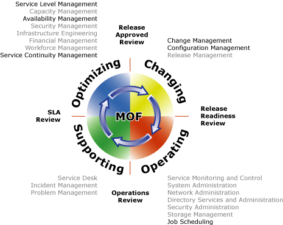

# High Availability and the Microsoft Operations Framework
Applying the Microsoft Operations Framework (MOF) process model to the planning and implementation of a highly available Microsoft BizTalk Server solution can help you make sure that you have appropriate processes at the different stages of the release life cycle. By looking ahead at all the life cycle stages where high availability surfaces, you can make the installation, maintenance, and troubleshooting of availability issues in your environment easier.  
  
 This section contains information about the MOF processes where you have to consider high-availability tasks.  
  
## Microsoft Operations Framework Process Model  
 The [Microsoft Operations Framework (MOF)](https://technet.microsoft.com/solutionaccelerators/dd320379.aspx) provides guidance that enables organizations to achieve mission-critical system reliability, availability, supportability, and manageability of Microsoft products and technologies. MOF provides operational guidance in the form of white papers, operations guides, assessment tools, best practices, case studies, templates, support tools, and services. This guidance addresses the people, process, technology, and management issues pertaining to complex, distributed, and heterogeneous IT environments. 
  
 The MOF process model enables companies to:  
  
- Facilitate consistent IT service management across service solutions.  
  
- Establish a structure for IT functions, processes, and procedures.  
  
- Represent a life-cycle approach.  
  
  Central to the MOF process model is its division into four quadrants of operational processes and procedures, named service management functions (SMFs). The SMFs are the foundation-level best practices and prescriptive guidance for operating and maintaining an IT environment.  
  
  The following figure shows the MOF processes where you have to consider high availability.  
  
    
  
## Changing Quadrant  
 The changing quadrant includes the service management functions (SMFs) required to identify, review, approve, and incorporate change into a managed IT environment. This includes changes in software, hardware, documentation, roles and responsibilities, and also specific process and procedural changes.  
  
### Change Management  
 Change management is responsible for changes in technology, systems, applications, hardware, tools, documentation, and processes, and also changes in roles and responsibilities.  
  
 During the change management process, as part of designing your BizTalk Server implementation, you can do the following:  
  
-   Determine whether the service level agreement with your partners or customers requires a certain level of availability, uptime, and load-processing capabilities.  
  
-   Determine the best cluster configuration for the BizTalk Server databases for your business needs. The run-time processes write to the BizTalk Management database, MessageBox databases, Tracking Analysis Services database, BAM Analysis database, BAM Star Schema database, BAM Primary Import database, and BAM Archive database. Therefore, these databases are especially important if a disaster occurs, and must have greater priority when determining what databases to cluster. Only users or tools write to the other databases. For the MessageBox databases, you can consider an active/active/active/passive four-server cluster to minimize the hardware needed.  
  
-   Determine whether to cluster the master secret server, or if manually restoring the master secret on another Enterprise Single Sign-On server is satisfactory for your scenario. This solution is available, but not highly available.  
  
-   Determine the number of hosts and host instances that you will need to process your expected message load and to provide high availability.  
  
-   Create a list of the people that will be involved in the change-management process. This list will include, but is not limited to, the domain administrator, database administrator, infrastructure administrator, BizTalk Server administrator, and IT operations staff.  
  
### Configuration Management  
 Configuration management is responsible for identifying, controlling, and tracking all versions of software, hardware, documentation, processes, procedures, and all other components of the IT environment under the control of change management.  
  
 During the configuration management process, you must create a detailed plan for how you are going to implement your highly available solution for BizTalk Server. You must also document the steps that you took to create your solution. At a high level, the steps are:  
  
-   The domain controller creates the domain groups and accounts that you will use in your BizTalk Server environment.  
  
-   The infrastructure administrator creates the Windows cluster for the BizTalk Server databases and the Windows cluster for the master secret server.  
  
-   The database administrator installs and configures Microsoft SQL Server on the Windows cluster for the BizTalk Server databases.  
  
-   The BizTalk Server administrator configures the master secret server cluster.  
  
-   The BizTalk Server administrator installs and configures BizTalk Server on the processing, receiving, and sending servers.  
  
-   The BizTalk Server administrator creates the hosts and installs the host instances on the appropriate servers to provide high availability or to increase capacity, or both.  
  
## Operating Quadrant  
 The operating quadrant includes the SMFs required to monitor, control, manage, and administer service solutions daily to achieve and maintain service levels within predetermined parameters.  
  
### Job Scheduling  
 Job scheduling involves the continuous organization of jobs and processes in the most efficient sequence, maximizing system throughput and use to meet service level agreement requirements.  
  
 Make sure that you schedule planned downtime, such as scheduled updates, at times when the message load is low (for example, late at night) to minimize the potential effect on your business.  
  
## Supporting Quadrant  
 The supporting quadrant includes the SMFs required to identify, assign, diagnose, track, and resolve incidents, problems, and requests within the approved requirements that are contained in the service level agreements.  
  
## Optimizing Quadrant  
 The optimizing quadrant includes the SMFs that contribute to maintaining business and IT alignment by focusing on decreasing IT costs while maintaining or improving service levels. This includes review of outages and incidents, examination of cost structures, staff assessments, availability and performance analysis, and capacity forecasting.  
  
### Service Level Management  
 The goal of service level management is to maintain and continuously improve the quality of IT service, through a constant cycle of negotiating and monitoring service level requirements. The successful service level management function causes an improvement in quality of service, greater levels of customer productivity, and ideally, a reduction in the overall cost of services provided.  
  
 During the service level management process, you can do the following:  
  
-   Evaluate how the current environment satisfies your service level agreement requirements.  
  
-   Recommend the addition of new servers for processing, receiving, or sending messages to meet the requirements.  
  
-   If necessary, recommend creating highly available solutions for points of failure that were not originally mitigated to meet the availability requirements in the service level agreement.  
  
### Availability Management  
 The single goal of availability management is to make sure that your customers can use a particular IT service whenever they want.  
  
 For the availability management process, you can establish mechanisms for notifying IT personnel when a hardware failure occurs so that they can fix or replace the hardware as quickly as possible, and mechanisms for notifying IT personnel when the server load is larger than a particular threshold.  
  
### Service Continuity Management  
 The objective of the service continuity management function is to make sure that a specified IT service provides value to the customer if regular-availability solutions fail.  
  
 During the service continuity function you must examine what high-availability configuration to implement to make sure that you continue providing your customers with the services they expect even when a planned or unplanned downtime occurs. Examples of unplanned downtime are hardware failures or acts of nature.  
  
## See Also  
 [Sample BizTalk Server High Availability Scenarios](../core/sample-biztalk-server-high-availability-scenarios.md)