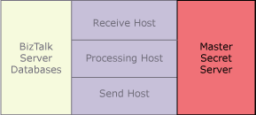

# High Availability for Enterprise Single Sign-On
Even if you do not use the Enterprise Single-Sign-On (SSO) functionality for mapping credentials and single sign-on, SSO is a critical part of the overall Microsoft [!INCLUDE[btsBizTalkServerNoVersion](../includes/btsbiztalkservernoversion-md.md)] infrastructure, because BizTalk Server uses SSO to help secure information for the receive locations.  
  
 You must configure the first computer where you install the SSO service as the master secret server. The master secret server is the SSO server that stores the master secret (encryption key). The master secret is the encryption key that the SSO system uses to encrypt and decrypt the data it stores in the SSO database.  
  
 If an SSO server fails, and if you have other BizTalk Server computers (and therefore SSO servers) running the same host instance, the other SSO servers continue doing their work. This means that the master secret server still functions correctly, and therefore the BizTalk Server processing continues.  
  
 If the master secret server fails, all run-time operations that were running before it failed, including decryption of credentials, continue successfully. However, you cannot encrypt new credentials. Therefore, the BizTalk Server environment has a dependency on the availability of the master secret server, as shown in the following figure.  
  
   
  
> [!NOTE]
>  If the master secret server becomes unavailable, then [!INCLUDE[btsBizTalkServerNoVersion](../includes/btsbiztalkservernoversion-md.md)] host instances can still perform run-time operations by using the in-memory cached copy of the master secret until:  
> 
> - The host instances are restarted.  
>   -   The SSO service on the computer running the BizTalk host instances is restarted.  
>   -   The SSO master secret is changed.  
> 
>   If the SSO service is restarted on the [!INCLUDE[btsBizTalkServerNoVersion](../includes/btsbiztalkservernoversion-md.md)] computers or if the SSO master secret is changed, then the cached copy of the master secret is released from memory and the [!INCLUDE[btsBizTalkServerNoVersion](../includes/btsbiztalkservernoversion-md.md)] must be able to contact the master secret server to obtain another copy of the master secret. If the master secret server is unavailable then any administrative operations that require access to the master secret server for purposes of encryption will fail.  
  
## Making the Master Secret Server Available  
 For availability of the SSO system, and therefore of the BizTalk Server environment, it is critical that you back up the master secret as soon as it is generated. If you lose it, you lose the data that the SSO system encrypted by using that master secret. For more information about backing up the master secret, see [How to Back Up the Master Secret](../core/how-to-back-up-the-master-secret.md).  
  
 You can make the master secret server available in two ways:  
  
-   **Available, but not highly available.** All the SSO servers have the master secret cached in memory, and run-time operations will continue even if the master secret server fails. However, you will not be able to change the configuration of ports or the SSO configuration. The BizTalk Server runtime will continue working without problems, but you cannot make any design changes.  
  
     Even if this configuration is not highly available, it can be satisfactory for most scenarios and it is consistent with scaling out the receiving, sending, and processing hosts.  
  
-   **Highly available.** To provide redundancy for the master secret server, use Windows Clustering on a separate master secret server cluster, or configure the master secret server on an existing database cluster. The services provided by the master secret server do not consume many resources, and typically do not affect database functionality or performance when installed on a database cluster. The following figure shows how you can make the master secret server highly available.  
  
       
  
     While this configuration is highly available, it requires additional hardware resources. For more information about high availability installation options for SSO, see [High-Availability SSO Installation Options](../core/high-availability-sso-installation-options.md). This section includes detailed information about configuring the SSO master secret server as a highly available cluster resource on a Windows Server cluster.  
  
    > [!NOTE]
    >  To reduce the hardware resources for a highly available solution, you can add the master secret server as a cluster resource in your SQL Server cluster. You do not need to purchase additional BizTalk Server licenses to install the SSO service on another computer.  
  
## See Also  
 [Clustering the BizTalk Server Databases](../core/clustering-the-biztalk-server-databases1.md)   
 [Creating a Highly Available BizTalk Server Environment](../core/creating-a-highly-available-biztalk-server-environment.md)   
 [How to Cluster the Master Secret Server](../core/how-to-cluster-the-master-secret-server1.md)