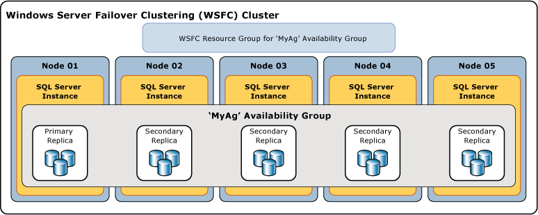
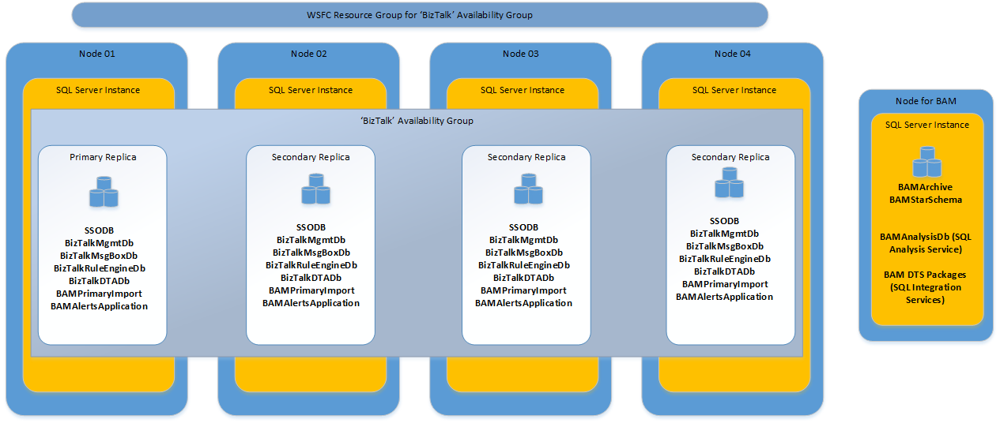
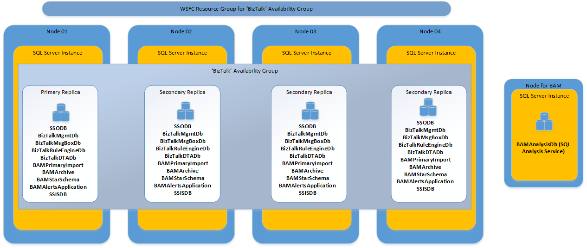
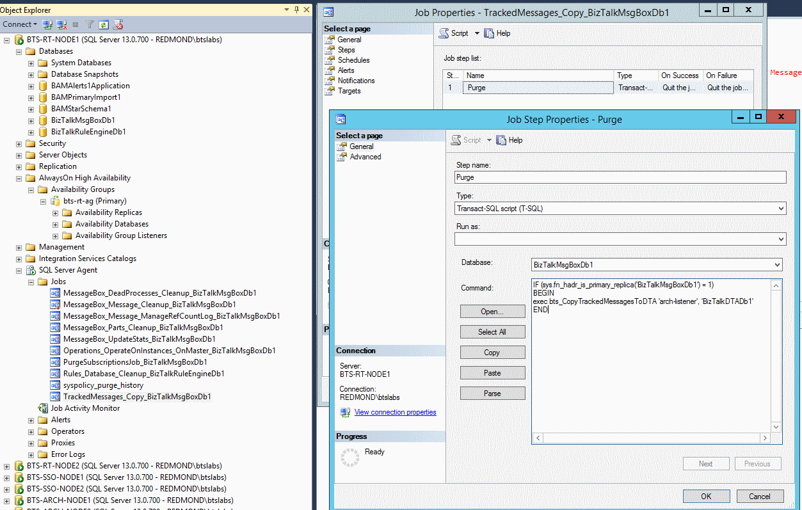

# High Availability using SQL Server Always On Availability Groups - BizTalk Server

Configure high availability using SQL Server AlwaysOn availability groups.

> [!TIP]
> [Setting up BizTalk Server 2016 using availability groups LAB](https://skastberg.wordpress.com/2017/02/22/setting-up-my-biztalk-server-2016-using-availability-groups-lab/) provides a step-by-step guide written by a Microsoft field engineer. It is based on a lab environment, and includes some observations. Check it out.  
> 
> [!IMPORTANT]
> - BizTalk Server support Always On Availability Groups starting with SQL Server 2016 and newer. If you're using a previous SQL Server version, this article doesn't apply to you. 
> - BizTalk Server supports synchronous-commit mode; asynchronous-commit mode isn't supported. For disaster recovery, it's recommended to configure the Backup BizTalk Server job, and use log shipping. See [Backing Up and Restoring BizTalk Server Databases](../core/backing-up-and-restoring-biztalk-server-databases.md) for specific details.
>
> [Availability Modes](/sql/database-engine/availability-groups/windows/availability-modes-always-on-availability-groups) details the commit options with Always On Availability Groups.

## Background and history

BizTalk Server relies heavily on SQL Server for data persistence. Other components and hosts in BizTalk Server have specific roles when integrating disparate business applications, such as receiving, processing, or routing messages. The database computer captures this work, and persists it to disk. 

BizTalk uses SQL Server Failover Clustering and Log Shipping to provide high availability, backup and restore, and disaster recovery for its on-premises databases. In Azure IaaS (Azure virtual machines), previous versions of SQL Server do not support Failover Cluster Instances (no MSDTC support). As a result, BizTalk did not have a HA solution when using Azure VMs.

Starting with SQL Server 2016, SQL Server AlwaysOn Availability Groups supports MSDTC for on-premises and using Azure VMs. As a result, the SQL Server 2016 AlwaysOn feature is supported for BizTalk databases on-premises or in Azure IaaS scenarios. 

## SQL Server 2016 AlwaysOn Availability Groups 

Deploying AlwaysOn Availability Groups requires a Windows Server Failover Clustering (WSFC) cluster. Each availability replica of a given availability group must reside on a different node of the same WSFC cluster. A WSFC resource group is created for every availability group that you create. The WSFC cluster monitors this resource group to evaluate the health of the primary replica.  

The following illustration shows an availability group that contains one primary replica and four secondary replicas.  

> [!div class="mx-imgBorder"]
> 

Clients can connect to the primary replica of a given availability group using an availability group listener. An availability group listener provides a set of resources that are attached to a given availability group to direct client connections to the appropriate availability replica. 

>[!IMPORTANT]
> SQL Server 2016 supports MSDTC with AlwaysOn Availability Groups (AG) on Windows Server 2016 and Windows Server 2012 R2. **Windows Server 2012 R2** requires  the [3090973](https://support.microsoft.com/kb/3090973) Windows hotfix  to be installed. 
> **Windows Server 2016** requires that the [RemoteAccessEnabled registry key](https://support.microsoft.com/kb/3182294) be enabled.

SQL Server does not support MSDTC with AlwaysOn AG for any versions prior to 2016.  

## Provide high availability for BizTalk databases using AlwaysOn Availability Groups 

In the basic configuration of BizTalk Server, a minimum of 9 databases are created including Rules and BAM databases.
 
In a scaled-out MessageBox scenario (a configuration with more than one MessageBox), there is more than one MessageBox database, and each MessageBox database must be added to availability group.

BizTalk Server also depends on SQL Server Analysis Services and SQL Server Integration Services for BAM Analysis and Archiving. SQL Server doesn't provide a high availability solution for Integration Services or Analysis Services in Azure IaaS. Therefore, it's recommended to use another standalone SQL Server instance for the BAMArchive and BAMAnalysis Analysis Services databases. For on-premises installations, SQL Failover Clustering Instance can be used for setting up a high availability configuration.

For BizTalk Server 2016 and older, this configuration is shown in the following image, and recommended for BizTalk databases in Availability Groups:  

> [!div class="mx-imgBorder"]
> 

**Starting with BizTalk Server 2020 and newer**, high availablity for BAM DTS packages is supported using SSIS Catalog. Add the SSISDB database to the same availability group as the BizTalk Server databases. This configuration is shown in the following image, and recommended for BizTalk databases in Availability Groups:

> [!div class="mx-imgBorder"]
> 

In addition to the SQL Server databases, the BizTalk Server configuration also creates SQL Server security logins and SQL Agent Jobs. AlwaysOn Availability Groups only provide the ability to manage databases inside an Availability Group. On all the availability replicas, the BizTalk Server logins and SQL Agent Jobs need to be created and updated manually.

The following list of SQL Server security logins are associated with BizTalk Server. You may have additional logins created for your BizTalk Server applications. If so, you need to replicate them on every instance of SQL Server hosting a replica of BizTalk databases. 

1. BizTalk Application Users (one or more corresponding to each in-proc Host) 
2. BizTalk Isolated Host Users (one or more corresponding to each Isolated Host) 
3. BizTalk Server Administrators 
4. BizTalk Server B2B Operators 
5. BizTalk Server Operators 
6. SSO Administrators 
7. BAM Alerts User 
8. BAM Management Web Service User 
9. Rule Engine Update Service Account 

If you have created additional hosts or will create additional hosts later, there will be new SQL logins created as part of this process. You must make sure to create these SQL logins manually on the corresponding replicas.

The following SQL Server Agent jobs are associated with BizTalk Server. The jobs installed on each server are different depending on which features are installed and configured. Most of these jobs are created during BizTalk Server configuration. Several are created when configuring log shipping. These jobs need to be replicated on each instance of SQL Server hosting replica of their corresponding BizTalk database. This must be performed manually. 

- BizTalkMgmtDb jobs: 
    - Backup BizTalk Server (BizTalkMgmtDb) 
    - CleanupBTFExpiredEntriesJob_BizTalkMgmtDb 
    - Monitor BizTalk Server (BizTalkMgmtDb) 
- BizTalkMsgBoxDb jobs: 
    - MessageBox_DeadProcesses_Cleanup_BizTalkMsgBoxDb 
    - MessageBox_Message_Cleanup_BizTalkMsgBoxDb
    - MessageBox_Message_ManageRefCountLog_BizTalkMsgBoxDb
    - MessageBox_Parts_Cleanup_BizTalkMsgBoxDb 
    - MessageBox_UpdateStats_BizTalkMsgBoxDb 
    - Operations_OperateOnInstances_OnMaster_BizTalkMsgBoxDb 
    - PurgeSubscriptionsJob_BizTalkMsgBoxDb 
    - TrackedMessages_Copy_BizTalkMsgBoxDb 
- Jobs on additional msgboxes
- BizTalkDTADb job: 
    - DTA Purge and Archive (BizTalkDTADb) 
- BizTalkRulesEngineDb job: 
    - Rules_Database_Cleanup_BizTalkRuleEngineDb 
- BAMAlertsApplication job: 
    - 0 or more DelAlertHistJob 

Unlike SQL Failover Clustering Instances, in Availability Groups all replicas are active, running, and available. When SQL Agent jobs are duplicated on each replica for failover, they run against the corresponding replica, irrespective of whether it is currently in primary role or secondary role. To make sure these jobs are executed only on the current primary replica, every step in every job must be enclosed within an IF block, as shown: 

```sql
IF (sys.fn_hadr_is_primary_replica(‘dbname’) = 1)  
BEGIN  
…  
END
```
  
Replace `‘dbname’` with the corresponding database name against which the job is configured to run. The following example shows this change for TrackedMessages_Copy_BizTalkMsgBoxDb on BizTalkMsgBoxDb: 

> [!div class="mx-imgBorder"]
> 

### Configure BizTalk when Availability Groups are already set up

1. Check your OS requirements: 
    - On all **Windows Server 2012 R2** computers, install the [3090973 MSDTC hotfix](https://support.microsoft.com/kb/3090973) (opens a KB article).
    - On all **Windows Server 2016** computers, enable the [RemoteAccessEnabled registry key](https://support.microsoft.com/kb/3182294) (opens a KB article).
4. Create the required Availability Groups. Make sure the Availability Groups are created with the **Per Database DTC Support** option.
5. When configuring BizTalk Server and specifying the SQL server name, use the Availability Group’s listener name instead of the actual machine name. This creates the BizTalk databases, logins, and SQL Agent jobs on the current primary replica. 
6. Stop BizTalk processing (Host Instances, SSO Service, IIS, Rules Engine Update Service, BAMAlerts Service, and so on), and stop the SQL Agent Jobs. 
7. Now add BizTalk databases to the respective Availability Groups. 
8. Enclose body of SQL Agent job steps within `IF` block (mentioned previously) to make sure they run only if the target is the primary replica. 
9. Script Logins and SQL Agent Jobs to replicate them on corresponding replica. 
10. Replicate SQL DBMail Profile and Account for BAM Alerts on corresponding SQL instances hosting the secondary replica. 
11. If you are adding an additional message box database or deploying a new BAM activity/view later, then new SQL jobs are created for new message box databases or BAM Alerts database on the current primary replica. Make sure to edit it on primary replica, and then create them manually on the corresponding secondary replicas. 
12. **Starting with BizTalk Server 2020 and newer**, BAM DTS packages are deployed to SSIS Catalog. Add the SSISDB database to the same availability group as the BizTalk databases. For more information, see [AlwaysON for SSIS Catalog](/sql/integration-services/catalog/ssis-catalog?view=sql-server-ver15#always-on-for-ssis-catalog-ssisdb).

This configuration can also be done using the SQL Instances hosting the primary replica. In this case, after the BizTalk configuration, run the `UpdateDatabase.vbs` and `UpdateRegistry.vbs` scripts on the BizTalk machines after the above steps. This is discussed in more detail in the next section.  

### Move existing BizTalk databases to Availability Groups

1. Check your OS requirements: 
    - On all **Windows Server 2012 R2** computers, install the [3090973 MSDTC hotfix](https://support.microsoft.com/kb/3090973) (opens a KB article)
    - On all **Windows Server 2016** computers, enable the [RemoteAccessEnabled registry key](https://support.microsoft.com/kb/3182294) (opens a KB article)
4. Create the required Availability Groups. Be sure the Availability Group are created with **Per Database DTC Support** option.  
5. Stop BizTalk processing and SQL Agent Jobs. 
6. Perform full backup of all BizTalk Databases. 
7. Restore BizTalk databases on the SQL instances currently in the primary role in the Availability Group. 
8. Script Logins and SQL Agent jobs on corresponding SQL Instances currently in the primary role in the Availability Group.  
9. Run the `UpdateDatabase.vbs` and `UpdateRegistry.vbs` scripts on the BizTalk machines using the following steps. Enter the Availability Group Listener as the new server name in the input update info xml.  
    1. Stop all BizTalk services and Enterprise SSO services on BizTalk Server. Stop SQL Agent Service on SQL Server. 
    2. On BizTalk Server, edit SampleUpdateInfo.xml in the following folder: 
 
        32-bit computer: `%SystemRoot%\Program Files\Microsoft BizTalk Server 20xx\Schema\Restore`
 
        64-bit computer: `%SystemRoot%\Program Files (x86)\Microsoft BizTalk Server 20xx\Bins32\Schema\Restore`
 
        1. Replace "SourceServer" with the source server name (old SQL Server hosting old databases).  
        2. Replace "DestinationServer" with the name of the destination server, which should be the availability group listener name.  
        3. If you have the BAMAnalysis, BAM databases or RuleEngineDB, uncomment the appropriate sections. 

    3. Open a command prompt, and go to: 
 
       32-bit computer: `%SystemRoot%\Program Files\Microsoft BizTalk Server 20xx\Schema\Restore` 
 
       64-bit computer: `%SystemRoot%\Program Files (x86)\Microsoft BizTalk Server 20xx\Bins32\Schema\Restore` 
 
       At the command prompt, run:  
       `cscript UpdateDatabase.vbs SampleUpdateInfo.xml`  
 
       Run UpdateDatabase.vbs on only one server in the BizTalk group. 

    4. Copy the edited SampleUpdateInfo.xml file to the following folder on every BizTalk Server computer in this BizTalk group: 
 
       32-bit computer: `%SystemRoot%\Program Files\Microsoft BizTalk Server 20xx\Schema\Restore` 
 
       64-bit computer: `%SystemRoot%\Program Files (x86)\Microsoft BizTalk Server 20xx\Bins32\Schema\Restore` 
 
    5. On each computer in the BizTalk Server group, open a command prompt, and go to: 
 
       32-bit computer: `%SystemRoot%\Program Files\Microsoft BizTalk Server 20xx\Schema\Restore`
 
       64-bit computer: `%SystemRoot%\Program Files (x86)\Microsoft BizTalk Server 20xx\Bins32\Schema\Restore` 
 
       At the command prompt, run:  
       `cscript UpdateRegistry.vbs SampleUpdateInfo.xml` 
 
       Run UpdateRegistry.vbs on every server in the BizTalk group. 
 
10. Now move the databases to their respective Availability Groups. 
11. Replicate the SQL DBMail Profile and Account for BAM Alerts on the SQL instances hosting the replica of the BAMAlerts database. 
12. Enclose the body of SQL Agent job steps within an IF block to make sure they run only if the target is the primary. 
13. Script Logins and SQL Agent Jobs to replicate them on the corresponding replica. The UpdateDatabase script also updates the server name in the Operations_OperateOnInstances_OnMaster_BizTalkMsgBoxDb and TrackedMessages_Copy_BizTalkMsgBoxDb jobs. So script the SQL Agent Jobs only after running the UpdateDatabase script. 

## Requirements

- BizTalk Server:
  - BizTalk Server 2020 Enterprise
  - BizTalk Server 2016 Enterprise CU5
- SQL Server:
  - SQL Server 2019 Enterprise or Standard
  - SQL Server 2017 Enterprise or Standard
  - SQL Server 2016 Enterprise or Standard.

    See [Known limitations](#known-limitations) in this article for SQL Server Standard Edition limitation.
- Windows Server
  - Windows Server 2019
  - Windows Server 2016
  - Windows Server 2012 R2

### Availability Group Listener configured with non-default port (1433) 

Use SQL alias on BizTalk Server machines. 

### Support Availability Group Multi-Subnet Failovers 

BizTalk Server uses Microsoft OLE DB for database connections, which does not support the **MultiSubnetFailover** connection option. BizTalk Server does not support the `MultiSubnetFailover (=TRUE)` connection option, and this may cause higher recovery time during multi-subnet failover. 

### Read-Only Routing 

Read-only routing refers to the ability of SQL Server to route incoming connections for an availability group listener to a secondary replica that is configured to allow read-only workloads. 

BizTalk does not use Read-Only Routing for any of the connections to its databases. This means the “Readable Secondary” option on Availability Replicas in the availability group does not have any impact on BizTalk database connections. 

### Behavior of BizTalk Host Instances during SQL Server Failover 

If the SQL Server availability group experiences a failover, the BizTalk Server databases on the availability group are temporarily unavailable. 

#### Behavior of In-Process Host Instances during SQL Server Failover 

If the BizTalk Server databases are unavailable, then an in-process instance of a BizTalk Server host is recycled until the connection to the SQL Server is restored. Once the connection to the SQL Server databases is restored, document processing resumes normally.
 
#### Behavior of Isolated Host Instances During SQL Server Failover 

If the BizTalk Server databases are unavailable, then an isolated instance of a BizTalk Server host pauses, and an error similar to the following is generated in the BizTalk Server Application log: 

`All receive locations are being temporarily disabled because either the MessageBox or Configuration database is not available. When these databases become available, the receive locations will be automatically enabled.`

Once the connection to the SQL Server databases is restored, an informational message similar to the following is written to the BizTalk Server Application log, and then document processing resumes normally: 

`All receive locations are being enabled because both the MessageBox and Configuration databases are back online.`

#### Log Shipping for Disaster Recovery 

BizTalk Server implements database standby capabilities through the use of database log shipping. BizTalk Server log shipping automates the backup and restore of databases and their transaction log files, allowing a standby server to resume database processing in the event that the production database server fails. 

**Secondary databases in availability group are not backups.** Continue to backup BizTalk databases and their transaction logs using BizTalk Server Log Shipping jobs. The way BizTalk Log Shipping is implemented ensures that backups are always performed against the current primary replica of every database. The backup preference setting on the availability group is not honored by the BizTalk Server Log Shipping jobs. 

If you are adding other BizTalk databases to the BizTalk Databases Backup job, be sure to use the Availability Group Listener name as the database server for them when setting up the Backup.  

## References

* [Providing High Availability for BizTalk Server Databases](../core/providing-high-availability-for-biztalk-server-databases.md)  
* [Microsoft server software support for Microsoft Azure virtual machines](https://support.microsoft.com/kb/2721672)  
* [SQL Server database mirroring, Volume Shadow Copy service and AlwaysOn](../core/sql-server-database-mirroring-volume-shadow-copy-service-and-alwayson.md)  
* [Overview of AlwaysOn Availability Groups (SQL Server)](/sql/database-engine/availability-groups/windows/overview-of-always-on-availability-groups-sql-server)
* [Cross-Database Transactions Support For Database Mirroring or AlwaysOn Availability Groups (SQL Server)](/sql/database-engine/availability-groups/windows/transactions-always-on-availability-and-database-mirroring)  
* [Reenlist can't be called when SQL Server receives transaction outcome from MSDTC in Windows Server 2012 R2](https://support.microsoft.com/kb/3090973)  
* [Backing Up and Restoring BizTalk Server Databases](../core/backing-up-and-restoring-biztalk-server-databases.md)  
* [How to Move the BizTalk Server Databases](../core/how-to-move-the-biztalk-server-databases.md)  
* [How to Restore Your Databases](../core/how-to-restore-your-databases.md)   
* [Connection Timeouts in Multi-subnet Availability Group](/archive/blogs/alwaysonpro/connection-timeouts-in-multi-subnet-availability-group)  

## Known limitations

These limitations are for BizTalk Server, SQL Server AlwaysOn Availability Group, and Azure Virtual Machines. These limitations may or may not get addressed in future. 

* Logins, SQL Agent Jobs, the SQL DB Mail profile, and accounts are not managed within Availability Groups. This requires manual modification in Jobs to make sure they run against the primary replica. 
* SQL Server Analysis Services and SQL Server Integration Services don't participate in Availability Groups. Without this support from SQL Server, there is no HA solution for these in Azure Virtual Machines. BizTalk Server’s BAM capabilities are dependent on these services.

* Prior to SQL Server 2016 SP2, Availability Groups don't support MSDTC between databases on the same SQL instance.

  Starting with SQL Server 2016 SP2 *and* BizTalk Server 2016 [CU5](https://support.microsoft.com/help/2555976/service-pack-and-cumulative-update-list-for-biztalk-server), the BizTalk databases can use the same SQL Server instance.
  
* BizTalk Server cannot use Read-Only Routing. 
* BizTalk Server does not set the `MultiSubnetFailover` connection property. 
* BizTalk Backup Jobs using Log Shipping will always target the primary replica irrespective of the backup preference set on the Availability Group. 
* SQL Server 2016 Standard supports only one single database in each SQL AlwaysOn AG. Since BizTalk uses many databases, SQL Server Enterprise edition is typically recommended.
* If using Azure VMs, it's recommended to use a dedicated fixed TCP/IP port for MSDTC. When using a fixed TCP/IP port, you aren't limiting your RPC port range typically used with older operating systems; and it helps simplify your firewall and load balancer rules. To avoid conflicts with known lower ports, consider using a higher fixed port (such as >20000). [Configuring DTC Single Port Support](/previous-versions/windows/desktop/dd573191(v=vs.85)) describes the `ServerTcpPort` registry key. In addition to the fixed port for MSDTC, the main RPC port 135 is also used. 

## Next steps

[Plan for fault tolerance](planning-your-platform-for-fault-tolerance.md).