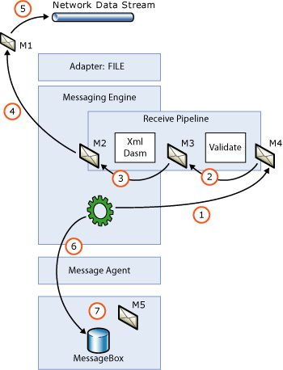

# How Adapters Handle Large Messages
The BizTalk Messaging Engine can process very large messages and imposes no restriction on the maximum size of a message. However, you should consider limits to message size to maintain optimum performance and resource management. As message size increases the number of messages processed per second decreases. Consider the average message size, message type, and number of messages being processed by [!INCLUDE[btsBizTalkServerNoVersion](../includes/btsbiztalkservernoversion-md.md)] when designing your scenario and planning for capacity.  
  
## Stream-Based Processing  
 It is important to keep large message handling in mind when developing adapters. Loading the entire data stream into memory regardless of its size is strongly discouraged because this could potentially stop the BizTalk Server process. Depending on the size and number of messages that the engine is processing at any given time, low virtual memory could become a problem. Instead, messages should be processed in a streaming fashion as follows:  
  
- **Inbound messages.** For inbound messages the network stream is attached to the BizTalk message by the receive adapter leaving the "pulling" of the stream to the BizTalk Messaging Engine.  
  
- **Outbound messages.** For outbound messages the adapter is responsible for pulling the stream. This effectively pulls the stream from the MessageBox database and though the send pipeline. The adapter should send the data over the wire in a streaming fashion.  
  
  The following figure shows stream-based processing on the receive side of the Messaging Engine.  
  
    
  
  When an adapter submits a message to the engine it should attach its data stream to the BizTalk message. For some adapters this may mean implementing a network stream. When the message is submitted, the engine executes the receive pipeline. During pipeline execution, the pipeline components that want to change the data clone the message, wiring up the stream from the new message to the stream on the previous message. After the pipeline has been executed, the Messaging Engine takes a message out of the pipeline and executes a loop reading the stream on that message. This reading of the stream invokes a read on the previous stream, which in turn invokes a read on the previous stream, and so on back to the network stream. The engine periodically flushes the data to the MessageBox to maintain a flat memory model.  
  
  **Troubleshooting Tip:** On the send side, the adapter is responsible for reading the stream. If the send adapter wants to read any message context properties that are promoted or written in the send pipeline, these properties may not be written until the entire stream is read. Only when the stream has been completely read can the adapter be sure that all of the pipeline components have finished executing.  
  
## Locating a Specific Byte in the Stream  
 There are scenarios in which an adapter may need to locate the stream back to the beginning to handle failed messages that need to be suspended. An example of this is an HTTP adapter that is receiving data using chunked encoding to submit the response message in a solicit-response pair.  
  
 However, in many scenarios you may not be able to trace the data stream. For example, consider an HTTP adapter receiving data using chunked encoding. For the data stream to be designed so you can find the messages that failed, the adapter would need to cache the data as it is read, either in memory or onto disk. Clearly this is not optimal and requires additional resources. Further, many of the out-of-the-box pipeline components operate in a forward-only streaming fashion. For these scenarios the BaseAdapter in the SDK uses a helper class called **VirtualStream**. The file that contains this functionality is named VirtualStream.cs.  
  
> [!NOTE]
>  The VirtualStream.cs file is located in two locations under the Pipelines SDK Samples—SDK\Samples\Pipelines\ArbitraryXPathPropertyHandler and SDK\Samples\Pipelines\SchemaResolverComponent\SchemaResolverFlatFileDasm.  
  
 The idea behind a virtual stream is that the data in the stream is cached in a memory stream until it reaches a threshold, over which the data is overflowed to a secure location on disk. After the stream is closed the disk file is automatically deleted. Forward-only streams can be designed in this way.