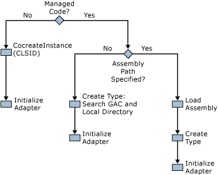

# How BizTalk Server Instantiates an Adapter
When the BizTalk service starts, all receive adapters are instantiated, as long as they have one or more configured and active receive locations. By default a send adapter is not instantiated until the Messaging Engine removes from the queue the first message to be sent by using that send adapter. (This is sometimes called "lazy creation.") However, if you need to instantiate a send adapter on service startup, you can use the **InitTransmitterOnServiceStart** adapter capability. This directs the Messaging Engine to create the send adapter on service startup rather than using the default lazy creation. The default lazy creation approach helps to reduce the amount of system resources used when adapters are not configured on endpoints.  
  
 When you create a custom adapter, we recommend that you use managed code. However, it is possible to use native COM components. For COM components the adapter is instantiated in the normal manner using **CoCreateInstance**.  
  
 For managed code, you need to specify the .NET **type** in the configuration file; the assembly path is optional.  
  
 The following deployment options are possible:  
  
|.NET type|Assembly path|Assembly deployment method|  
|---------------|-------------------|--------------------------------|  
|Specified|Not specified|XCopy assembly to product directory or subdirectory in product directory with the same name as the assembly|  
|Specified|Not specified|Global assembly cache (GAC) assembly|  
|Specified|Specified|XCopy assembly to specified directory|  
  
 **Troubleshooting Tip:** When you create an adapter using managed code, if the creation fails, use the fuslogvw.exe tool to determine if there are references to assemblies that cannot be resolved. This is a common mistake.  
  
 The following figure shows the logic for creating adapters, depending on the configuration specified:  
  
   
  
 The following table gives an example of how a receive adapter may be configured, and the ways the run-time assembly may be configured.  
  
|Assembly deployment method|InboundTypeName|InboundAssemblyPath|  
|--------------------------------|---------------------|-------------------------|  
|Specify assembly location|Microsoft.Samples.MyReceiveAdapter|C:\MyAdapter\MyAdapter.dll|  
|Specify .NET type (include public key, version, and culture information)|Microsoft.Samples.MyReceiveAdapter, MyReceiveAdapter, Version=1.0.2510.24622, Culture=neutral, PublicKeyToken=077cf886a2d1c020|N/A|  
|GAC assembly|Microsoft.Samples.MyReceiveAdapter, MyReceiveAdapter, Version=1.0.2510.24622, Culture=neutral, PublicKeyToken=077cf886a2d1c020|N/A|
