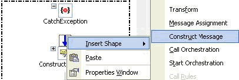

# Catch Exception Blocks

The **Catch Exception** block represents an exception handler. **Catch Exception** blocks are attached to the end of a **Scope** shape in Orchestration Designer. In BizTalk Server, you can attach as many **Catch Exception** blocks as you need.  
  
 You can set up exception handlers to handle different kinds of exceptions. On each exception handler, you specify an exception type, which must be either a fault message or an object derived from the class `System.Exception`. If you do not specify an exception type, the exception block is treated as a general exception handler, and can catch exceptions that do not derive from `System.Exception`.  
  
 If an exception is thrown that matches the specified type in an exception handler, that exception handler is called. If some other exception is thrown, it is handled by the default exception handler.  
  
> [!NOTE]
> To add a **Catch Exception** block to a **Scope** shape, the **Transaction Type** property of the **Scope** shape must be set to None or Long Running.  
  
## Adding and Populating a Catch Exception Block  
  
#### To add and populate a catch exception block  
  
1.  Right-click the **Scope** shape that you want to add a **Catch Exception** block to, and then click **New Exception Handler**.  
  
     A **Catch Exception** block is added to the orchestration immediately following the associated **Scope** shape.  
  
2.  In the **Properties** window, specify the properties. The most important property is the **Exception Object Type** because this is the type of message it will catch.  
  
    |Property|Description|  
    |--------------|-----------------|  
    |Exception Object Name|Assigns a name to the exception object caught by the exception handler.|  
    |Exception Object Type|Determines the object type (derived from System.Exception) that this exception handler will catch.|  
  
3.  In the **Properties** window, click the **Exception Object Type** list. This list contains the general exception that is thrown by the adapter.  
  
     The name appears as the fault you set in the port to the back-end system, for example, PS.SQLExecute.Fault.  
  
4.  Add a name for the **Exception Object Name**, for example, Test.  
  
     Inside the **Catch Exception** block, add shapes to create the process for handling the exception.  
  
    1.  Right-click below the **Catch Exception**, point to **Insert Shape**, and select **Construct Message**.  
  
           
  
    2.  Double-click inside **MessageAssignment** to open the Text Editor and enter the Message assignment.  
  
         Enter the name that you set in the **Exception Object Name** from the **Catch Exception**, and the new message you created for the fault.  
  
         For example, type `Message_3 = Test`.  
  
           
  
## See Also
  
- [How to Add a Scope Shape](../core/how-to-add-a-scope-shape1.md)   
- [Completing the Exception Message](../core/completing-the-exception-message3.md)   
- [Using BizTalk Server Exception Handling](../core/using-biztalk-server-exception-handling2.md)
