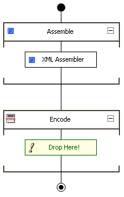

# How to Add a Component to a Pipeline
You add components to pipelines by dragging from the Toolbox to the design surface.  
  
### To add a component to a pipeline  
  
- In the Toolbox, drag the pipeline component onto a **Drop Here!** box on the design surface.  
  
  The following illustration shows how the pipeline design surface illustrates pipelines. This pipeline has two stages, the Assemble stage and the Encode stage. The XML Assembler pipeline component was added to the Assemble stage, but the Encode stage is still empty, because it still shows **Drop Here!** to indicate that a pipeline component can be added to the stage.  
  
    
  Illustrates stages and components in a BizTalk pipeline.  
  
> [!NOTE]
>  A pipeline component can only be dropped at specific places on the design surface. The pipeline component can only be dropped in a stage in which it has stage affinity. A circle with a line through it appears next to the pointer where the pipeline component cannot be dropped. An arrow appears, and a portion of the design surface is highlighted where a pipeline component can be placed.  
  
## See Also  
 [How to Create a New Pipeline](../core/how-to-create-a-new-pipeline.md)   
 [How to Open a Pipeline](../core/how-to-open-a-pipeline.md)   
 [How to Use the Toolbox](../core/how-to-use-the-toolbox.md)   
 [How to Navigate with the Keyboard](../core/how-to-navigate-with-the-keyboard.md)   
 [Creating Pipelines with Pipeline Designer](../core/creating-pipelines-with-pipeline-designer.md)