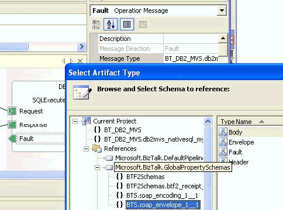

# Add a Fault Message

When you first created the port to the back-end system, it contained a request and a response. You must add a fault to capture the exception.  
  
### To add a fault message  
  
1.  Right-click **Port Operation**, and then select a **New Fault Message**.  
  
     A **Fault** appears under the **Request and Response** in the port.  
  
2.  On the **Orchestration View** screen, right-click **Messages**, and then select **New Message**.  
  
     This creates Message_3, which you can assign specifically to the fault.  
  
3.  Right-click **Message_3** to access the **Properties** window.  
  
    1.  Set the **Message Type**.  
  
    2.  Select **Schema**, and then select from **ref assembly**.  
  
         This opens a **Select Artifact Type** window.  
  
    3.  Scroll down and select the fully qualified fault.  
  
         The name is **BTS.SOAP_Envelope_1__1.fault**. Click **OK** to accept the selection and close the window.  
  
4.  Right-click the **Fault** to access the **Properties** window.  
  
    1.  Set the **Message Type**.  
  
    2.  Select **Schema** and then select from **ref** assembly.  
  
         This opens a **Select Artifact Type** window.  
  
    3.  Scroll down and select the fully qualified fault.  
  
         The name is **BTS.SOAP_Envelope_1__1.fault**.  
  
    4.  Click **OK** to accept the selection and close the window.  
  
           
  
5.  After the fault is named, you will set this name to the CatchException's exception object type.  
  
## See Also  
 [Using BizTalk Server Exception Handling](../core/using-biztalk-server-exception-handling2.md)
