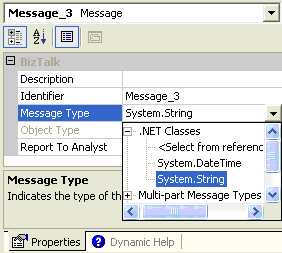

# How to Add a Message for an Exception
When you first create a port to the back-end system, it contains a request and a response. You must add a message so that you can assign it to the fault.  
  
### To add a fault message  
  
1. In the **Orchestration View** window, right-click **Messages**, and then select **New Message**.  
  
    This creates Message_3, which you can assign specifically to the fault.  
  
2. Right-click **Message_3**, and select **Properties**.  
  
3. Set the **Message Type** as follows: select **.NET Classes**, and then select **System,String**  
  
     
  
## See Also  
 [Using BizTalk Server Exception Handling](../core/using-biztalk-server-exception-handling1.md)