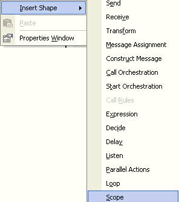
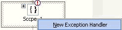

# How to Add a Scope Shape
Follow these steps to add a Scope shape.  
  
### To add a Scope Shape  
  
1.  Right-click the arrow below the **ReceiveFromIn** port, point to **Insert Shape**, and then click **Scope**.  
  
       
  
     In the Scope shape, you set operations that might have a fault.  
  
     For example, add a send, a receive, and a send port in an SQLExecute orchestration. In this example, we are sending a message to DB2. DB2 gives a response. It runs the rest of the orchestration and returns information back to the OutFile port.  
  
2.  In the Scope shape, set the **Transaction** to **None**.  
  
3.  Right-click inside the Scope shape, and select **New Exception Handler**.  
  
       
  
     This creates the Catch Exception block. If an exception occurs from the back-end, it is caught inside the Catch Exception block.  
  
4.  In the Catch Exception block, you must add the logic.  
  
     The most important logic you must set is the type of error message you are expecting.  
  
## See Also  
 [Using BizTalk Server Exception Handling](../core/using-biztalk-server-exception-handling2.md)