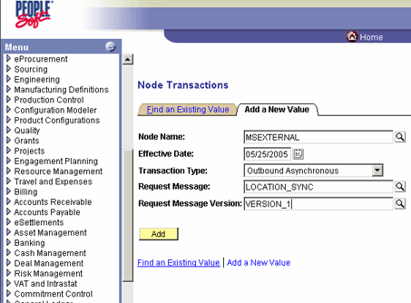
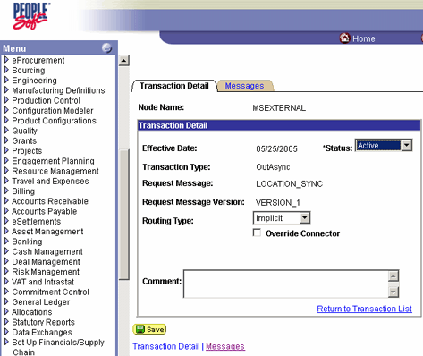

# How to Add a Transaction
Follow these steps to add a transaction.  
  
### To add a transaction  
  
1. Click the **Transactions** tab.  
  
2. Click **Add Transaction**.  
  
3. Click **Add a New Value**. Enter the following information, and then click **Add**.  
  
   1. **Node Name:** Verify that this is **MSEXTERNAL**.  
  
   2. **Transaction Type:** Verify that this is **Outbound Asynchronous**.  
  
   3. **Request Message:** Enter `LOCATION_SYNC`.  
  
   4. **Request Message Version:** Enter `VERSION_1`.  
  
        
  
4. On the **Transaction Detail** tab, verify the following settings:  
  
   1. **Status:** Active.  
  
   2. **Routing:** Implicit.  
  
        
  
5. Click **Save**.  
  
6. Click the **Return to Transaction List** link.  
  
    The transaction appears in the list of transactions.  
  
## See Also  
 [Creating a PeopleSoft HTTP Host and Port](../core/creating-a-peoplesoft-http-host-and-port.md)