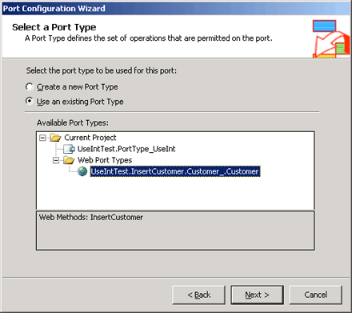

# How to Add a Web Port
You add a Web port on the port surface in Orchestration Designer. Unlike other configured ports, Web ports support a mixture of request (one-way) and request/response (two-way) operations. Each operation in the Web port represents a Web method. If the Web method contains *input* and *output* parameters, BizTalk creates a request/response operation. If the Web service contains only an *input* parameter, BizTalk only creates a one-way operation.  
  
### To add a Web port  
  
1.  In Orchestration Designer, with an orchestration open, right-click the port surface, and then select **New Configured Port**.  
  
2.  On the **Welcome to the Port Configuration Wizard** page, click **Next**.  
  
3.  On the **Port Properties** page, in the **Name** text box, type a name for the port, and then click **Next**.  
  
4.  In the **Select a Port Type** page, select **Use an existing Port Type**.  
  
5.  In the **Available Port Types** box, expand the **Web Port Types** node and select the Web port type that corresponds to the added Web service, and then click **Next**.  
  
     The following figure shows the **Select a Port Type** dialog box.  
  
       
  
6.  In the **Port Binding** page, in the **Port binding** drop down box, select **Specify now**. BizTalk automatically places the values from the referenced Web service in the URI, transport, and receive and send pipelines. BizTalk uses these values to create the send port when you deploy your BizTalk project.  
  
    > [!IMPORTANT]
    >  The default authentication method for the send port is anonymous access. If the Web service requires a different authentication or encryption method, you must change the configuration to supply the appropriate user credentials or Secure Sockets Layer (SSL) to run Web services. For more information, see [SOAP Send Adapter](../core/soap-send-adapter.md) and [Sample TMA: HTTP and SOAP Adapters](../core/sample-tma-http-and-soap-adapters.md).  
  
7.  Click **Next**, and then **Finish** to complete the wizard.  
  
## See Also  
 [How to Run the Port Configuration Wizard](../core/how-to-run-the-port-configuration-wizard.md)   
 [Creating Web Ports](../core/creating-web-ports.md)