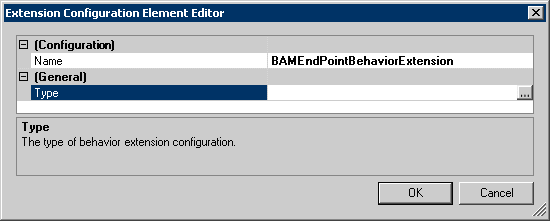
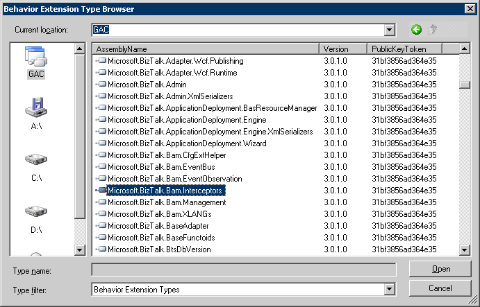
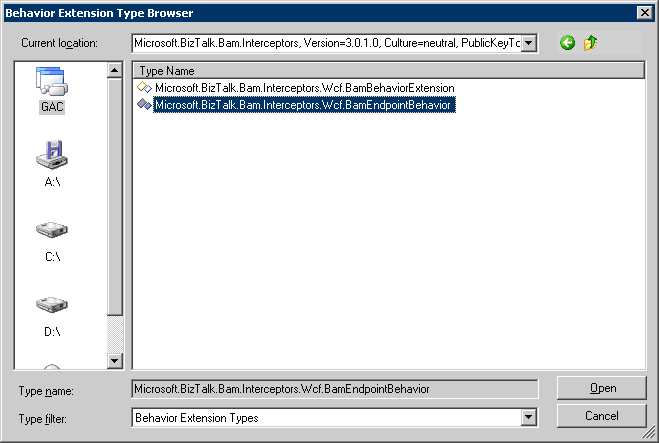

# How to Add the BAM Interceptor Behavior to the Machine.config File
To intercept data in BAM, you must add the BAM interceptor behavior to the Microsoft .NET machine.config file. You can do this in two ways:  
  
-   Manually edit the machine.config file to include the behavior.  
  
-   Use the Service Configuration Editor to include the behavior.  
  
### To manually edit the machine.config file  
  
1.  Edit the machine.config file located in the Microsoft .NET configuration folder. To do this, click **Start**, click **Run**, type notepad c:\WINDOWS\Microsoft.NET\Framework\v4.0.30319\Config\machine.config, and then click **OK**.  
  
2.  Update the machine.config file with the following behavior extensions.  
  
    ```  
    <system.serviceModel>  
      <extensions>  
        <behaviorExtensions>  
          <add name="BAMEndPointBehaviorExtension" type="Microsoft.BizTalk.Bam.Interceptors.Wcf.BamEndpointBehavior, Microsoft.BizTalk.Bam.Interceptors, Version=3.0.1.0, Culture=neutral, PublicKeyToken=31bf3856ad364e35" />  
        </behaviorExtensions>  
      </extensions>  
    </system.serviceModel>  
    ```  
  
3.  Close and save the machine.config file.  
  
#### To edit the machine.config file using the Service Configuration Editor  
  
1.  Open the Service Configuration Editor. For information about using the Service Configuration Editor, see [http://go.microsoft.com/fwlink/?LinkId=83557](http://go.microsoft.com/fwlink/?LinkId=83557).  
  
2.  In the tree view pane (labeled **Configuration**), expand the node tree. Click the **Advanced** folder, click the **Extensions** folder, and then select the **behavior element extensions** element.  
  
3.  Create a new behavior element extension. Click the **New** button to open the Extension Configuration Element Editor dialog box. In **Configuration Name** enter a unique name for the behavior, for example BAMEndPointBehaviorExtension.  
  
       
  
4.  Click the **Type** field, and then click the ellipsis button (**...**) button to open the Behavior Extension Type Browser dialog box.  
  
5.  Click the global assembly cache (GAC) icon to list the DLLs in GAC.  
  
6.  Select the Microsoft.BizTalk.Bam.Interceptors assembly.  
  
7.  Click the **Open** button to select the assembly, and then close the dialog box.  
  
       
  
8.  In the Type Name pane of the Behavior Extension Type Browser dialog box, double-click the Microsoft.BizTalk.Bam.Interceptors.Wcf.BamEndpointBehavior type (as highlighted in the following screen).  
  
       
  
     This opens the Extension Configuration Element Editor.  
  
9. Click **OK** to close the Extension Configuration Element Editor dialog box.  
  
10. In the details pane of the Service Configuration Editor, verify that the BAMEndPointBehaviorExtension appears.  
  
11. Close the Service Configuration Editor.  
  
## Next Steps  
 [How to Configure the BAM WCF Interception](../core/how-to-configure-the-bam-wcf-interception.md)  
  
## See Also  
 [Configuring the WCF Adapter to Intercept BAM Data](../core/configuring-the-wcf-adapter-to-intercept-bam-data.md)