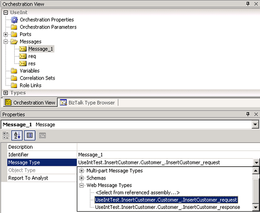

# How to Add Web Messages
You create Web message variables in the Orchestration View window. You must set the message type for the Web message to a Web message type.  
  
### To add a Web message  
  
1.  With an orchestration open, on the **View** menu, click **Other Windows**,and then click **Orchestration View**.  
  
2.  Right-click the **Message** node and then click **New Message**.  
  
3.  Message_*x* appears under the **Message** node.  
  
4.  In the **Properties** window, from the **Message Type** drop-down box, select a Web message type.  
  
5.  Scroll through the drop-down box to the Web message type you want to use, and then click the Web message type to select it.  
  
     The following figure shows the **Orchestration View** window with Message_1 selected and the Properties window, selecting a Web message type for Message_1.  
  
       
  
## See Also  
 [Constructing Web Messages](../core/constructing-web-messages.md)
