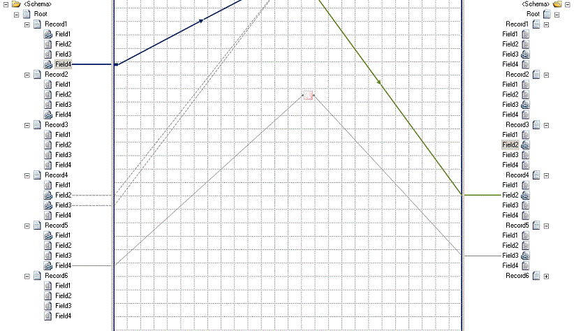
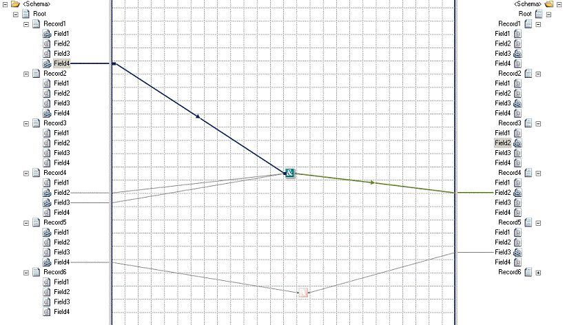

# How to Bring Selected Map Items in View
With earlier versions of BizTalk Mapper, if a map comprised big schemas, you had to manually scroll the source schema pane, the grid page, and the target schema pane to bring all the relevant map items into a single view. The BizTalk Mapper with [!INCLUDE[prague](../includes/prague-md.md)] allows you to bring all the relevant map items of the selected functoid/link into a single view by automatically scrolling the grid page. This topic provides information about how to perform the operation.  
  
 Depending on your selection (a source schema node, an element in the relationship view, or a target schema node), the BizTalk Mapper auto-scrolls the schema views and relationship view in a synchronized fashion, and displays the overall relationship view of the selected item.  
  
> [!NOTE]
>  The auto-scroll feature comes into effect after the BizTalk Mapper has emphasized all the relevant map items. In other words, first the elements related to the selection are highlighted, and then the BizTalk Mapper auto-scrolls to bring the related elements into view.  
  
 The BizTalk Mapper does not actually move the grid objects. The grid objects return to their respective locations when you remove or modify the selection.  
  
## Prerequisites  
 This operation requires that BizTalk Mapper is running.  
  
### To bring the selected map items in view  
  
1.  On the Mapper utility ribbon, click the auto-scroll icon  to switch it OFF.  
  
    > [!NOTE]
    >  The  icon is switched OFF by default.  
  
2.  Click a functoid or a link; the relevant map items in the relationship are emphasized.  
  
     The following figure displays the selected link in blue color. In turn, BizTalk Mapper emphasizes the other map items relevant to the selection, in green color. From the figure, you can see that all the elements of the selected relationship, though emphasized, are completely not in the current view.  
  
       
  
3.  Click the auto-scroll icon  to switch it ON.  
  
     The BizTalk Mapper automatically scrolls to bring all the relevant items in the selection into the current map view.  
  
       
  
    > [!NOTE]
    >  Alternatively, you can press CTRL+M, CTRL+U from the keyboard. For a list of Mapper keyboard shortcuts, see [BizTalk Mapper Keyboard Shortcuts](../core/biztalk-mapper-keyboard-shortcuts.md).  
  
## See Also  
 [Using Enhanced Features in BizTalk Mapper](../core/using-enhanced-features-in-biztalk-mapper.md)