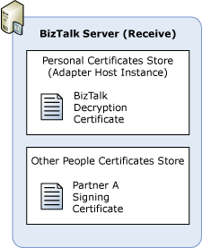
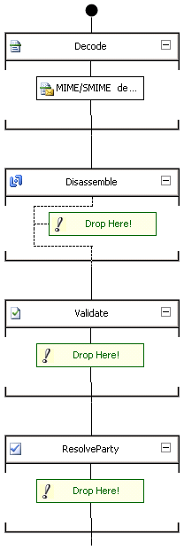

# How to Configure BizTalk Server for Party Resolution
The following procedure lists the steps that you have to follow to configure [!INCLUDE[btsBizTalkServerNoVersion](../includes/btsbiztalkservernoversion-md.md)] for party resolution.  
  
-   To install the certificates in the certificates store to receive signed messages  
  
-   To create a party to represent your partner  
  
-   To create a pipeline for party resolution using certificates  
  
-   To configure the receive location for party resolution using certificates  
  
### To install the certificates in the certificates store to receive signed messages  
  
1. Partner A requests a private-public key pair for digital signatures from the certification authority (CA).  
  
2. Partner A sends you its public key for digital signatures.  
  
3. In [!INCLUDE[btsBizTalkServerNoVersion](../includes/btsbiztalkservernoversion-md.md)], log on to the server that has a host instance running a handler that will receive messages from Partner A. Install the Partner A public key certificate to verify their signature in the Other People store. The following figure shows the certificate store where you install the certificate.  
  
      
  
4. In Partner A, install the Partner A private key certificate for signing messages in the appropriate store. (If Partner A is using [!INCLUDE[btsWin2kSvr](../includes/btswin2ksvr-md.md)], or [!INCLUDE[btsWinSvr2k3](../includes/btswinsvr2k3-md.md)], or [!INCLUDE[btsWinSvr2k8](../includes/btswinsvr2k8-md.md)], install the private key in the personal store for the account that will sign messages sent to [!INCLUDE[btsBizTalkServerNoVersion](../includes/btsbiztalkservernoversion-md.md)].)  
  
   > [!NOTE]
   >  This step is exactly same as the step "To install the certificates in the certificates store to receive signed messages" in [How to install the Certificates for Digital Signatures](../core/how-to-install-the-certificates-for-digital-signatures.md).  
  
### To create a party to represent your partner  
  
1. In the [!INCLUDE[btsBizTalkServerNoVersion](../includes/btsbiztalkservernoversion-md.md)] Administration console, create a party for the Partner A. For more information about how to create a Party, see [How to Create a Party](http://msdn.microsoft.com/library/f6feca1d-bc83-4fb6-981d-26c9e0d53044).  
  
2. In the **Certificates** properties, select the public key signing certificate to use to identify this party, Partner A.  
  
### To create a pipeline for party resolution using certificates  
  
1. In Solution Explorer in the Microsoft [!INCLUDE[btsVStudioNoVersion](../includes/btsvstudionoversion-md.md)], select the project in which you want to create the pipeline.  
  
   1.  On the **File** menu, click **Add New Item**.  
  
   2.  In the **Add New Item** dialog box, expand BizTalk Project Items, click **Pipeline Files**, and then click the **Receive Pipeline** template.  
  
   3.  In the **Name** field, type a name for the pipeline.  
  
   4.  Click **Add**.  
  
        The new pipeline appears in Solution Explorer.  
  
2. Drag the MIME/SMIME Decoder pipeline component into the **Decode** stage of a receive pipeline.  
  
      
  
   -   Configure the MIME/SMIME Decoder pipeline component properties in the **Properties** window. For more information about the MIME/SMIME decoder, see [How to Configure the MIME-SMIME Decoder Pipeline Component](../core/how-to-configure-the-mime-smime-decoder-pipeline-component.md).  
  
   > [!NOTE]
   >  You can configure pipeline properties for a receive location after the pipeline has been deployed into a BizTalk group using the [!INCLUDE[btsBizTalkServerNoVersion](../includes/btsbiztalkservernoversion-md.md)] Administration console. You can configure different pipeline properties for each receive location in the BizTalk group. For more information, see [How to Configure Per-instance Pipeline Properties for a Receive Location](../core/how-to-configure-per-instance-pipeline-properties-for-a-receive-location.md).  
   > 
   > [!NOTE]
   >  The MIME/SMIME Decoder pipeline component performs both decryption and digital signature validation (when configured to perform both functions). Therefore, if you are configuring [!INCLUDE[btsBizTalkServerNoVersion](../includes/btsbiztalkservernoversion-md.md)] to receive encrypted and signed messages, you can use the same receive pipeline. In other words, you do not have to create separate pipelines for decryption and digital signature validation.  
  
3. Drag the Party Resolution pipeline component into the **ResolveParty** stage of a receive pipeline. For more information about the Party Resolution pipeline component, see [How to Configure the Party Resolution Pipeline Component](../core/how-to-configure-the-party-resolution-pipeline-component.md).  
  
   > [!NOTE]
   >  You can also use the default XMLReceive pipeline instead of creating a new receive pipeline. The XMLReceive pipeline runs the Party Resolution component, which resolves the certificate subject to the party ID. Note that the XMLReceive pipeline has an empty Decode stage, and therefore you cannot use it for receiving encrypted messages or verifying digital signatures.  
  
   -   In the Properties window, configure the Party Resolution pipeline property **Resolve party by certificate** to `True`.  
  
4. Build and deploy the receive pipeline.  
  
### To configure the receive location for party resolution using certificates  
  
1.  Add the BizTalk assembly that you created in previous procedure to the BizTalk Application including the receive locations to receive signed messages. For more information about how to add BizTalk assemblies, see [How to Add a BizTalk Assembly to an Application](../core/how-to-add-a-biztalk-assembly-to-an-application.md).  
  
2.  Configure the receive locations in the BizTalk Application with the receive pipeline that you created in previous procedure. For more information about how to configure receive locations, see [How to Edit the Properties of a Receive Location](../core/how-to-edit-the-properties-of-a-receive-location.md).  
  
## See Also  
 [How to Configure BizTalk Server for Receiving Signed Messages](../core/how-to-configure-biztalk-server-for-receiving-signed-messages.md)   
 [Certificates that BizTalk Server Uses for Signed Messages](../core/certificates-that-biztalk-server-uses-for-signed-messages.md)   
 [Inbound Message Authentication](../core/inbound-message-authentication.md)   
 [Using Certificates for Party Resolution](../core/using-certificates-for-party-resolution.md)