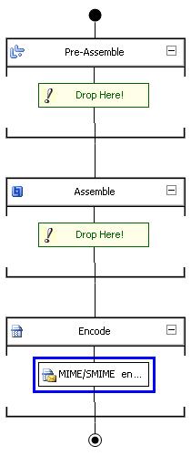

# How to Configure BizTalk Server for Sending Signed Messages
The following procedure lists the steps that you have to follow to configure [!INCLUDE[btsBizTalkServerNoVersion](../includes/btsbiztalkservernoversion-md.md)] to send signed messages.  
  
-   To create a pipeline to send signed messages  
  
-   To configure the send port for sending signed messages  
  
## Prerequisites  
 Before configuring [!INCLUDE[btsBizTalkServerNoVersion](../includes/btsbiztalkservernoversion-md.md)]s for sending signed messages, you must perform the steps in [How to install the Certificates for Digital Signatures](../core/how-to-install-the-certificates-for-digital-signatures.md).  
  
### To create a pipeline to send signed messages  
  
1. In Solution Explorer in the Microsoft [!INCLUDE[btsVStudioNoVersion](../includes/btsvstudionoversion-md.md)], select the project in which you want to create the pipeline.  
  
   1.  On the **File** menu, click **Add New Item**.  
  
   2.  In the **Add New Item** dialog box, expand BizTalk Project Items, click **Pipeline Files**, and then click the **Send Pipeline** template.  
  
   3.  In the **Name** field, type a name for the pipeline.  
  
   4.  Click **Add**.  
  
        The new pipeline appears in Solution Explorer.  
  
2. Drag the MIME/SMIME Encoder pipeline component into the Encode stage of a receive pipeline.  
  
      
  
3. In the Properties window, configure the MIME/SMIME Encoder pipeline component **Signature type** property to **ClearSign**or **BlobSign**. For more information about the **Enable encryption** property, see [How to Configure the MIME-SMIME Encoder Pipeline Component](../core/how-to-configure-the-mime-smime-encoder-pipeline-component.md).  
  
   > [!IMPORTANT]
   >  If you are also using encryption, you can only select **BlobSign**.  
   > 
   > [!NOTE]
   >  You can configure the send pipeline component properties using the [!INCLUDE[btsBizTalkServerNoVersion](../includes/btsbiztalkservernoversion-md.md)] Administration console after the pipeline has been deployed into a BizTalk group. For more information, see [How to Configure Per-Instance Pipeline Properties for a Send Port](../core/how-to-configure-per-instance-pipeline-properties-for-a-send-port.md).  
   > 
   > [!NOTE]
   >  The MIME/SMIME Encoder pipeline component performs both encryption and digital signing (when configured to perform both functions). Therefore, if you are configuring [!INCLUDE[btsBizTalkServerNoVersion](../includes/btsbiztalkservernoversion-md.md)] to send encrypted and signed messages, you can use the same send pipeline. In other words, you do not have to create separate pipelines for encryption and digital signing.  
  
4. Build and deploy the send pipeline.  
  
### To configure the send port for sending signed messages  
  
1.  Add the BizTalk assembly that you created in previous procedure to the BizTalk Application including the receive locations to sending signed messages. For more information about how to add BizTalk assemblies, see [How to Add a BizTalk Assembly to an Application](../core/how-to-add-a-biztalk-assembly-to-an-application.md).  
  
2.  Configure the send port in the BizTalk Application with the send pipeline that you created in previous procedure. For more information about how to configure send ports, see [Creating and Configuring Send Ports](../core/creating-and-configuring-send-ports.md).  
  
3.  Configure the BizTalk group with the signing certificate that you installed in [How to install the Certificates for Digital Signatures](../core/how-to-install-the-certificates-for-digital-signatures.md). For more information how to configure a BizTalk group, see [How to Modify Group Properties](../core/how-to-modify-group-properties.md).  
  
## See Also  
 [How to Configure BizTalk Server for Receiving Signed Messages](../core/how-to-configure-biztalk-server-for-receiving-signed-messages.md)   
 [Certificates that BizTalk Server Uses for Signed Messages](../core/certificates-that-biztalk-server-uses-for-signed-messages.md)   
 [Sending and Receiving Signed Messages](../core/sending-and-receiving-signed-messages.md)