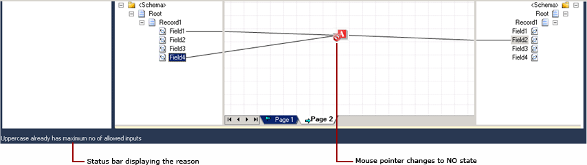
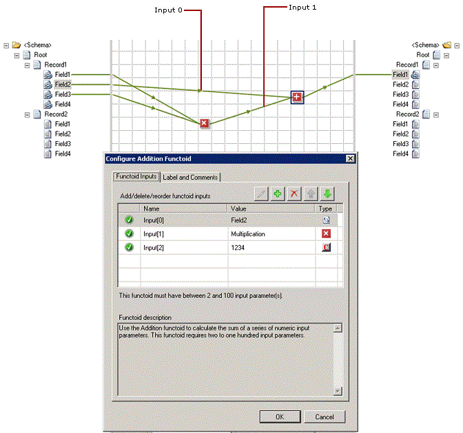

# How to Configure Functoid Input Parameters
Properly configuring the input parameters to the functoids in your map is one of the most important, and potentially error-prone, aspects of using functoids. You can configure the functoid input parameters as follows:  
  
- Create visible input links by connecting schema nodes and respective functoids (drag-and-drop the mouse from schema node to the functoid).  
  
- Directly edit the list of input parameters using the **Configure \<Functoid\> Functoid** dialog box.  
  
  This topic provides step-by-step instructions for configuring the input parameters for a functoid using these methods.  
  
  The dragging method of establishing functoid input parameters provides a convenient way to specify input parameters that involve XPath specifications into the source schema. For information on creating a schema node and functoid input parameters, see [How to Add Basic Functoids to a Map](../core/how-to-add-basic-functoids-to-a-map.md). However, the **Configure \<Functoid\> Functoid** dialog box is the definitive mechanism for viewing all the input parameters to a functoid, for creating and modifying any constant parameters, and for re-arranging the order of the input parameters when necessary.  
  
  When you configure the input parameters for a functoid directly on the grid page (by drawing lines, using the mouse drag-and-drop, from the source schema node and linking it to the functoid), if the number of inputs reaches maximum, the cursor changes to a NO state. Also, the status bar displays the reason. The figure below shows a functoid which accepts only one input link.  
  
    
  
  You can configure the Scripting and Table Looping functoids using the **Configure \<Functoid\> Functoid** dialog box. For information about how to configure the functoids, see [How to Configure the Scripting Functoid](../core/how-to-configure-the-scripting-functoid.md) and [How to Configure the Table Looping and Table Extractor Functoids](../core/how-to-configure-the-table-looping-and-table-extractor-functoids.md).  
  
## Prerequisites  
 These instructions require that BizTalk Mapper is running.  
  
## What is an input parameter?  
 An input parameter can be any of the following:  
  
-   A link from source schema node to a functoid  
  
-   A link from functoid to another valid functoid  
  
-   A constant value  
  
> [!NOTE]
>  There are a few functoids, such as **Date**, **Time**, **Date and Time**, and **Nil**, which do not need any input parameters.  
  
 The figure below displays a functoid (highlighted in red) with two input parameters (Input[0] and Input[1]) and a constant parameter (Input[2]).  
  
   
  
## To open the Configure \<Functoid\> Functoid dialog box  
 You can open the **Configure \<Functoid\> Functoid** dialog box in one of the following ways:  
  
-   In the relevant grid page, right-click the functoid, and then click **Configure Functoid Inputs**.  
  
-   Double-click the functoid for which you want to configure the input parameters.  
  
-   Select the functoid and then click the ellipses (**…**) in the Visual Studio’s **Properties** window.  
  
-   Select the functoid and then press ENTER from the keyboard.  
  
-   Select the functoid and then press CTRL+M, CTRL+I from the keyboard. For a list of Mapper shortcut keys, see [BizTalk Mapper Keyboard Shortcuts](../core/biztalk-mapper-keyboard-shortcuts.md).  
  
### To insert constant input parameters  
  
1.  In the **Configure \<Functoid\> Functoid** dialog box, select the **Functoid Inputs** tab.  
  
    > [!NOTE]
    >  The **Functoid Inputs** tab is selected by default.  
  
2.  Click the  button. A new row is added.  
  
3.  Type the value for the new input parameter, and then click **OK**.  
  
    > [!NOTE]
    >  If the add button is not enabled, the functoid does not accept or require input parameters, or may already have the maximum number of allowed inputs.  
  
### To edit existing constant input parameters  
  
1.  In the **Configure \<Functoid\> Functoid** dialog box, click the existing constant input parameter that you want to edit. The current value is selected.  
  
    > [!IMPORTANT]
    >  You can edit the parameters of constant inputs only. Input parameters of all other types cannot be edited. They can only be rearranged or deleted.  
  
2.  Click the  button. Make the appropriate changes to the constant value, and then click **OK**.  
  
     Alternatively, you can double-click the constant input parameter to edit it, or press F2 from the keyboard.  
  
## To select multiple input parameters  
 You can select multiple input parameters by holding down the CTRL key and clicking the desired rows, and then perform any of the following operations. You can press CTRL+A from the keyboard to select all the rows.  
  
-   Move the selection up/down.  
  
    > [!NOTE]
    >  If the bulk selection includes either the top-most or the bottom-most row among the other rows, you cannot move the selection up/down respectively.  
  
-   Rearrange the selection.  
  
-   Delete the selection.  
  
### To change the order of existing input parameters  
  
1.  In the **Configure \<Functoid\> Functoid** dialog box, click the existing input parameter that you want to move to a different position in the ordered list of input parameters.  
  
2.  Click the  button to move the parameter up in the parameter list. Repeat as necessary until the selected input parameter is in the desired position. Alternatively, you can press the UP ARROW key from the keyboard. For a list of Mapper shortcut keys, see [BizTalk Mapper Keyboard Shortcuts](../core/biztalk-mapper-keyboard-shortcuts.md).  
  
     -OR-  
  
     Click the  button to move the parameter down in the parameter list. Repeat as necessary until the selected input parameter is in the desired position. Alternatively, you can press the DOWN ARROW key from the keyboard. For a list of Mapper shortcut keys, see [BizTalk Mapper Keyboard Shortcuts](../core/biztalk-mapper-keyboard-shortcuts.md).  
  
    > [!IMPORTANT]
    >  You can rearrange the sequence of inputs only from the **Configure \<Functoid\> Functoid** dialog box. If you select the top-most or bottom-most row, the  or  buttons would be disabled, respectively.  
  
### To delete an input parameter by deleting the input link  
  
1.  In the relevant grid page, click the input link corresponding to the input parameter you want to delete.  
  
2.  On the **Edit** menu, click **Delete**.  
  
    > [!NOTE]
    >  Alternatively, you can press the DELETE key, or right-click the link in the relevant grid page, and click **Delete** from the shortcut menu.  
  
    > [!IMPORTANT]
    >  The input link is deleted silently. You can always undo delete if you are not sure about it. For more information about undo/redo operations, see [How to Undo or Redo User Operations](../core/how-to-undo-or-redo-user-operations.md).  
  
### To delete existing input parameters within the Configure \<Functoid\> Functoid dialog box  
  
1.  In the **Configure \<Functoid\> Functoid** dialog box, click the existing input parameter that you want to delete.  
  
    > [!NOTE]
    >  You can delete any input parameter using this technique, even those that correspond to an input link.  
  
2.  Click the  button. The selected existing input parameter is deleted from the parameter list. Click **OK**.  
  
     Alternatively, you can select the row you want to delete, and press the DELETE key from the keyboard.  
  
    > [!IMPORTANT]
    >  The input parameter is deleted silently. You can always undo delete if you are not sure about it. For more information about undo/redo operations, see [How to Undo or Redo User Operations](../core/how-to-undo-or-redo-user-operations.md).  
  
    > [!NOTE]
    >  The delete button is not enabled when there are no input parameters in the parameter list.  
  
## To set labels and comments for functoids  
 You can set labels and comments for functoids using the **Configure \<Functoid\> Functoid** dialog box.  
  
1.  In the **Configure \<Functoid\> Functoid** dialog box, click the **Label and Comments** tab.  
  
2.  Type the **Label** and **Comments**, and then click **OK**.  
  
    > [!IMPORTANT]
    >  For more information about how to label and comment functoids and/or links, see [How to Label a Link](../core/how-to-label-a-link.md) and [How to Label and Comment a Functoid](../core/how-to-label-and-comment-a-functoid.md).  
  
## See Also  
 [Editing Functoid Properties and Input Parameters](../core/editing-functoid-properties-and-input-parameters.md)