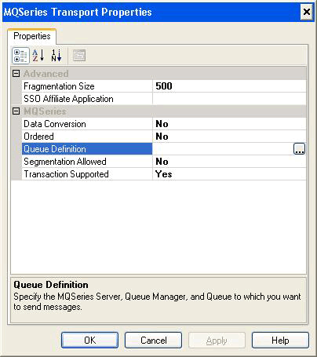

# How to Configure MQSeries Adapter Receive Locations and Send Ports
You can configure the MQSeries adapter for both receive locations and send ports.  

## To configure receive locations and send ports  
 **To create the receive port and receive location:**  

1. In the BizTalk Server Administration console, expand **BizTalk Server Administration**, expand **BizTalk Group**, expand **Applications**, and then expand the application in which you want to create a receive location.  

2. Right-click the **Receive Ports** node, click **New,** and point to **One-Way Receive Port**.  

3. Enter the appropriate values in the **Port Properties** dialog box. For information about the **Port Properties** dialog box, see [How to Create a Receive Port](../core/how-to-create-a-receive-port.md).  

4. In the BizTalk Server Administration console, right-click the **Receive Port** node you created and then click **Properties**.  

5. In the **Receive Port Properties** dialog box, in the left pane, select **Receive Locations**, and then click **New** in the right pane.  

6. In the **Receive Location Properties** dialog box, in the **Transport** section next to **Type**, select **MQSeries** from the drop-down list, and then click **Configure**.  

7. In the **MQSeries Transport Properties** dialog box, do the following:  

   |        Use this        |                                                                                                                                                                                                                                                                                                                                                                                                                             To do this                                                                                                                                                                                                                                                                                                                                                                                                                             |
   |------------------------|--------------------------------------------------------------------------------------------------------------------------------------------------------------------------------------------------------------------------------------------------------------------------------------------------------------------------------------------------------------------------------------------------------------------------------------------------------------------------------------------------------------------------------------------------------------------------------------------------------------------------------------------------------------------------------------------------------------------------------------------------------------------------------------------------------------------------------------------------------------------|
   |     **Batch Size**     | Determine the maximum size of a batch of messages in KB. **Note:**  If the **Transaction Supported** property for the receive location is set to **Yes**; each message batch is submitted to the MessageBox database under the context of a Microsoft Distributed Transaction Coordinator (MSDTC) transaction. The MSDTC transaction that is created for a message batch remains open until every message in the batch has been persisted to the MessageBox and placed in the appropriate subscriber queue. Therefore the duration of this MSDTC transaction is increased as the **Maximum Batch Size** parameter is increased. Since having a large number of MSDTC transactions open simultaneously can negatively impact overall performance, the **Maximum Batch Size** parameter should not be set to a very large value when transaction support is enabled. |
   | **Ordered Processing** |                                                                                                                                                                                                                                                                                         Set MQSeries to maintain the order of the messages as they are received from the MQSeries queue. **Note:**  To maintain message ordering for a specific queue, only one BizTalk Host instance may be receiving messages from that MQSeries queue.    **Default:** False                                                                                                                                                                                                                                                                                          |
   |       **Queue**        |                                                                                                                                                                                                                                                                                                                                                     Filled in with information from the **Queue Definition** dialog box. **Note:**  The URI for a send port or receive location cannot exceed 256 characters.                                                                                                                                                                                                                                                                                                                                                      |
   |   **Transactional**    |                                                                                                                                                                                                                                                                                                                   The adapter begins a Microsoft Distributed Transaction Coordinator (DTC) transaction between BizTalk Server and MQSeries Server. When set to **No**, there is no guarantee of message delivery.   **Default:** False                                                                                                                                                                                                                                                                                                                   |

8. In the **MQSeries Transport Properties** dialog box, click **OK** to populate the **Address (URI)** box in the **Receive Location Properties** dialog box.  

9. In the **Receive Location Properties** dialog box, enter the appropriate values to complete the configuration of the receive location, and click **OK** to save settings. For information about the **Receive Locations Properties** dialog box, see [How to Create a Receive Location](../core/how-to-create-a-receive-location.md).  

   **To create the send port:**  

10. In the BizTalk Server Administration console, create a new static send port. See [How to Create a Send Port](../core/how-to-create-a-send-port2.md) for more information. Configure all of the send port options and specify **MQSeries** for the **Type** option in the **Transport** section of the **General** tab.  

11. On the **General** tab, in the **Transport** section, click the **Configure** button next to **Type**.  

12. In the **MQSeries Transport Properties** dialog box, do the following:  

    |Property|Description|  
    |--------------|-----------------|  
    |**Fragmentation Size**|Sets the message chunk size in KB for messages as they are sent between the adapter and MQSAgent|  
    |**SSO Affiliate Application**|Sets the Single Sign-On (SSO) affiliate application. The user ID and password from SSO are used for the **MQMD_UserIdentifier**, and the **MQIIH_Authenticator** (or **MQCIH_Authenticator**) property respectively.   **Default:** Blank|  
    |**Data Conversion**|Converts the message to the ANSI code page of MQSeries for Windows server.   Select **Yes** to perform this conversion from Unicode to ANSI.   **Default:** No|  
    |**Ordered**|Sets MQSeries to maintain the order of messages as they are sent to the MQSeries queue.   Select **Yes** to maintain message order. **Note:**  You must set the **Delivery Notification** property in your orchestration to **Transmitted** for the send port.    **Default:** No|  
    |**Queue Definition**|Populated with information from the **Queue Definition** dialog box or directly in the field. **Note:**  The URI for a send port or receive location cannot exceed 256 characters.|  
    |**Segmentation Allowed**|Uses MQSeries Queue Manager segmentation if an individual message exceeds the MQSeries queue maximum message length. If you select **Yes**, MQSeries puts segmented messages into the queue.   **Default:** No|  
    |**Transaction Supported**|The adapter begins a DTC transaction between BizTalk Server and MQSeries Server. When set to **No**, there is no guarantee of message delivery.   **Default:** Yes **Note:**  Do not configure send ports with different **Transaction Supported** settings to send messages to the same MQSeries queue. **Note:**  With the exception of test scenarios, this property should always be set to the default value of **Yes**. Setting this property to a value of **No** in a production environment may cause unexpected problems.|  

     The following figure shows how you might configure these properties.  

       

13. Click the ellipsis (**...**) button to the right of the **Queue Definition** box to define the queue. You can use the **Export** dialog box, just as you may have with the receive location, to create the queue immediately or to export a script defining the queue.  

14. Click **OK** in each dialog box to close it and save the settings.  

    **To enlist the send port, start the send port, and enable the receive location:**  

15. Right-click the send port and click **Enlist** to enlist the send port.  

16. Right-click the send port and click **Start** to start the send port.  

17. Right-click the receive location and click **Enable** to enable the receive location.  

18. Review the event log to verify that there are no BizTalk Server errors.  

## See Also  
 [How to Configure MQSeries Adapter Send and Receive Handlers](../core/how-to-configure-mqseries-adapter-send-and-receive-handlers.md)   
 [Configuring the MQSeries Adapter](../core/configuring-the-mqseries-adapter.md)