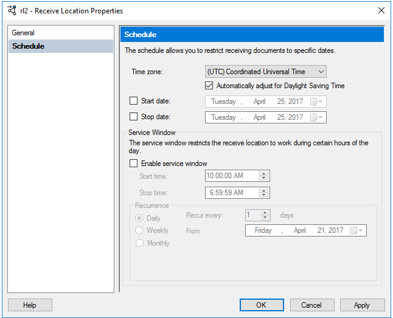
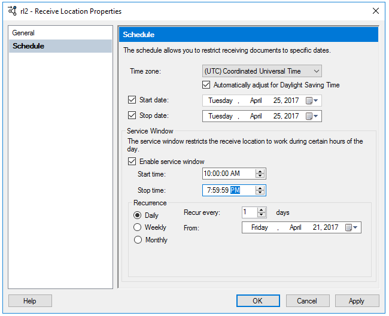
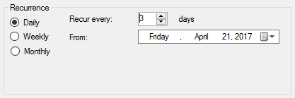

# How to Configure Scheduling for a Receive Location
This topic describes how to use the BizTalk Server Administration console to configure scheduling properties for a receive location. You can specify the dates when you want the receive location to start and stop processing messages. You can also specify certain times of the day during which you want the receive location to process messages.  
  
## Prerequisites  
 To perform the procedure in this topic, you must be logged on with an account that is a member of the BizTalk Server Administrators group. For more detailed information on permissions, see [Permissions Required for Deploying and Managing a BizTalk Application](../core/permissions-required-for-deploying-and-managing-a-biztalk-application.md).  
  
### To configure scheduling for a receive location  
  
1. Click **Start**, click **All Programs**, click [!INCLUDE[btsBizTalkServerStartMenuItemui](../includes/btsbiztalkserverstartmenuitemui-md.md)], and then click **BizTalk Server Administration**.  
  
2. In the console tree, expand the BizTalk group and the BizTalk application for which you want to configure scheduling for a receive location.  
  
3. Click **Receive Locations**, right-click the receive location, and click **Properties**.  
  
4. In the left pane, click **Schedule**, configure scheduling properties as described in the following table, and then click **OK**.  
  
   |Use this|To do this|  
   |--------------|----------------|  
   |**Time zone**| *Applicable starting BizTalk Server 2020 and BizTalk 2016 with Feature Pack 1 onwards.*  Please choose the appropriate Time zone, based on the time in choosen time zone all the values of date time are considered for scheduling. |  
   |**Automatically Adjust for Daylight Saving Time**| *Applicable starting BizTalk Server 2020 and BizTalk 2016 with Feature Pack 1 onwards.*  When checked, the schedule automatically adjusts to the daylight saving time of the time zone you choose. This option has no impact on the schedule if, either The specified time zone does not have a daylight saving time, or Daylight saving time is not observed in the time zone you choose. | 
   |**Start date**|Select this check box, and then from the pull-down calendar, select the date on which the receive location starts processing messages. To change the year, click the displayed year.|  
   |**Stop date**|Select this check box, and then from the pull-down calendar, select the date on which the receive location stops processing messages. This property is optional. If you do not specify a stop date, the receive location remains active until it is disabled.|  
   |**Enable service window**|Select this check box to configure the receive location to receive messages only at specified times of the day, then specify the times in the **Start time and Stop time** boxes. If the check box is cleared, the receive location receives messages at any time. The default value is false (cleared).|  
   |**Start time**|Specify the time when the receive location should begin to receive messages. This box is available only when the **Enable service window** check box is selected.|  
   |**Stop time**|Specify the time when the receive location should cease to receive messages. This box is available only when the **Enable service window** check box is selected.| 
   |**Recurrence**|Please refer below details for Recurrence schedule| 

## Enable recurrence schedule

> [!NOTE]
> Applicable starting BizTalk Server 2020 and BizTalk 2016 with Feature Pack 1 onwards

1. In the **BizTalk Server Administration** console, right-click one of your receive locations, and select **Properties**.
2. On the **Scheduling** page, select **Enable service window**. The **Start Time** and **Stop time** set the initial time the schedule is allowed to run:

    

3. The additional scheduling options are displayed:

    

4. The **Recurrence** property runs the receive port every day, week, or month that you choose:

    1. Use the **Daily** recurrence to run the receive port every *x* number of days, starting on the **From** date you choose, and only within the **service window** you choose:

        

    2. Use the **Weekly** recurrence to run the receive port on a specific day within a week, and only within the **service window** you choose:

        

    3. Use the **Monthly** recurrence to run the receive port on a monthly schedule. The **Days** and **On** options are available.

        Use the **Days** recurrence to run the receive port on specific dates within the **months** you choose:

        

        Use the **On** recurrence to run the receive port on specific days of the month:

        

5. Select **OK** to save your changes.

## See Also  
 [Managing Receive Locations](../core/managing-receive-locations.md)