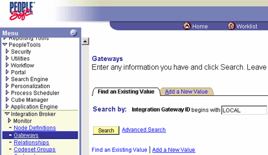
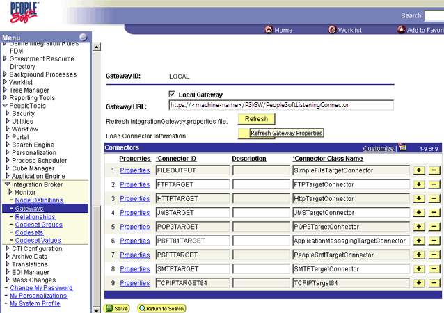
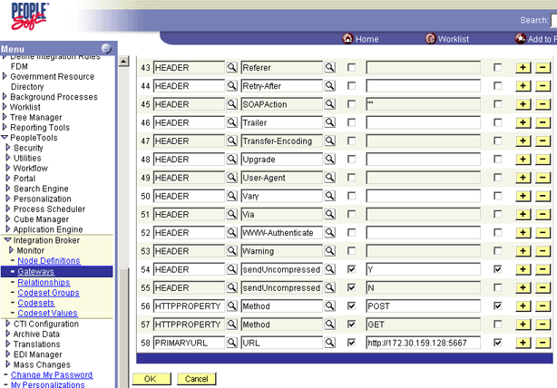

# How to Configure the Integration Gateway and HTTP Output Connector
Follow these steps to configure the Integration Gateway and HTTP Output Connector.  
  
### To create and configure a new gateway node  
  
1.  In a Web browser, open the PeopleSoft application.  
  
2.  Locate **PeopleTools**, select **Integration Broker**, and then select **Gateways**.  
  
3.  In the **Search By** field, type `LOCAL`, and then click **Search**.  
  
       
  
4.  Enter `machine-name/PSIGW/PeopleSoftListeningConnector` into the **Gateway URL** entry.  
  
       
  
5.  Click **Refresh**, and then click **Save**.  
  
6.  Click the **Properties** link for **HTTPTARGET** to view the properties/value combination for that ID.  
  
     You can set the URL here, or at the Node Definition. For this discussion, set the URL at the Node level.  
  
       
  
## See Also  
 [Creating a PeopleSoft HTTP Host and Port](../core/creating-a-peoplesoft-http-host-and-port.md)
