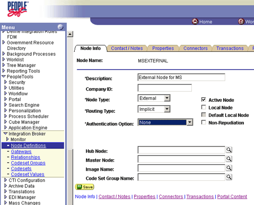
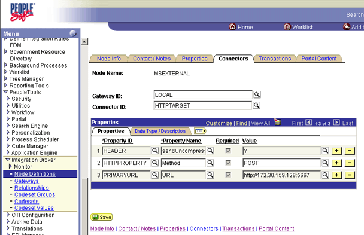
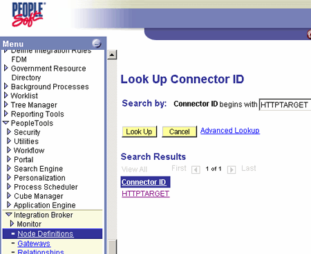
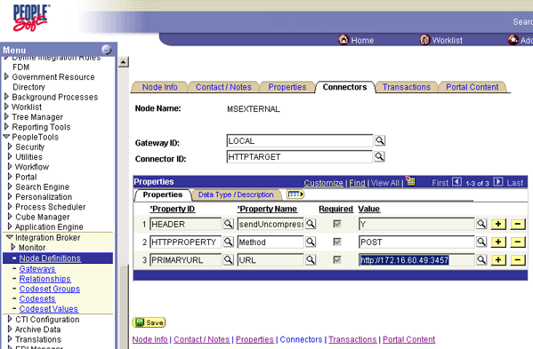

# How to Create a New Gateway Node
Follow these steps to create and configure a new Gateway node in PeopleSoft Enterprise.  
  
### To create and configure a new gateway node  
  
1. In PeopleSoft, on the left panel, click the **Node Definitions** link.  
  
2. Click the **Add a New Value** tab.  
  
3. In the **Node Name** field, enter `MSEXTERNAL`, and then click **Add**.  
  
4. Click the **Node** tab, and enter the following information:  
  
   1. **Description:** Enter a description for the node.  
  
   2. **Node Type:** Select **External**.  
  
   3. **Routing Type:** Select **Implicit**.  
  
        
  
5. Click the **Connectors** tab, and enter the following information:  
  
   1. **Gateway ID:** Enter `LOCAL`.  
  
   2. **Connector ID:** Enter `HTTPTARGET`.  
  
        
  
6. Click the **Lookup** icon.  
  
7. Under **Connector ID**, click the **HTTPTARGET** link.  
  
      
  
8. On the **Properties** tab, enter the following information:  
  
   1.  **Header:** Enter `Y`.  
  
   2.  **HTTPPROPERTY:** Enter `POST`.  
  
   3.  **PrimaryURL:** Enter the IP address and port of the target computer (the development computer).  
  
   > [!NOTE]
   >  The **Receive Port** was previously set.  
  
      
  
## See Also  
 [Creating a PeopleSoft HTTP Host and Port](../core/creating-a-peoplesoft-http-host-and-port.md)