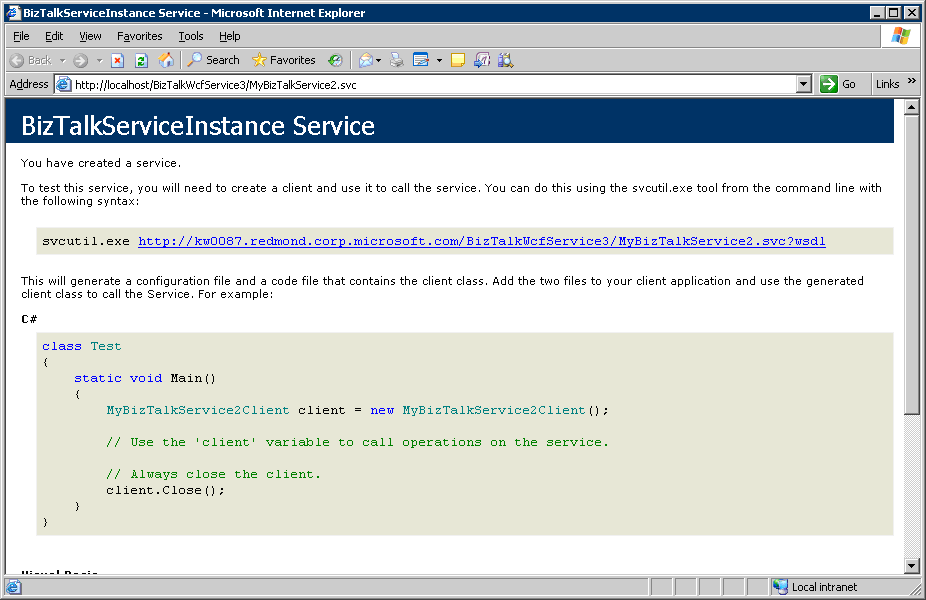

# How to Create a WCF Adapter for BizTalk Server
There are three parts to creating a BizTalk [!INCLUDE[firstref_btsWinCommFoundation](../includes/firstref-btswincommfoundation-md.md)] adapter.  
  
- Create a [!INCLUDE[nextref_btsWinCommFoundation](../includes/nextref-btswincommfoundation-md.md)] Web service using the BizTalk [!INCLUDE[nextref_btsWinCommFoundation](../includes/nextref-btswincommfoundation-md.md)] Service Publishing Wizard. For information about using the BizTalk [!INCLUDE[nextref_btsWinCommFoundation](../includes/nextref-btswincommfoundation-md.md)] Service Publishing Wizard, see [Publishing WCF Services](../core/publishing-wcf-services.md).  
  
- Configure the [!INCLUDE[btsBizTalkServerNoVersion](../includes/btsbiztalkservernoversion-md.md)] receive and send locations and ports by using the [!INCLUDE[btsBizTalkServerNoVersion](../includes/btsbiztalkservernoversion-md.md)] Administration console. For an example of how to do this, see [How to Configure Receive and Send Locations and Ports for BAM WCF Interception](../core/how-to-configure-receive-and-send-locations-and-ports-for-bam-wcf-interception.md).  
  
- If you are hosting your solution in IIS, you must configure the [!INCLUDE[nextref_btsWinCommFoundation](../includes/nextref-btswincommfoundation-md.md)] Web service by using IIS Manager.  
  
  -   You must grant permissions to the App pool user. To do this, see [Security Considerations for IIS Impersonation](../core/security-considerations-for-iis-impersonation.md).  
  
  -   You must set the directory security for your application as described in the following procedure.  
  
## Setting the Directory Security  
 Ensure that the Directory Security Access Control for the [!INCLUDE[nextref_btsWinCommFoundation](../includes/nextref-btswincommfoundation-md.md)] service allows for anonymous access; this simplifies the application access.  
  
 For example, if your application is named MyBizTalkService3 and you have a MyBizTalkService3 that is in Default Websites, you would follow this procedure to set the access control.  
  
#### To set the access control in Windows Server 2008  
  
1. Click **Start**, click **All Programs**, expand **Administrative Tools**, and then click **Internet Information Services (IIS) Manager**.  
  
2. In the Internet Information Services (IIS) Manager window, expand your server name, expand **Sites**, expand **Internet Information Services**, and then expand **Default Web Site**.  
  
3. Right-click **MyBizTalkService3**, and then click **Edit Permissions**.  
  
4. On the **Security** tab of the **MyBizTalkService3 Properties** dialog box, click **Edit**.  
  
5. In the **Permissions for MyBizTalkService3** dialog box, click **Add**.  
  
6. In the **Select Users, Computers, or Groups** dialog box, type `anonymous logon` and then click **OK**.  
  
7. Select **ANONYMOUS LOGON** in the **Group or user names** section, select **Read & execute** in the **Permissions for ANONYMOUS LOGON** section, and then click **OK**.  
  
8. Click **OK** to close the **MyBizTalkService3 Properties** dialog box.  
  
   To confirm that the service is configured correctly, right-click the service, and then click **Browse**.  
  
   If the service is configured correctly, you will see a screen similar to the one below.  
  
     
  
## See Also  
 [Configuring the WCF Adapter to Intercept BAM Data](../core/configuring-the-wcf-adapter-to-intercept-bam-data.md)