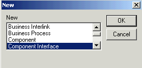
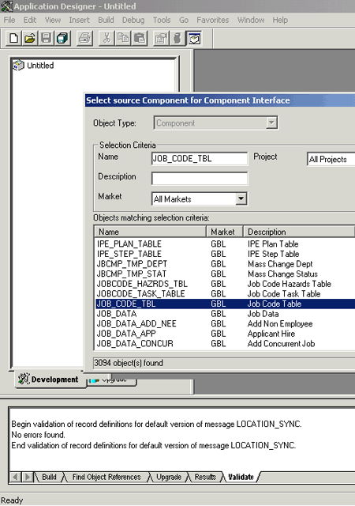
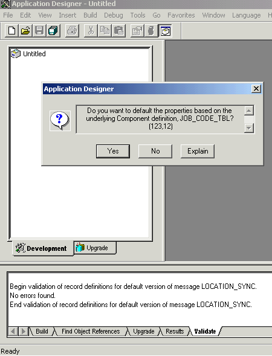

# How to Create Component Interfaces
You create component interfaces using the PeopleSoft Application Designer. (For more information about Application Designer, see the PeopleSoft Enterprise documentation.)  
  
 You can add properties from the records in the component view. In the component interface, you can delete a property that you do not want to expose. You can rename properties by clicking the property and then clicking again until you can type a new name. If you rename a property, you can reference it in the component interface only by the new name, not by the underlying component name.  
  
 Properties may have various icons adjacent to them. For example, EMPLID has an icon that indicates that it is a key field from the underlying record. NAME has an icon that indicates that it is an alternate key field from the underlying record. (For a complete list of property icons, see the PeopleBooks documentation.)  
  
### Creating a new component interface  
  
1.  Open the PeopleSoft Application Designer.  
  
2.  On the **File** menu, click **New**.  
  
       
  
3.  In the **New** dialog box, select **Component Interface**, and then click **OK**.  
  
       
  
4.  In the **Select Source Component for Component Interface** window, select the component to use as a basis for the component interface, and then click **Select**.  
  
       
  
    > [!NOTE]
    >  If the component interface is large, expose the component properties manually.  
  
5.  In the **Application Designer** dialog box, choose one of the following options:  
  
    -   Click **No** to create the component interface without displaying properties and to expose component properties manually.  
  
         a. Drag the relevant fields from the left pane to the right pane.  
  
         b. To select various functions to perform, right-click either the right or left pane, depending on which pane is active.  
  
         For a complete list of functions, see the PeopleBooks documentation.  
  
    -   Click **Yes** to create the component interface and display the properties of the underlying component interface.  
  
           
  
## See Also  
 [Standard Methods in Component Interfaces](../core/standard-methods-in-component-interfaces.md)   
 [Appendix C: Using Component Interfaces](../core/appendix-c-using-component-interfaces.md)   
 [Appendix A: Component Interface Methods](../core/appendix-a-component-interface-methods.md)
