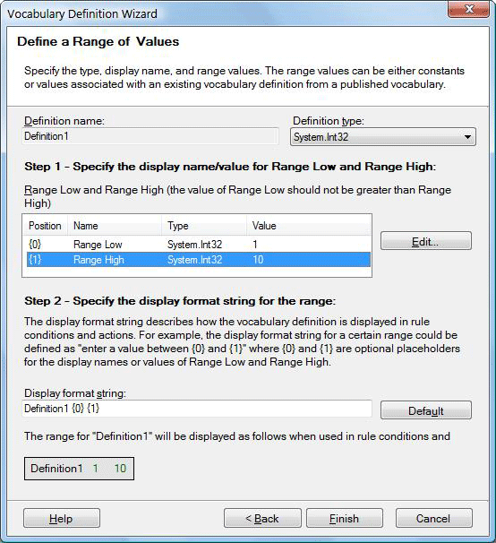
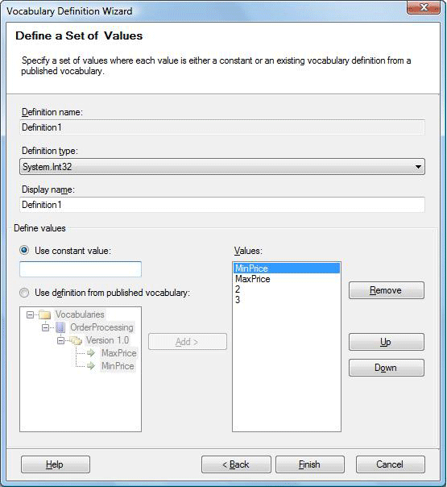
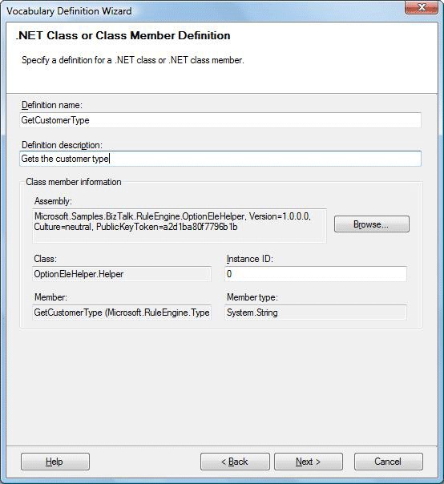
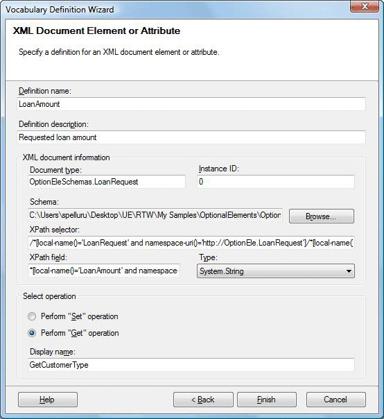
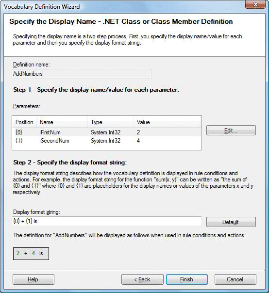

# How to Create Vocabulary Definitions
You can use the Vocabulary Definition Wizard to create vocabulary definitions. You can define a vocabulary definition as a constant value, a range of values, a set of values, or elements of a .NET assembly, XML document, or database table. If you select a public variable, there will be **Get** and **Set** options just like in Database and XML definition wizard.  
  
 Alternatively, you can create a new vocabulary definition by selecting a fact from one of the three tabs—for example, a database column, an XML node, or a member of a .NET class—dragging the fact over to the **Vocabularies** tab, and dropping it to an unpublished version of a vocabulary.  
  
> [!NOTE]
>  You cannot add a vocabulary definition to a vocabulary version that has been published.  
  
### To define a vocabulary definition as a constant value  
  
1.  Right-click the vocabulary version, and then click **Add New Definition**.  
  
    > [!NOTE]
    >  You can also drag and drop items from other tabs of Fact Explorer: XML Schemas, Databases and .NET Classes  
  
2.  In the Vocabulary Definition Wizard, select **Constant Value, Range of Values, or Set of Values**, and then click **Next**.  
  
3.  Edit the definition name and definition description.  
  
    > [!NOTE]
    >  The maximum length for a definition display name is 512 characters.  
  
4.  Select **Constant Value**, and then click **Next**.  
  
5.  Select a definition type from the drop-down list of available system types.  
  
6.  Edit the display name and value, and then click **Finish**.  
  
### To define a vocabulary definition as a range of values  
  
1.  Right-click the vocabulary version, and then click **Add New Definition**.  
  
2.  In the Vocabulary Definition Wizard, select **Constant Value, Range of Values, or Set of Values**, and then click **Next**.  
  
3.  Edit the definition name and definition description.  
  
4.  Select **Range of Values**, and then click **Next**.  
  
5.  Select a definition type from the drop-down list.  
  
6.  Click **Range Low**, and then click **Edit** to specify the values for the lower range. The parameter definition dialog will be opened.  
  
7.  Select **Use Constant Value** and enter a constant value, or select **Use Definition from a Published Vocabulary** and browse to a vocabulary definition, and then click **OK**.  
  
8.  Repeat steps 6 and 7 for **Range High**.  
  
    > [!NOTE]
    >  The **Range High** value must exceed the **Range Low** value.  
  
9. Type the display format string or click **Default** to revert to the default display format string, and then click **Finish**.  
  
    > [!NOTE]
    >  Your format string should include parameter indexes in curly braces—for example, "{0}" and "{1}"—to serve as placeholders for the high and low range parameters.  
  
       
Range of values with formatted string  
  
### To define a vocabulary definition as a set of values  
  
1.  Right-click the vocabulary version, and then click **Add New Definition**.  
  
2.  In the Vocabulary Definition Wizard, select **Constant Value, Range of Values, or Set of Values**, and then click **Next**.  
  
3.  Edit the definition name and definition description.  
  
4.  Select **Set of Values**, and then click **Next**.  
  
5.  Enter the definition type and display name.  
  
6.  To add a member to the set, select **Use Constant Value** and enter a constant value, or select **Use Definition from a Published Vocabulary** and browse to a vocabulary definition, and then click **Add**.  
  
7.  Repeat step 6, with any combination of constants or vocabulary definitions, for as many items as you want to include in your set.  
  
8.  To move a member within the relative order of the set, select it and then click **Up** or **Down**.  
  
9. To remove a member from the set, select it and then click **Remove**.  
  
10. When you have completed your set, click **Finish**.  
  
       
Set of values  
  
### To define a vocabulary definition as a .NET class or class member  
  
1.  Right-click the vocabulary version, and then click **Add New Definition**.  
  
2.  In the Vocabulary Definition Wizard, select **.NET Class or Class Member**, and then click **Next**.  
  
3.  Edit the **Definition Name** and **Description** fields.  
  
4.  Click **Browse**.  
  
5.  In the **.NET Assemblies** dialog box, select an assembly, and then click **OK**.  
  
    > [!NOTE]
    >  The assemblies have to be in the global assembly cache (GAC). The business rule composer loads a .NET assembly when you browse for the .NET assembly in the **Facts Explorer** window or in the **.NET Class or Class Member Definition** page of the **Vocabulary Definition** window.  If you update the assembly in the GAC, close the business rule composer and restart it to load the updated .NET assembly. The business rule composer does not refresh the assembly automatically.  
  
6.  Expand the assembly node.  
  
7.  Select a class, or expand a class and select a class member, and then click **OK**.  
  
8.  Click **Next**, and specify the display name.  
  
     For more information, see "To specify the display format of a vocabulary definition by using parameters" later in this topic.  
  
9. Click **Finish**.  
  
       
Net object vocabulary definition  
  
### To define a vocabulary definition as an XML document element or attribute  
  
1.  Right-click the vocabulary version, and then click **Add New Definition**.  
  
2.  In the Vocabulary Definition Wizard, select **XML Document Element or Attribute**, and then click **Next**.  
  
3.  Type a definition name and a definition description.  
  
4.  Click **Browse** to locate a schema file and specify a document element or attribute.  
  
5.  From the drop-down list, select a type that is compatible with the type of the element or attribute in the schema.  
  
    > [!NOTE]
    >  If a valid cast cannot be done to or from the specified type to the type of the document element or attribute, you will get an error at run time.  
  
6.  Select an operation type to indicate whether you plan to get the value of the element or attribute, or to set its value.  
  
7.  If you chose to set the value, click **Next**, and then specify the display format.  
  
8.  Click **Finish**.  
  
       
XML vocabulary definition  
  
> [!NOTE]
>  The existence of the defined element and the document type is never validated. If the asserted document does not have the element, you will get a runtime error. If you assert a document with unknown document type, it will simply be ignored.  
  
#### To define a vocabulary definition as a database table or database table column  
  
1.  Right-click the vocabulary version and then click **Add New Definition**.  
  
2.  In the Vocabulary Definition Wizard, select **Database Table or Database Table Column Definition**, and then click **Next**.  
  
3.  Type a definition name and definition description.  
  
4.  Click **Browse**.  
  
5.  Select a SQL Server computer to connect with. If the SQL Server computer is not currently started, select the **Start SQL Server if it is stopped** check box.  
  
6.  Select an authentication type. If you select SQL Server authentication, type your logon name and password, and then click **OK**.  
  
7.  Select the table or table column that you want to bind to, and then click **OK**.  
  
8.  If you selected a table column, select whether you want to get its value or set its value. If you choose to get its value, type the display name. If you choose to set its value, click **Next** to specify the display format.  
  
     For more information, see "To specify the display format of a vocabulary definition by using parameters" later in this topic.  
  
9. If you selected a table, type a display name.  
  
10. Click **Finish**.  
  
    > [!NOTE]
    >  By default, **DataConnection** binding is used  
  
       
Database vocabulary definition  
  
#### To specify the display format of a vocabulary definition by using parameters  
  
1.  Select a parameter from the list of **Parameters** in Vocabulary Definition Wizard, and then click **Edit**.  
  
2.  Select **Use Constant Value** and enter a constant value, or select **Use Definition from a Published Vocabulary** and browse to a vocabulary definition, and then click **OK**.  
  
3.  Type the display format string or click **Default** to revert to the default display format string, and then click **Finish**.  
  
    > [!NOTE]
    >  Your format string should include parameter indexes in curly braces—for example, "{0}" and "{1}"—to serve as placeholders for the parameters.  
  
       
Vocabulary definition with parameters