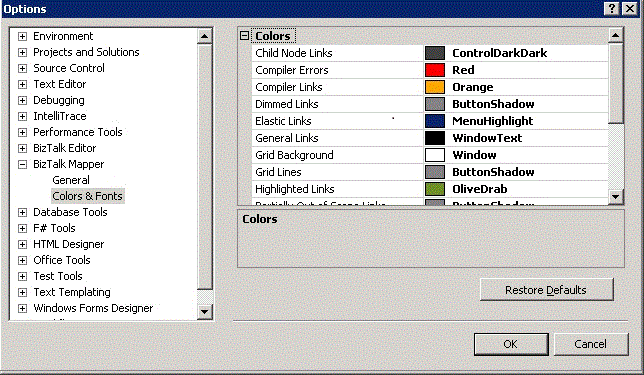

# How to Customize Colors and Font in BizTalk Mapper
You can change the colors associated with various types of links and the color of selected objects in the Grid view. You can also change the font used to display the schema tree nodes. This topic provides step-by-step instructions for making such changes.  
  
 You can also choose to customize the general settings for BizTalk Mapper. For information on how to choose the settings, see [How to Customize General Settings in BizTalk Mapper](../core/how-to-customize-general-settings-in-biztalk-mapper.md).  
  
> [!NOTE]
>  These instructions require that BizTalk Mapper is running.  
  
### To change the colors and font used in BizTalk Mapper  
  
1. In [!INCLUDE[btsVStudioNoVersion](../includes/btsvstudionoversion-md.md)], on the **Tools** menu, click **Options**.  
  
2. In the **Options** dialog box, expand the **BizTalk Mapper** node, and then click **Colors & Fonts**.  
  
      
  
3. Change the colors for the various types of links, compiler warnings, grid foreground, and grid background by using the drop-down color picker associated with each color property.  
  
    The following color choices are available:  
  
   -   **Child Node Links.** The color used for drawing links of collapsed parent’s children.  
  
   -   **Compiler Errors.** The color used for drawing the compiler error.  
  
   -   **Compiler Links.** The color of compiler links, which are the compiler directive links. They are links that are automatically created when a link is set from a field in the source schema tree to a field in the destination schema tree.  
  
   -   **Dimmed Links.** The color used to draw links that are not selected or highlighted.  
  
   -   **Elastic Links.** The color of elastic links, which are simple value-copy links that are dragged from the source schema tree to the destination schema tree. After the link is made, the color of the link changes to the color for fixed links.  
  
   -   **General Links.** The color used to draw links that have both the ends in the view, when nothing is selected.  
  
   -   **Grid Background.** The color of the background in grid pages.  
  
   -   **Grid Lines.** The color used for drawing the grid lines.  
  
   -   **Highlighted Links.** The color used for highlighting links.  
  
   -   **Indicative Match Links.** The color used to draw indicative matches.  
  
   -   **Partially Out of Scope Links.** The color used to draw links that have only one end in view.  
  
   -   **Schema Node Font Color.** The color used for schema tree nodes.  
  
   -   **Search Results.** The color used for drawing search matches on the schema tree.  
  
   -   **Selected Grid Objects.** The color used for drawing the selection in the grid surface.  
  
   -   **Totally Out of Scope Links.** The color used to draw links that have both ends out of the view.  
  
4. Click the ellipsis (**…**) button located at the right end of the **Schema node font** property value box.  
  
5. In the **Font** dialog box, change the font used in the views in the main editing window.  
  
6. Click **OK**. The settings are applied as chosen.  
  
   > [!IMPORTANT]
   >  If you do not want to use the customized settings, click **Restore Defaults** in the **Options** dialog box.  
  
## See Also  
 [Using BizTalk Mapper](../core/using-biztalk-mapper.md)