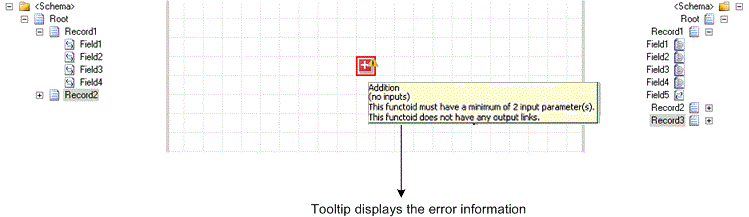
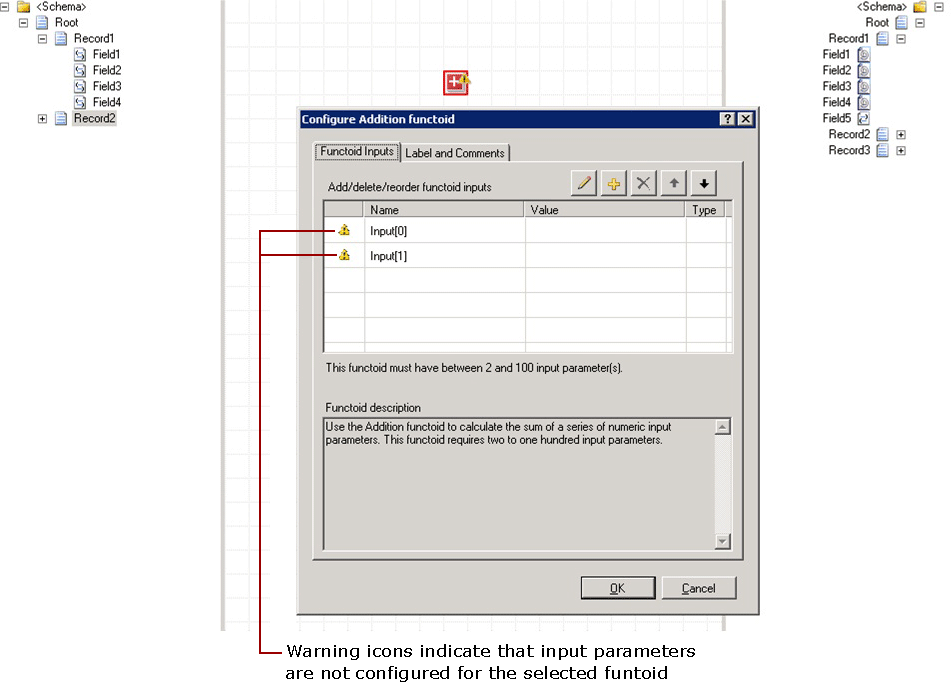

# How to Detect Configuration Issues for a Functoid
While working with maps, you might encounter issues with configuration of a functoid and/or link. The BizTalk Mapper uses a visualization mechanism to help quickly identify problems associated with a functoid configuration. This visual indication renders as a warning annotation on the functoid icon (for e.g. ) in the relationship view. This topic provides information about how to detect the configuration issues for a functoid.  
  
 The warning status icon appears when the Mapper detects that a functoid is not properly configured. Moving the mouse over the functoid also displays brief information of the issue identified by the Mapper. For example, if a functoid does not have minimum number of valid inputs, the tooltip for the functoid mentions the number of input parameters required.  
  
## Prerequisites  
 This operation requires that BizTalk Mapper is running.  
  
### To detect configuration issues for a functoid  
  
1.  Drag the required functoid from the toolbox onto the grid page. You see the functoid with a warning icon.  
  
2.  You can do one of the following:  
  
    -   Move the mouse pointer on the functoid. The tooltip displays information about the error and what you need to do.  
  
         The following figure displays a tooltip with error information while configuring the functoid “Addition.”  
  
           
  
    -   Double-click the functoid. The **Configure \<Functoid> Functoid** dialog box displays warning icons against the input parameters. This indicates that the input parameters of the selected functoid are not configured.  
  
         The following figure displays error information about input parameters for the “Addition” functoid.  
  
           
  
## See Also  
 [Using Enhanced Features in BizTalk Mapper](../core/using-enhanced-features-in-biztalk-mapper.md)