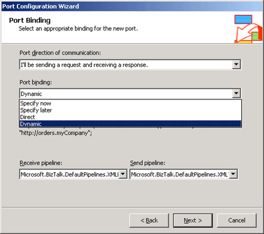

# How to Dynamically Set the URI of a Consumed Web Service
When you create a Web port for a consumed Web service, you can select a dynamic port binding. When you select a dynamic port binding, you must set the URI of the consumed Web service at run time. The selected URI must call a Web service that has the same Web proxy as the Web service that you used to create the Web port type.  
  
> [!NOTE]
>  This topic describes how to programmatically set dynamic SOAP send port properties in an orchestration. However, you can also set these properties in an orchestration or a custom pipeline component no matter where the send port is static or dynamic. For more information about custom pipeline components, see [Developing Custom Pipeline Components](../core/developing-custom-pipeline-components.md).  
  
 Dynamic port bindings for Web ports have different behavior than dynamic port binding for non-Web ports. When selecting dynamic bindings for a non-Web port, you cannot use the SOAP adapter.  
  
 When using dynamic Web ports to consume a Web service, the send port properties are set to the default values. Some of these values are set internally and other values default to the values that are set in the **SOAP Adapter Handler** property pages. You can overwrite these values in an orchestration when you use dynamic send ports. For more information, see [Considerations When Consuming Web Services](../core/considerations-when-consuming-web-services.md).  
  
## Dynamically change the URI of a consumed Web service  
  
1.  Add a Web port as outlined in [How to Add a Web Port](../core/how-to-add-a-web-port.md). However, instead of selecting the **Specify now** port binding, select **Dynamic** port binding, as shown in the following figure.  
  
       
  
2.  In the orchestration that calls the consumed Web service, add an **Expression** shape at some point prior to the **Send** shape that you have connected to the Web port.  
  
3.  In the **Expression** shape, add an expression similar to:  
  
    ```  
    myWebPort(Microsoft.XLANGs.BaseTypes.Address) = "http://orders/myCompany.asmx";  
    ```  
  
> [!NOTE]
>  You can retrieve the URI used in the BizTalk Expression Editor from various locations, including the incoming message, a SQL database, or a line-of-business application.  
  
## Dynamically modify send port properties  
  
1. In the **Construct Message** shape that you use to construct the Web message, add a **Message Assignment** shape if one is not already present.  
  
2. In the **Message Assignment** shape, add an expression similar to:  
  
   ```  
   myWebMessage(SOAP.UseSSO) = true;  
   ```  
  
   All of the properties for the SOAP send port use the SOAP namespace.  
  
   The following table contains a list of the SOAP send port properties that you can set when using dynamic Web ports.  
  
|        Property Name         |  Type   |                                                                                                                                                                                                                                                                                                 Description                                                                                                                                                                                                                                                                                                  |
|------------------------------|---------|--------------------------------------------------------------------------------------------------------------------------------------------------------------------------------------------------------------------------------------------------------------------------------------------------------------------------------------------------------------------------------------------------------------------------------------------------------------------------------------------------------------------------------------------------------------------------------------------------------------|
|   **AuthenticationScheme**   | String  |                                                                                                                                                                                                                             Authentication method to use for calling the Web service<br /><br /> Default value: Anonymous<br /><br /> Other allowed values: Basic, Digest, NTLM                                                                                                                                                                                                                              |
|         **Username**         | String  |                                                                                                                                                                                                                                                         User name to specify for accessing the target Web service.<br /><br /> Default value: Blank                                                                                                                                                                                                                                                          |
|         **Password**         | String  |                                                                                                                                                                                                                                                          User password to use for authentication with the server.<br /><br /> Default value: Blank                                                                                                                                                                                                                                                           |
|    **ClientCertificate**     | String  |                                                                                                                                                                                                                                                        Thumbprint of client Secure Sockets Layer (SSL) certificate.<br /><br /> Default value: Blank                                                                                                                                                                                                                                                         |
|          **UseSSO**          | Boolean |                                                                                                                                                                                                                                                       Indicates whether this Web port will use Single Sign-On (SSO).<br /><br /> Default value: False                                                                                                                                                                                                                                                        |
| **AffiliateApplicationName** | String  |                                                                                                                                                                                                                                  The name of the SSO application that this Web port will use to redeem the ticket for client credentials.<br /><br /> Default value: Blank                                                                                                                                                                                                                                   |
|    **UseHandlerSetting**     | Boolean |                                                                                                                                                                                      Indicates whether this Web port will use SOAP send handler HTTP proxy settings. **Note:**  If the **UseProxy** context property is set, then **UseHandlerSetting** context property is ignored. <br /><br /> Default value: False                                                                                                                                                                                       |
|         **UseProxy**         | Boolean |                                                                                                                                                                                 Indicates whether this Web port will use a proxy server to access the target Web service. **Note:**  If the **UseProxy** context property is set, then **UseHandlerSetting** context property is ignored. <br /><br /> Default value: False                                                                                                                                                                                  |
|       **ProxyAddress**       | String  |                                                                                                                                                                                                                                      Address of the HTTP proxy to use for the Web service call.<br /><br /> Default value: Retrieved from SOAP send handler properties.                                                                                                                                                                                                                                      |
|        **ProxyPort**         | Integer |                                                                                                                                                                                                                                       Port of the HTTP proxy to use for the Web service call.<br /><br /> Default value: Retrieved from SOAP send handler properties.                                                                                                                                                                                                                                        |
|      **ProxyUsername**       | String  |                                                                                                                                                                                                                                                 User name to use for the HTTP proxy.<br /><br /> Default value: Retrieved from SOAP send handler properties.                                                                                                                                                                                                                                                 |
|      **ProxyPassword**       | String  |                                                                                                                                                                                                                                                 Password to use for the HTTP proxy.<br /><br /> Default value: Retrieved from SOAP send handler properties.                                                                                                                                                                                                                                                  |
| **ClientConnectionTimeout**  |  Int32  |                                                                                                                                                                                                                                           Time-out value for HTTP client connection.<br /><br /> Default value: Same as default ASP.NET HTTP connection time-out.                                                                                                                                                                                                                                            |
|         **TypeName**         | String  |                                                                                                                                                                                                                                                  Specify the name of the class that contains the Web method to be invoked.<br /><br /> Default value: Blank                                                                                                                                                                                                                                                  |
|        **MethodName**        | String  | Specify the method of the class that will be invoked. **Note:**  To configure **MethodName** property for the static SOAP send port programmatically, you need to set **Method name** as to **[Specify Later]** in the **Web Service** tab of the **SOAP Transport Properties** dialog box in BizTalk Server Administration console. For more information about **SOAP Transport Properties** dialog box, see the **SOAP Transport Properties Dialog Box, Web service** tab [!INCLUDE[ui-guidance-developers-reference](../includes/ui-guidance-developers-reference.md)]. <br /><br /> Default value: Blank |
|       **AssemblyName**       | String  |                                                                                                                                                                                                                                                      Identifies the .NET type and assembly to be loaded and executed.<br /><br /> Default value: Blank                                                                                                                                                                                                                                                       |
|      **UnknownHeaders**      | String  |                                                                                                                                                                                                                                                           Specifies the serialized list of unknown SOAP headers.<br /><br /> Default value: Blank                                                                                                                                                                                                                                                            |
|       **UserDefined**        | String  |                                                                                                                                                                                                                                                                        Defines user-defined classes<br /><br /> Default value: Blank                                                                                                                                                                                                                                                                         |
|        **UseSoap12**         | Boolean |                                                                                                                                                                                                             Specify to generate proxy code that will support the SOAP 1.2 protocol. If this property is False, SOAP 1.1-compliant proxy code will be generated.<br /><br /> Default value: False                                                                                                                                                                                                             |
  
> [!NOTE]
>  Except for the **ClientConnectionTimeout** setting, these values can only be dynamically set when using **Dynamic** port bindings. They are read-only when using the **Specify now** port binding. You can set the **ClientConnectionTimeout** setting with both **Specify now** and **Dynamic** port bindings.  
  
## See Also  
 [SOAP Headers with Consumed Web Services](../core/soap-headers-with-consumed-web-services.md)   
 [Creating Web Ports](../core/creating-web-ports.md)