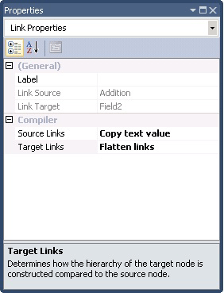

# How to Edit Link Properties
Links have several properties that appear in the [!INCLUDE[btsVStudioNoVersion](../includes/btsvstudionoversion-md.md)]**Properties** window, such as the following:  
  
- **Label** property provides a short description of the link and is especially helpful in table-driven looping. For information about the **Label** property, see [How to Manage Existing Links](../core/how-to-manage-existing-links.md).  
  
- **Source Links** property determines whether the link represents the text value of an element or the name of the element.  
  
- **Target Links** property enables you to control the order in which links are processed in the map.  
  
    
  
  For general information about source and target schemas, see [Compiler Directives and Links](../core/compiler-directives-and-links.md). For information about setting and using the **Source Links** and **Target Links** properties, see [How to Configure Node Hierarchy Matching](../core/how-to-configure-node-hierarchy-matching.md) and [How to Set the Source Links Compiler Value](../core/how-to-set-the-source-links-compiler-value.md).  
  
## See Also  
 [Using Links to Specify Record and Field Mappings](../core/using-links-to-specify-record-and-field-mappings.md)