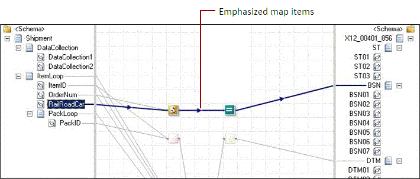

# How to Emphasize Map Items
In the BizTalk Mapper, when you select a map item, all the associated links and functoids are emphasized. This is useful in maps with many links, where it is difficult to identify a relationship and the related schema items.  
  
 When you select a link, a functoid, or a schema element, the BizTalk Mapper emphasizes the related relationship and schema elements. For the selected map item, all the incoming links and the outgoing links (recursively) are highlighted in bold, and all the other map items are greyed out. The following screenshot shows the selected map item in bold and color and the other map items appear lighter.  
  
> [!NOTE]
>  In this context, a related relationship means all the links, functoids, or schema elements directly or indirectly linked to the selected map item.  
  
   
  
## Prerequisites  
 This operation requires that BizTalk Mapper is running.  
  
## To emphasize a map item  
  
-   Click a map item (a link, a functoid, or a schema element). You can see that all the other links and functoids (including the schema nodes) associated with the selected map item in the current grid page are highlighted.  
  
     Sometimes, for the selected node, there might be relationships existing in other grid pages. In such a case, the BizTalk Mapper emphasizes the instance in current grid page and also highlights the page tab where the other related relationship to the selected node exists.  
  
## See Also  
 [Using Enhanced Features in BizTalk Mapper](../core/using-enhanced-features-in-biztalk-mapper.md)
